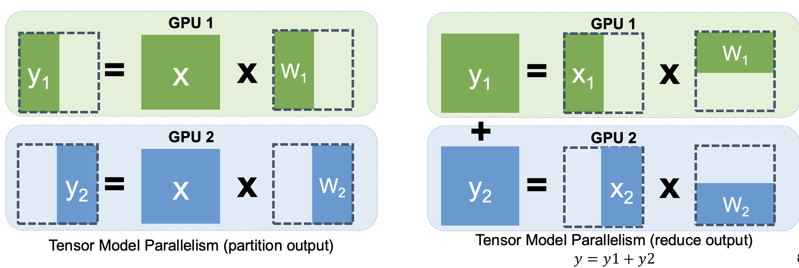
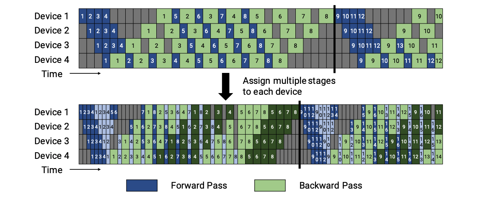
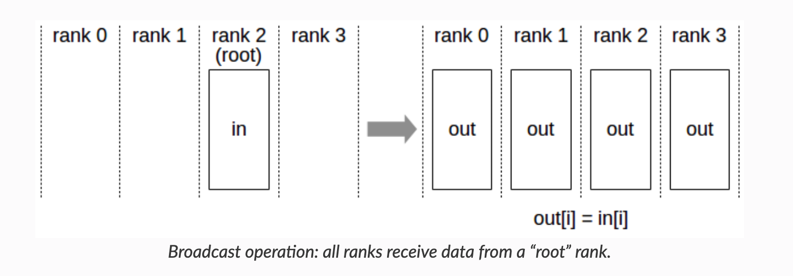
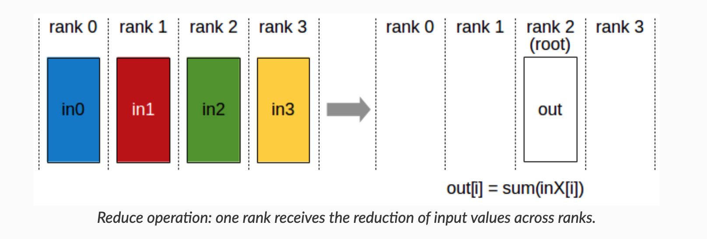
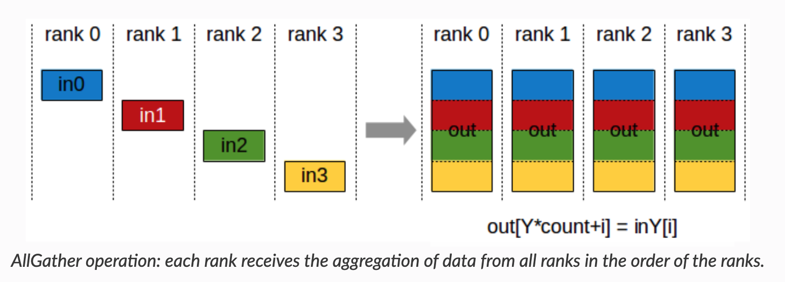
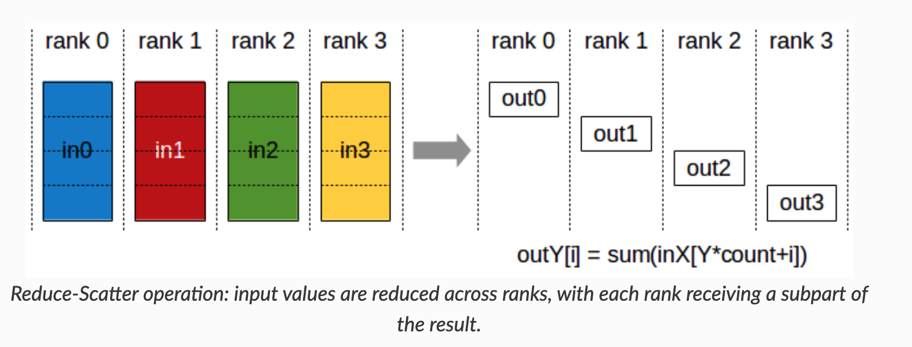

# NCCL and SGLang

Before we discuss NVIDIA Collective Communication Library (NCCL) and communication in SGLang, we introduce the parallelism and general communication primitives.


## Parallelism

In this section, we introcue the parallelism - TP, DP, PP. Generally we assume the communication data size should be TP>DP>PP. (Therefore we prefer to have inter-node PP but intra-node TP. You might want to reference `_initialize_distributed` in Megatron-LM for this, although it is not the key-point of this documentation.)

The figures are for training. But it still gives the rough idea of inference parallelism and why we need the communication operations included in the next section.

### DP: Data Parallelism

The key idea is to distribute data on the replicated model of each GPU. We need to perform element-wise reduction across multiple GPUs (AR/AllReduce). 

To reduce memory consumption, you might want to have a look at ZeRO.


(CMU-15442, 09-ML-Parallelization by Tianqi Chen)

### TP: Tensor Parallelism

For $Y = XW$, we could have:



(CMU-15442, 10-ML-Parallelization by Tianqi Chen)

We would require communication to perform reduce operation.

### PP: Pipeline Parallelism

The key iead is to improve resource utilization by pipelined sub-stages.



(Efficient Large-Scale Language Model Training on GPU Clusters Using Megatron-LM)


### EP: Expert Parallelism


(TensorRT-LLM: https://nvidia.github.io/TensorRT-LLM/advanced/expert-parallelism.html)


## Communication in NCCL

### Primitives

NCCL provides the following **collective** communication primitives.

By these visualized representation with their names, you could get an intuitive understanding of their functions.

(https://docs.nvidia.com/deeplearning/nccl/user-guide/docs/usage/collectives.html)

**AllReduce**


- `ncclAllReduce()`

**Broadcast**



* `ncclBroadcast()`

**Reduce**



* `ncclReduce`

**AllGather**



* `ncclAllGather()`

**ReduceScatter**



* `ncclReduceScatter()`

Also there are **point-to-point** send/recv for scatter, gather, and all-to-all operations. You can get how they works from their names.

### How to Apply these Primitives on Network Topology?

To get a quick view, you might want to read this slide: https://images.nvidia.com/events/sc15/pdfs/NCCL-Woolley.pdf

**Ring-based**

`NCCL_ALGO_RING`


**Tree-based**

`NCCL_ALGO_TREE`

**CollNet**

`NCCL_ALGO_COLLNET_CHAIN`

**NVLink-Shuffle**

`NCCL_ALGO_NVLS` and `NCCL_ALGO_NVLS_TREE`


We can have a detailed look at the NCCL in the next section now.


## What is NCCL
NCCL (NVIDIA Collective Communications Library) is a high-performance communication library developed by NVIDIA for GPU-to-GPU interactions. 

NCCL addresses large model parallized training by:

- Enabling efficient data exchange in multi-GPU training
- Automatically identifying and optimizing communication topology between GPUs
- Providing standardized collective communication interfaces
- Supporting both intra-node (single-machine multi-GPU) and inter-node (multi-machine multi-GPU) communication

### Key Concepts of NCCL
- **Collective Operations**: Supports operations like Broadcast, Reduction, Aggregation, AllReduce, AllGather, etc., for data synchronization across GPUs/nodes.
- **Processes and Groups**: Processes represent computational nodes participating in communication, organized into groups for collective operations.
- **Communicators**: Objects defining communication relationships between processes, specifying participant groups and modes (e.g., peer-to-peer, broadcast).
- **Devices and Streams**: Works with CUDA streams for asynchronous communication and parallel computation across GPUs.
- **Synchronization**: Provides synchronization primitives (e.g., barriers) to ensure consistent states during collective operations.
- **Performance Optimization**: Techniques like merged collective operations, batched data transfers, and computation-communication overlap.
- **Fault Tolerance**: Reliable communication despite node failures or network instability.

### Supported Collective Operations
1. **AllReduce**: Aggregate data across GPUs (e.g., sum) and broadcast results to all GPUs.
2. **Broadcast**: Transmit data from a source GPU to all others.
3. **Reduce**: Aggregate data to a single target GPU.
4. **AllGather**: Gather data from all GPUs and distribute to all GPUs.
5. **ReduceScatter**: Reduce data and scatter results across GPUs.
6. **Send/Recv**: Peer-to-peer communication.
7. **AllToAll**: Distribute data to all GPUs.

### Hardware Requirements
- NVIDIA GPUs with CUDA support
- NVLink-enabled GPUs recommended for best performance
- InfiniBand or RoCE networks for multi-node communication
- Compatible CUDA and GPU driver versions

### NCCL in PyTorch
PyTorch natively supports NCCL:
```python
import torch.distributed as dist

# Initialize process group
dist.init_process_group(backend='nccl')

# Wrap model
model = torch.nn.parallel.DistributedDataParallel(model)
```

### How NCCL Works
**Ring Algorithm**  
Used for intra-node communication:

1. Organize GPUs into a ring.
2. Each GPU communicates only with adjacent neighbors.
3. Global data exchange via multi-step transfers.
4. Data split into chunks for parallel transfer.

**Advantages**:

- Maximizes GPU-to-GPU bandwidth
- Balanced communication load
- Scalable design

**Tree Algorithm**  
(See [postscript in torch-distributed notes](../torch-distributed/readme.md#ring-all-reduce-and-tree-all-reduce).）

<!--真的要放在这里吗？-->

### Communication Protocols
NCCL implements three protocols:
1. **Simple**: Basic protocol.
2. **LL (Low Latency)**: Optimized for small payloads.
3. **LL128**: Optimized for NVLink, achieving 93.75% effective bandwidth.

### NCCL vs. Other Libraries
1. **MPI Comparison**:
   - NCCL: GPU-focused optimizations.
   - MPI: General-purpose but less optimized for GPUs.
   - Hybrid use: MPI manages processes, NCCL handles GPU communication.
2. **Gloo Comparison**:
   - Gloo: Supports CPU/GPU.
   - NCCL: Outperforms in GPU scenarios.

### Topology Optimization

<!--我记得好像有这个东西，有空写吧-->

## Common NVIDIA Tools
Reference: [WeLearnNLP Guide](https://www.yourmetaverse.cn/deep_learning/199/).

## `nvidia-smi topo -m`
Compare two cluster topologies:

```bash
	GPU0	GPU1	GPU2	GPU3	GPU4	GPU5	GPU6	GPU7	CPU Affinity	NUMA Affinity	GPU NUMA ID
GPU0	 X 	SYS	SYS	SYS	SYS	SYS	SYS	SYS	0-15,32-47	0		N/A
GPU1	SYS	 X 	SYS	SYS	SYS	SYS	SYS	SYS	0-15,32-47	0		N/A
GPU2	SYS	SYS	 X 	SYS	SYS	SYS	SYS	SYS	0-15,32-47	0		N/A
GPU3	SYS	SYS	SYS	 X 	SYS	SYS	SYS	SYS	0-15,32-47	0		N/A
GPU4	SYS	SYS	SYS	SYS	 X 	SYS	SYS	SYS	16-31,48-63	1		N/A
GPU5	SYS	SYS	SYS	SYS	SYS	 X 	SYS	SYS	16-31,48-63	1		N/A
GPU6	SYS	SYS	SYS	SYS	SYS	SYS	 X 	SYS	16-31,48-63	1		N/A
GPU7	SYS	SYS	SYS	SYS	SYS	SYS	SYS	 X 	16-31,48-63	1		N/A

Legend:

  X    = Self
  SYS  = Connection traversing PCIe as well as the SMP interconnect between NUMA nodes (e.g., QPI/UPI)
  NODE = Connection traversing PCIe as well as the interconnect between PCIe Host Bridges within a NUMA node
  PHB  = Connection traversing PCIe as well as a PCIe Host Bridge (typically the CPU)
  PXB  = Connection traversing multiple PCIe bridges (without traversing the PCIe Host Bridge)
  PIX  = Connection traversing at most a single PCIe bridge
  NV#  = Connection traversing a bonded set of # NVLinks
```

```bash
        GPU0    GPU1    GPU2    GPU3    GPU4    GPU5    GPU6    GPU7    CPU Affinity    NUMA Affinity   GPU NUMA ID
GPU0     X      NV18    NV18    NV18    NV18    NV18    NV18    NV18    0-47,96-143     0               N/A
GPU1    NV18     X      NV18    NV18    NV18    NV18    NV18    NV18    0-47,96-143     0               N/A
GPU2    NV18    NV18     X      NV18    NV18    NV18    NV18    NV18    0-47,96-143     0               N/A
GPU3    NV18    NV18    NV18     X      NV18    NV18    NV18    NV18    0-47,96-143     0               N/A
GPU4    NV18    NV18    NV18    NV18     X      NV18    NV18    NV18    48-95,144-191   1               N/A
GPU5    NV18    NV18    NV18    NV18    NV18     X      NV18    NV18    48-95,144-191   1               N/A
GPU6    NV18    NV18    NV18    NV18    NV18    NV18     X      NV18    48-95,144-191   1               N/A
GPU7    NV18    NV18    NV18    NV18    NV18    NV18    NV18     X      48-95,144-191   1               N/A

Legend:

  X    = Self
  SYS  = Connection traversing PCIe as well as the SMP interconnect between NUMA nodes (e.g., QPI/UPI)
  NODE = Connection traversing PCIe as well as the interconnect between PCIe Host Bridges within a NUMA node
  PHB  = Connection traversing PCIe as well as a PCIe Host Bridge (typically the CPU)
  PXB  = Connection traversing multiple PCIe bridges (without traversing the PCIe Host Bridge)
  PIX  = Connection traversing at most a single PCIe bridge
  NV#  = Connection traversing a bonded set of # NVLinks
```

**Key Observations**:
1. **Interconnect**:
   - Cluster 1: PCIe + NUMA nodes (SYS)
   - Cluster 2: NVLink (NV18) → Higher bandwidth/lower latency.
2. **NUMA Architecture**:
   - GPU 0-3: NUMA node 0
   - GPU 4-7: NUMA node 1
   - Optimal task placement: Minimize cross-NUMA communication.
3. **System Scale**:
   - Cluster 1: 64 CPU cores; Cluster 2: 192 cores.
4. **Topology Completeness**:  
   - Every GPU directly connects to all others
   - Eliminates intermediate "hops," improving throughput.  
## NVLink Inspection
```bash
nvidia-smi nvlink --status -i 0
nvidia-smi nvlink --capabilities -i 0
```
<details>
<summary>Example Output (H100 GPUs)</summary>

```bash
GPU 0: NVIDIA H100 80GB HBM3
         Link 0: 26.562 GB/s
         ... (18 links total)
         All links support:
         - Peer-to-peer (P2P) communication
         - System memory access
         - P2P/System atomics
         - SLI support
```
</details>

**Key Features**:
- Full bidirectional P2P support
- High-speed atomics
- System memory access

## GPU Monitoring
Tool recommendation: **[nvitop](https://github.com/Syllo/nvtop)**  
Install via `pip install nvitop` for real-time GPU metrics visualization.


## SGLang Communication

<!--我还没找到代码在哪里，晚点再说 -->


## References

* https://mlsyscourse.org/ CMU-15442 by Tianqi Chen
* https://docs.nvidia.com/deeplearning/nccl/user-guide/docs/index.html NCCL docs
* https://images.nvidia.com/events/sc15/pdfs/NCCL-Woolley.pdf NCCL talk
* https://nvidia.github.io/TensorRT-LLM/index.html TensorRT-LLM docs

