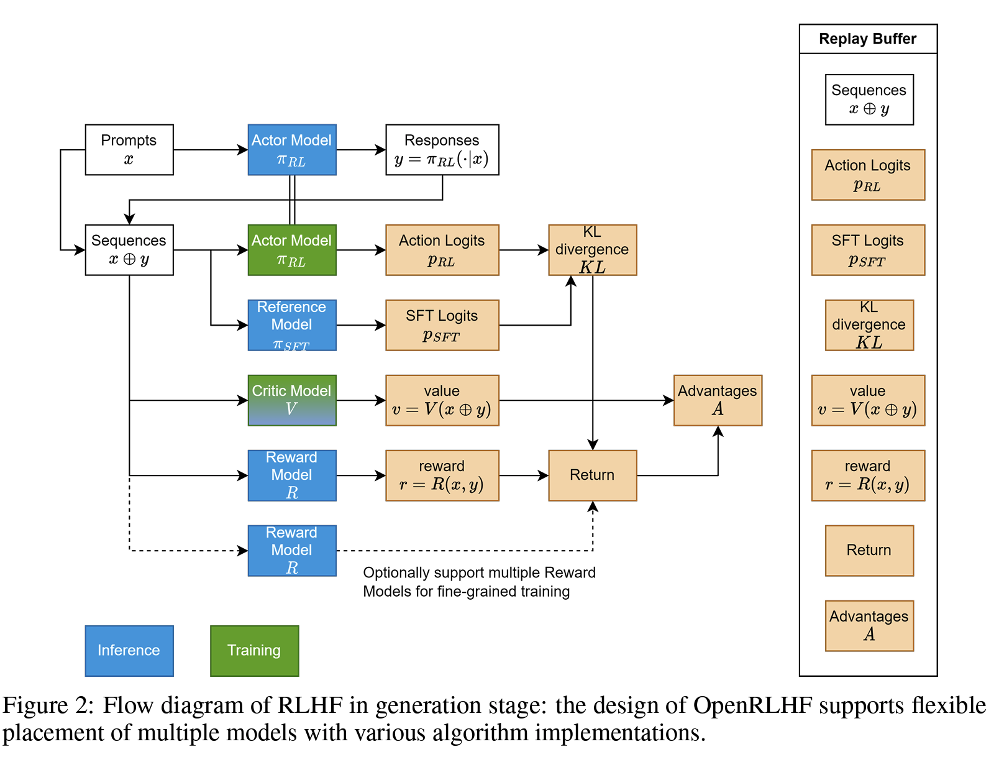
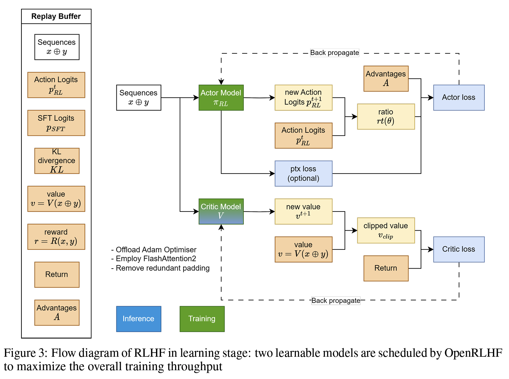

# 基于 OpenRLHF 上手 RLHF 计算流

将 SGLang 接入到 OpenRLHF 中的事情已经做了好几周了，然而非常惭愧，我直到昨天才算是人生第一次用 OpenRLHF 跑了一个完整的 RLHF 流程。仅仅跑起来就遇到了不少坑，这里先记录下，此后不断更新一些 RLHF 的计算特性。**Github 的 markdown 公式渲染实在太烂了，建议 clone 下来本地看。**

## Quick Start

OpenRLHF 的文档默认用户都比较理解 RLHF 的流程，所以很多地方写的不算入门，对我这种不甚理解 RLHF 的人就比较痛苦。

1. 配环境

我一开始误判了 OpenRLHF 的依赖复杂度，选择了用 docker，其实也没差。这是我自己用的 docker 指令：

```bash
docker run --runtime=nvidia -it --shm-size="40g" --cap-add=SYS_ADMIN -v $PWD:/openrlhf nvcr.io/nvidia/pytorch:24.07-py3 bash
```

主要是我把原本指令里面的 `--rm` 去掉了，不理解为什么文档加了这个参数，让 docker 容器在退出后自动删除。

进入 docker 后，先卸载环境里面的一些库，避免和 OpenRLHF 的依赖冲突。

```bash
pip uninstall xgboost transformer_engine flash_attn -y
```

然后，安装有 vllm 依赖的 OpenRLHF。

```bash
 pip install openrlhf[vllm]
```

PS: 这个发行版可能偶尔会被取消，也可以直接安装最新发行的 openrlhf 和 vllm 0.6.4.post1，前者版本无所谓，后者版本目前得固定在这里。


用 docker 的话，接着可以把 docker commit 保存下来，`docker ps -a` 查找 <container_id>，然后 `docker commit <container_id> openrlhf`，下次直接 `docker run -it openrlhf` 就可以直接进入 docker 了。

然后，配置 `wandb`，老实说我都有快两年没碰过这玩意儿了，越发觉得有点鸡肋。由于 OpenRLHF 可以基于 ray 使用，而 ray 有一套自己 prometheus 的监控，所以配置 `wandb` 的必要性不大。要配置也不麻烦，`wandb init` 一通操作就好了。

2. A Quick Check Out

由于我主要是使用单机多卡做 SGLang 和 vllm 的对拍，所以不使用多机模式。这里简单给两个指令：

```bash
ray start --head --node-ip-address 127.0.0.1 --num-gpus 3 --port 4567
```

这是在单机的 3 张卡上启动 ray 的 head 节点，可能会遇到各种启动失败的情况，诸如端口被占用或者卡没分配够，就不断的 `ray stop` 和 `ray start` 直到成功为止。

<details>
<summary> ray start 的输出 </summary>

```bash
ray start --head --node-ip-address 127.0.0.1 --num-gpus 3 --port 4567

Usage stats collection is enabled. To disable this, add `--disable-usage-stats` to the command that starts the cluster, or run the following command: `ray disable-usage-stats` before starting the cluster. See https://docs.ray.io/en/master/cluster/usage-stats.html for more details.

Local node IP: 172.31.54.252

--------------------
Ray runtime started.
--------------------

Next steps
  To add another node to this Ray cluster, run
    ray start --address='172.31.54.252:4567'

  To connect to this Ray cluster:
    import ray
    ray.init(_node_ip_address='172.31.54.252')

  To submit a Ray job using the Ray Jobs CLI:
    RAY_ADDRESS='http://127.0.0.1:8265' ray job submit --working-dir . -- python my_script.py

  See https://docs.ray.io/en/latest/cluster/running-applications/job-submission/index.html
  for more information on submitting Ray jobs to the Ray cluster.

  To terminate the Ray runtime, run
    ray stop

  To view the status of the cluster, use
    ray status

  To monitor and debug Ray, view the dashboard at
    127.0.0.1:8265

  If connection to the dashboard fails, check your firewall settings and network configuration.
```

</details>

这里给出了 ray 的 start address，也即  `ray start --address='172.31.54.252:4567'`，注意之后要在 OpenRLHF 的指令中使用这个地址。而后也给出了 ray dashboard 的地址，也即 `127.0.0.1:8265`，登上去可以查看到非常精细的监控信息。

接着，submit 一个 test job，这是我在 3 张 H100 上跑通了的脚本，可以参考。

```bash
ray job submit --address="172.31.54.252:4567" \
   --runtime-env-json='{"working_dir": "/opt/dlami/nvme/chenyang/open-rlhf-sglang"}' \
   -- python3 -m openrlhf.cli.train_ppo_ray \
   --ref_num_nodes 1 \
   --ref_num_gpus_per_node 1 \
   --reward_num_nodes 1 \
   --reward_num_gpus_per_node 1 \
   --critic_num_nodes 1 \
   --critic_num_gpus_per_node 1 \
   --actor_num_nodes 1 \
   --actor_num_gpus_per_node 1 \
   --vllm_num_engines 1 \
   --vllm_tensor_parallel_size 1 \
   --colocate_critic_reward \
   --colocate_actor_ref \
   --pretrain OpenRLHF/Llama-3-8b-sft-mixture \
   --reward_pretrain OpenRLHF/Llama-3-8b-rm-mixture \
   --save_path /opt/dlami/nvme/chenyang/open-rlhf-sglang/examples/checkpoint/llama3-8b-rlhf \
   --save_steps 100 \
   --micro_train_batch_size 16 \
   --train_batch_size 128 \
   --micro_rollout_batch_size 32 \
   --rollout_batch_size 128 \
   --max_samples 512 \
   --max_epochs 1 \
   --prompt_max_len 1024 \
   --generate_max_len 1024 \
   --zero_stage 3 \
   --bf16 \
   --actor_learning_rate 5e-7 \
   --critic_learning_rate 9e-6 \
   --init_kl_coef 0.01 \
   --prompt_data OpenRLHF/prompt-collection-v0.1 \
   --input_key context_messages \
   --apply_chat_template \
   --packing_samples \
   --normalize_reward \
   --adam_offload \
   --flash_attn \
   --gradient_checkpointing
```

任何一套框架都得在易用性和性能之间 trade off，我如上的指令几乎可以最快速地完成 OpenRLHF 的流程测试。注意这么几个参数：

1. `colocate_critic_reward` 和 `colocate_actor_ref`：将 critic/reward 和 actor/ref 放在同一个卡上，显著节省了显存，但是中间有一些 empty cache，会拖慢训练速度。如果不开启，就会各自占据一张卡，显存占用翻倍。
2. `adam_offload`：将 adam 的优化器 offload 到 CPU 上，显著节省了显存，但是会拖慢训练速度。不开启会在 80G H100 上 OOM。
3. `max_samples` 是从 `prompt_data` 里面进行采样的最大样本数，其必须大于 `rollout_batch_size`，否则不够一轮 rollout，会报错。

## RLHF 的计算流

在[图解大模型RLHF系列之：人人都能看懂的PPO原理与源码解读](https://zhuanlan.zhihu.com/p/677607581)中已经解释的很清楚了，这里摘录并且总结下，分别会如何计算 critic 和 actor 的 loss。

给定一个 transformer 和任何一个 string，我都可以将整个 string 输入给 reward model 做一次 forward pass，得到每个位置的 token 的 logit。我们取出最后一个 token 的 logit，经过 logit processor 处理，再过一次 softmax 并取 log，得到此处的  log prob。此外，我们也可以对最后一个 token 的 logit 进行其他操作，譬如 pooling 和 projection 等等，拿到 embedding、reward 或者 value。由此可见，对于 string 里的每个 token，我们都可以得到前述所有计算值，但是在 RLHF 中，我们会用到 response 中每个 token 的 log prob 和 value，但是 reward 只会用最后一个 token 的 reward。

### 构造 Reward

这里直接给出 reward 的实际计算，对于第 t 个 response token。当 t 为最后一个 token T 时，才将 reward model 输出的对整个 response 的 reward 加到 $R_t$ 上。换言之，实际上一个 prompt + response 只会让 reward model 推理一次，作为整个 response 的 reward。

$$
R_t = 
\begin{cases} 
-kl\_ctl \cdot \left( \log \frac{P(A_t|S_t)}{P_{ref}(A_t|S_t)} \right), & t \neq T \\
-kl\_ctl \cdot \left( \log \frac{P(A_t|S_t)}{P_{ref}(A_t|S_t)} \right) + R_t, & t = T
\end{cases}
$$


至于其他部分，$kl \_ ctl$ 是个常数，$ \log \frac{P(A_t|S_t)}{P_{ref}(A_t|S_t)} $ 是 reference model 和 actor model 生成 $A_t$ 这个 token 的条件概率比值取对数，也即直接将 actor 的 log prob 和 reference 的 log prob 相减，体现到代码里就是 `kl_ctl * (actor_log_probs - ref_log_probs)`（KL 散度），这样就得到了每个 token 的 reward。注意这里的单复数，`actor_log_probs` 和 `ref_log_probs` 都是所有 response token 的 log prob 构成的 list。

得到 KL 散度后，再在这个 `prompt + response` 的最后一个 token 上加上此处的 reward（称为 reward score），整个 response 每一处的 reward 便构造完成了。当然，实际上的计算还需要考虑 reward score 的 clip 问题，也即不能让 reward 过大。在[知乎](https://zhuanlan.zhihu.com/p/677607581)里面给了非常好的伪代码，这里贴一份代码和解析：

<details>
<summary> 伪代码解析 </summary>

```python
def compute_rewards(self, prompts, log_probs, ref_log_probs, reward_score,
                        action_mask):
        """
        reward_function：计算最终的reward分数
        复习一下几个相关参数的默认值：
        self.kl_ctl = 0.1
        self.clip_reward_value = 5
        
        对于batch中的某个prompt来说，它最终的reward分数为：
        (1) 先计算actor和ref_model的logit相似度： -self.kl_ctl * (log_probs - ref_log_probs)
            其实写成self.kl_ctl * (ref_log_probs - log_probs)更好理解些
            这个值越大，说明ref_model对actor生成的结果的认可度越高（即表明rlhf没有训歪），
            没有训歪的情况下我们也应该给模型一些奖励，这个奖励就是self.kl_ctl * (ref_log_probs - log_probs)
            
        （2）由于我们只取最后一个token对应位置的分数作为reward_score，因此我们只需要：
            self.kl_ctl * (ref_log_probs - log_probs)的最后一位 + reward_score
         
         (3) 同时我们对reward_score也做了大小限制，最大不超过self.clip_reward_value（超过统一给成self.clip_reward_value），
             最小不低于-self.clip_reward_value（低于统一给成-self.clip_reward_value）
        
         (4) 最后返回的rewards大小为：（batch_size, 各条数据的长度），对batch中的每条数据来说：
             - response的最后一位：self.kl_ctl * (ref_log_probs - log_probs)的最后一位 + reward_score
             - response的其余位置：self.kl_ctl * (ref_log_probs - log_probs)
        
        """

        kl_divergence_estimate = -self.kl_ctl * (log_probs - ref_log_probs)
        rewards = kl_divergence_estimate
        # ---------------------------------------------------------------------------------------------------
        # response开始的位置
        # （因为我们对prompt做过padding处理，因此batch中每个prompt长度一致，也就意味着每个response开始的位置一致）
        # （所以这里start是不加s的，只是一个int）
        # ---------------------------------------------------------------------------------------------------
        start = prompts.shape[1] - 1
        # ---------------------------------------------------------------------------------------------------
        # response结束的位置
        # （因为一个batch中，每个response的长度不一样，所以response的结束位置也不一样）
        # （所以这里end是加s的，ends的尺寸是(batch_size,)
        # ---------------------------------------------------------------------------------------------------
        ends = start + action_mask[:, start:].sum(1) + 1
        # ---------------------------------------------------------------------------------------------------
        # 对rewards_score做限制
        # ---------------------------------------------------------------------------------------------------
        reward_clip = torch.clamp(reward_score, -self.clip_reward_value,
                                  self.clip_reward_value)
        batch_size = log_probs.shape[0]
        for j in range(batch_size):
            rewards[j, start:ends[j]][-1] += reward_clip[j] # 

        return rewards
```
注意输入输出的维度，`prompts` 是一个 `[batch size, padded prompt length]` 的 matrix，`ref_log_probs` 和 `log_probs` 是 `[batch size, padded prompt with response length]` 大小的矩阵，然后只有从 `prompt` 结束到 `response` 结束这一块儿的 `reward` 才会实际有作用，`prompt` 的 `reward` 是不计算的。

`prompt` 有统一的 `padding`，所以 `response` 的 `start` 位置是唯一的，而 `ends` 则通过 `action_mask` 中的 1 元素的截止为止计算得到。最后，在这个 `batch` 中，每个 `prompt` 的 `reward` 的结尾那个 `token` 加上 `reward_score` 进过 clip 得到的 `reward`。

</details>

### 构造 Advantage

Advanatage 可以某种程度理解为“意外之喜”，具体的描述参考知乎原文。这里直接给出 Advantage 的构造公式：

$$
Adv_t = \left( R_t + \gamma \cdot V_{t+1} - V_t \right) + \gamma \cdot \lambda \cdot Adv_{t+1}
$$

我们来拆解下，考虑到 $R_t$ 是每个 token 的 reward，前面已经构造了。$V_t$ 和 $V_{t+1}$ 是当前 token 和下一个 token 的 value，而每个 token 的 value 在 value model 的 forward pass 中都可以得到，$Adv_t$ 是当前 token 的 advantage，$\gamma, \lambda$ 都是常数。这种递归的构造方式，可以用尾递归来反推每个位置的 advantage。

这里还是贴下伪代码，注意这个函数一并返回了 `returns`，也即每个 token 的实际收益，这个收益之后会用于更新 critic model：

<details>
<summary> 伪代码 </summary>

```python
 def get_advantages_and_returns(self, values, rewards, start):
        """
        Adopted from https://github.com/CarperAI/trlx/blob/main/trlx/models/modeling_ppo.py#L134
        
        没有引入GAE前的t时刻的优势值：
        detal_t = r_t + gamma * V_t+1 - V_t
        其中：
            - r_t表示t时刻的即时收益
            - V_t+1表示未来时刻的预期收益
            - r_t + gamma * V_t+1可理解成t时刻的实际预期收益
            - V_t可理解成t时刻的预估预期收益（是模型，例如critic model自己估算出来的）
        
        引入GAE后的t时刻的优势值：
        A_t = delta_t + gamma * lambda * A_t+1
        粗暴理解为在t时刻时，不仅考虑当下优势，还考虑了未来的优势
        为了知道A_t, 我们得知道A_t+1，所以在本算法中采取了从后往前做动态规划求解的方法，也即：
        假设T是最后一个时刻，则有A_T+1 = 0, 所以有: A_T = delta_T
        知道了A_T, 就可以依次往前倒推，把A_t-1, A_t-2之类都算出来了
        
        引入GAE后t时刻的实际预期收益
        returns_t = A_t + V_t
                  = delta_t + gamma * lambda * A_t+1 + V_t
                  = r_t + gamma * V_t+1 - V_t + gamma * lambda * A_t+1 + V_t
                  = r_t + gamma * (V_t+1 + lambda * A_t+1)
        
        注意，这里不管是advantages还是returns，都只算response的部分
        """
        
        # Adopted from https://github.com/CarperAI/trlx/blob/main/trlx/models/modeling_ppo.py#L134
        lastgaelam = 0
        advantages_reversed = []
        length = rewards.size()[-1]
        # 注意这里用了reversed，是采取从后往前倒推计算的方式
        for t in reversed(range(start, length)):
            nextvalues = values[:, t + 1] if t < length - 1 else 0.0
            delta = rewards[:, t] + self.gamma * nextvalues - values[:, t]
            lastgaelam = delta + self.gamma * self.lam * lastgaelam
            advantages_reversed.append(lastgaelam)
        advantages = torch.stack(advantages_reversed[::-1], dim=1) # 优势
        returns = advantages + values[:, start:] # 实际收益
        # values: 预期收益
        return advantages.detach(), returns
```

</details>

### 构造 Actor Loss

这里还是直接给出 Actor Loss 的构造公式：

$$
actor \_  loss = - \min \left[ Adv_t \cdot \frac{P(A_t|S_t)}{P_{old}(A_t|S_t)}, Adv_t \cdot clip \left( \frac{P(A_t|S_t)}{P_{old}(A_t|S_t)}, 0.8, 1.2 \right) \right]
$$

这个构造公式看着复杂，实际上一点也不简单。每个 response token 的 $Adv_t$ 的构造已经在前文给出，而 $P(A_t|S_t), P_{\text{old}}(A_t|S_t)$ 其实都是 actor model 的条件概率。之所以有个 old 是因为我们希望多利用每轮产生的 experiences，因此一组 experiences 会更新多轮。old 表示这一组 experiences 用于更新之前的 actor model，用这个 old actor model 对这几轮更新的大小做了约束。**最后，考虑到某一轮更新里，当前 actor model 和 old actor model 的差距实在太大了，以至于条件概率的比值超出了人为预设的范围，此时 $Adv_t$ 的系数（ratio）会取为约束边界。此时 actor model 的参数不再影响 ratio，换言之 actor model 的参数不再在 actor loss 的计算图中了，这个 loss 也就不会更新 actor 的参数了。** 注意，advantage 的构造是由 old actor model 构造来的，计算结束就固定了，对于更新中的 actor model 没有梯度，所以整个 actor loss 的计算图中只有 ratio 对更新中的 actor model 有梯度。

这里还是贴下代码，注意最后整个 response 每一处的 loss 取均值，就是这个 prompt + response 的 actor loss 了。

<details>
<summary> 伪代码 </summary>

```python

    def actor_loss_fn(self, logprobs, old_logprobs, advantages, mask):
        """
        logprobs: 实时计算的，response部分的prob（只有这个是随着actor实时更新而改变的）
        old_logprobs：老策略中，response部分的prob （这个是固定的，不随actor实时更新而改变）
        advantages： 老策略中，response部分每个token对应的优势（这个是固定的，不随actor实时更新而改变）
        mask：老策略中，response部分对应的mask情况这个是固定的，不随actor实时更新而改变）
        
        之所以要引入logprobs计算actor_loss，是因为我们不希望策略每次更新的幅度太大，防止模型训歪
        
        self.cliprange: 默认值是0.2
        """
        ## policy gradient loss
        # -------------------------------------------------------------------------------------
        # 计算新旧策略间的KL散度
        # -------------------------------------------------------------------------------------
        log_ratio = (logprobs - old_logprobs) * mask
        ratio = torch.exp(log_ratio)
        # -------------------------------------------------------------------------------------
        # 计算原始loss和截断loss
        # -------------------------------------------------------------------------------------
        pg_loss1 = -advantages * ratio
        pg_loss2 = -advantages * torch.clamp(ratio, 1.0 - self.cliprange, 1.0 + self.cliprange)
        pg_loss = torch.sum(torch.max(pg_loss1, pg_loss2) * mask) / mask.sum() # 最后是取每个非mask的response token的平均loss作为最终loss
        return pg_loss

```

</details>

### 构造 Critic Loss

注意到，在 advantage 的构造中，我们一并得到了 `returns`，将其视为每个 token 的实际收益。


$$
Ret_t = \left( R_t + \gamma \cdot V_{t+1} - V_t \right) + \gamma \cdot \lambda \cdot Adv_{t+1} + V_t = R_t + \gamma \cdot \left( V_{t+1} + \lambda \cdot Adv_{t+1} \right)
$$

而预估收益就是 $V_t$，然后我们构造 MSE loss 来最小化预估收益和实际收益的差距。

$$
critic \_  loss = \left( Ret_t - V_t \right)^2
$$

看上去似乎 $Ret_t - V_t$ 就是 $Adv_t$，**但是实际使用的 `values` 是多轮更新中的 value model 的输出，也即 new value，而 `returns` 是多轮更新开始时就固定了的实际收益（old returns），所以 $Ret_t - V_t$ 并不是 $Adv_t$。**

伪代码如下：

<details>
<summary> 伪代码 </summary>

```python
def critic_loss_fn(self, values, old_values, returns, mask):
        """
        values: 实时critic跑出来的预估预期收益（是变动的，随着ppo epoch迭代而改变）
        old_values：老critic跑出来的预估预期收益（是固定值）
        returns：实际预期收益
        mask：response部分的mask
        
        self.cliprange_value = 0.2
        """
        ## value loss
        # 用旧的value去约束新的value
        values_clipped = torch.clamp(
            values,
            old_values - self.cliprange_value,
            old_values + self.cliprange_value,
        )
        if self.compute_fp32_loss:
            values = values.float()
            values_clipped = values_clipped.float()
        
        # critic模型的loss定义为（预估预期收益-实际预期收益）**2
        vf_loss1 = (values - returns)**2
        vf_loss2 = (values_clipped - returns)**2
        vf_loss = 0.5 * torch.sum(
            torch.max(vf_loss1, vf_loss2) * mask) / mask.sum() # 同样，最后也是把critic loss平均到每个token上
        return vf_loss
```

</details>

### 更新流程

1. 准备一个 batch 的 `prompts`；
2. 将这个 batch 的 `prompts` 输入给 Actor，解码得到 `responses`；
3. 将 `prompt + responses` 输入给 Critic/Reward/Reference，分别计算得得到所有 token 的 values、最后一个 token 的 reward 和所有 token 的 log probs，按照强化学习的术语，称这些数据为经验（experiences）了；
4. 根据 experiences 多轮计算 actor loss 和 critic loss 并更新 Actor 和 Critic 模型。

对于第 4 步，我们当然可以一轮 experiences 就更新一次 actor 和 critic，但是为了尽可能利用这个 batch 的 experiences，我们对 actor 和 critic 做多轮更新。我们将 experiences 中多轮更新开始前的 log probs 和 values 称为 old log probs 和 old values（reward 不会多轮计算）。在每一轮中，actor 和 critic 会生成 new log probs 和 new values，然后在 old 的基础上计算 actor loss 和 critic loss，然后更新参数。

<details>
<summary> 伪代码 </summary>

```python
# --------------------------------------------------------------
# 初始化RLHF中的四个模型
# --------------------------------------------------------------
actor, critic, reward, ref = initialize_models()

# --------------------------------------------------------------
# 训练
# --------------------------------------------------------------
# 对于每一个batch的数据
for i in steps: 
    # 先收集经验值
    exps = generate_experience(prompts, actor, critic, reward, ref)
    # 一个batch的经验值将被用于计算ppo_epochs次loss，更新ppo_epochs次模型
    # 这也意味着，当你计算一次新loss时，你用的是更新后的模型
    for j in ppo_epochs:
        actor_loss = cal_actor_loss(exps, actor)
        critic_loss = cal_critic_loss(exps, critic)
        
        actor.backward(actor_loss)
        actor.step()
        
        critc.backward(critic_loss)
        critic.step()
```

</details>

这时候回看这两个图，整体就清晰太多了：





## 基于 Ray 的 OpenRLHF 分布式训练

这里主要是参考了这篇知乎：[图解 OpenRLHF 中基于 Ray 的分布式训练流程](https://zhuanlan.zhihu.com/p/12871616401)，原文讲的很清楚，这里做一些进一步阐述，可以结合原文一起阅读，更加清晰。

### Ray 的一些核心概念

原文中提到了一些 Ray 的概念，不过个人觉得稍微模糊了些，所以进一步补充。

1. Placement Group

OpenRLHF 里有一个变量 `pg`，大多数时候指的都是 Placement Group，而不是 torch 通讯里的 process group。Placement Group 可以理解为一组资源分配方案，允许用户精确控制资源的分配和任务的调度。比如这里：

```python 
import ray

# 创建Placement Group
pg = ray.util.placement_group(
    bundles=[{"CPU": 2, "GPU": 1}, {"CPU": 4, "GPU": 2}],
    strategy="PACK"
)

# 使用Placement Group来指定任务的执行位置
@ray.remote(placement_group=pg)
def train_model():
    # 训练模型的代码
    pass
```

2. Driver

Ray 程序的控制节点，通常是程序的起始点。它通常在一个单独的节点上运行，负责启动 Ray 集群、提交任务并调度执行。Driver 端不会执行计算工作，而是通过远程调用将计算任务分配出去。

3. Worker

Worker 是 Ray 集群中的计算节点，负责执行由 Driver 提交的任务。每个 Worker 节点上运行着多个 Worker 进程，这些进程会处理来自 Driver 或其他 Worker 的任务。

4. Task

Ray Task 是最基本的计算单元，通常表示一个需要执行的函数或者操作，是并行执行的最小单位。每个任务都是一个函数调用，它会被分配到 Ray 集群中的一个 Worker 执行。**任务是无状态的，执行完任务后它不会保存任何状态，每次执行都是独立的。**

5. Actor 与 Actor Handle

与 Task 不同，Actor 是 Ray 中有状态的计算单元，在其生命周期内保存内部状态。创建时，Ray 为其分配独立执行实例并返回其引用 Actor Handle。通过 Actor Handle 调用 Actor 方法时，Driver 会通过 Ray 调度系统将这次请求发送给合适的 Worker 节点。

```python
import ray

# 初始化 Ray 集群
ray.init()

# 定义一个简单的 Actor 类
@ray.remote
class Counter:
    def __init__(self, value=0):
        self.value = value

    def increment(self):
        self.value += 1
        return self.value

# 创建一个 Actor 实例，返回的就是一个 Actor Handle
counter_handle = Counter.remote()

# 通过 Actor Handle 调用 increment 方法
result = ray.get(counter_handle.increment.remote())
print(result)  # 输出 1

# 再次调用 increment 方法
result = ray.get(counter_handle.increment.remote())
print(result)  # 输出 2
```

比较麻烦的是，Ray 系统中的 Actor 和 RLHF 中的 Actor 是两个概念，后文也会特殊区分二者。在 OpenRLHF 中，`PPORayActorGroup` 代表 Ray 系统的 Actor 组，而 `ActorModelRayActor` 代表基于 Ray 的 RLHF 中的 Actor。

### colocate 的资源分配策略

OpenRLHF 实现了 Actor/Reference，Value/Reward 的 colocate 策略，也即 Actor 和 Reference 会共享同一片计算资源，直观上我几乎省下了一半的显存，直接通过 ``--colocate_actor_ref` 就可以开启。比较有趣的是，开启 colocate 后，实际上资源并不是对半分的，而是：

```python
    actor_model = PPORayActorGroup(
        args.actor_num_nodes,
        args.actor_num_gpus_per_node,
        ActorModelRayActor,
        pg=pg,
        num_gpus_per_actor=0.75 if pg else 1,
    )

    ref_model = PPORayActorGroup(
        args.ref_num_nodes,
        args.ref_num_gpus_per_node,
        ReferenceModelRayActor,
        pg=pg,
        num_gpus_per_actor=0.25 if pg else 1,
    )
```

这里是个 trick，大意是说按照目前的启动逻辑，假设要 actor model 要 data parallelism 占据两张卡，设置 `num_gpus_per_actor=0.5`，则 Ray 先在第一张卡上用 0.5 显存启动了第一个 actor model，接下来要分配第二个占据 0.5 显存的 actor model，Ray 会继续将第二个 actor model 分配到第一张卡上，利用省下的 0.5，而不是第二张卡。所以 colocate 的时候，采取了 `num_gpus_per_actor=0.75, 0.25` 的策略。实际上的显卡并不是对半分的，而且对于只使用一张卡的情况，这种策略不会有影响。

