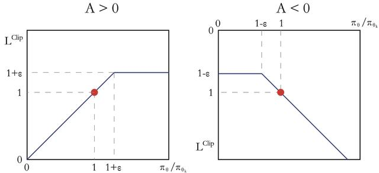

# Actor-Critic 算法

我们已经有了基于值函数的方法（DQN）和基于策略的方法（REINFORCE），其中基于值函数的方法只学习一个价值函数，而基于策略的方法只学习一个策略函数。那么，一个很自然的问题是，有没有什么方法既学习价值函数，又学习策略函数呢？答案就是 Actor-Critic。Actor-Critic 是囊括一系列算法的整体架构，目前很多高效的前沿算法都属于 Actor-Critic 算法，本章接下来将会介绍一种最简单的 Actor-Critic 算法。需要明确的是，Actor-Critic 算法本质上是基于策略的算法，因为这一系列算法的目标都是优化一个带参数的策略，只是会额外学习价值函数，从而帮助策略函数更好地学习。

## Actor-Critic

回顾一下，在 REINFORCE 算法中，目标函数的梯度中有一项是轨迹回报，用于指导策略梯度的更新。REINFORCE 算法用蒙特卡洛方法来估算 $Q(s, a)$，能不能考虑将一个值函数来代替策略梯度中的 $Q$ 值呢？这还是 Actor-Critic 算法所做的。在策略梯度中，可以把梯度写成如下一般形式：

$$
g = \mathbb{E} \left[ \sum_{t=0}^{T} \psi_t \nabla_{\theta} \log \pi_{\theta}(a_t|s_t) \right]
$$

其中，$\psi_t$ 可以有很多种形式：

1. $\sum_{t'=0}^{T} \gamma^{t'} r_{t'}$：轨迹的总回报；
2. $\sum_{t'=t}^{T} \gamma^{t'-t} r_{t'}$：动作 $a_t$ 之后的回报；
3. $\sum_{t'=t}^{T} \gamma^{t'-t} r_{t'} - b(s_t)$：基线改进；
4. $Q^{\pi_{\theta}}(s_t, a_t)$：动作价值函数；
5. $A^{\pi_{\theta}}(s_t, a_t)$：优势函数；
6. $r_t + \gamma V^{\pi_{\theta}}(s_{t+1}) - V^{\pi_{\theta}}(s_t)$：时序差分残差。

REINFORCE 通过蒙特卡洛采样的方法对策略梯度的估计是无偏的，但是方差过大。我们可以用式(3)引入基线函数 (baseline function) $b(s_t)$ 来减小方差。比如，我们可以用 Actor-Critic 算法估计一个轨迹的价值函数 $Q$，代替蒙特卡洛样本得到的回报，这便是式(4)。这时候，我们可以把状态价值函数 $V$ 作为基线，从 $Q$ 函数减去这个 $V$ 值就则得到 $A$ 函数，即我们称之为优势函数 (advantage function)，这便是式(5)。更进一步，我们可以利用 $Q = r + \gamma V$ 逼近得到式(6)。

这里主要考虑形式(6)，即逼近时序差分残差 $\psi_t = r_t + \gamma V^{\pi_{\theta}}(s_{t+1}) - V^{\pi_{\theta}}(s_t)$ 来指导策略梯度更新计算。事要上，用 $Q$ 值或者 $V$ 值本质上也是用奖励来指导动作，但是用神经网络进行估计的方法可以减小方差、提高鲁棒性。除此之外，REINFORCE 算法基于蒙特卡洛样本，尺能在序列结束后才进行更新，这同时也要求任务有明确的步数，而 Actor-Critic 算法则可以在每一步之后都进行更新，并且不对于任务的步数做假想。

我们将 Actor-Critic 分为两个部分，Actor（策略网络）和 Critic（价值网络）：

-Actor 要做的是与环境交互，并在 Critic 价值函数的指导下用策略梯度学习一个更好的策略。
- Critic 要做的是通过 Actor 与环境交互收集的数据学习一个价值函数，这个价值函数会用于判断在当前状态什么动作是好的，什么动作不是好的，进而帮助 Actor 进行策略更新。

Actor 的更新采用策略梯度原则，那 Critic 知道更新的呢？我们将 Critic 价值网络表示为 $V_w$，参数为 $w$。于是，我们可以采取时序差分的学习方法，对于单个数据定义又知价值函数的损失函数：

$$
\mathcal{L}(w) = \frac{1}{2} \left( r + \gamma V_w(s_{t+1}) - V_w(s_t) \right)^2
$$

与 DQN 中一样，我们采取类似于目标网络的方法，将上述 $r + \gamma V_w(s_{t+1})$ 作为时序差分目标标记，不会产生梯度来更新新的价值函数。由此，价值函数的梯度为：

$$
\nabla_w \mathcal{L}(w) = - \left( r + \gamma V_w(s_{t+1}) - V_w(s_t) \right) \nabla_w V_w(s_t)
$$

然后使用梯度下降法来更新 Critic 价值网络参数 $w$。

Actor-Critic 算法的具体流程如下：

- 初始化策略网络参数 $\theta$，价值网络参数 $w$
- **for** 序列 $e = 1 \to E$ **do**：
  - 用当前策略 $\pi_{\theta}$ 采样轨迹 $\{s_1, a_1, r_1, s_2, a_2, r_2, \dots\}$
  - 为每一步数据计算 $\delta_t = r_t + \gamma V_w(s_{t+1}) - V_w(s_t)$
  - 更新价值参数 $w = w + \alpha_w \sum_t \delta_t \nabla_w V_w(s_t)$
  - 更新策略参数 $\theta = \theta + \alpha_{\theta} \sum_t \delta_t \nabla_{\theta} \log \pi_{\theta}(a_t|s_t)$
- **end for**

## TRPO

基于策略梯度的方法包括策略梯度算法和 Actor-Critic 算法。这些方法虽然简单、直观，但在实际应用过程中会遇到训练不稳定的情况。回顾一下基于策略梯度的方法：参数化智能体的策略，并设计衡量策略好坏的目标函数，通过梯度上升的方法来最大化这个目标函数，使得策略最优。具体来说，假设 $\theta$ 表示策略 $\pi_{\theta}$ 的参数，定义：

$$
J(\theta) = \mathbb{E}_{s_0} \left[ V^{\pi_{\theta}}(s_0) \right] = \mathbb{E}_{\pi_{\theta}} \left[ \sum_{t=0}^{\infty} \gamma^t r(s_t, a_t) \right]
$$

基于策略梯度的方法的目标是找到：

$$
\theta^* = \arg \max_{\theta} J(\theta)
$$

策略梯度法主要沿着 $\nabla_{\theta} J(\theta)$ 方向以更新策略参数 $\theta$。但是这种算法有一个明显的缺点：当策略网络参数更新，沿着策略梯度更新参数，很可能一步比上次大，策略变化幅度过大，进而影响到训练动态。

针对以上问题，我们考虑在更新时找到一块信任区域（trust region），在这个区域上更新策略时能够得到某种策略性能的安全性保证，这就是信任区域策略优化（trust region policy optimization，TRPO）算法的主要思想。TRPO 算法在 2015 年被提出，它在理论上能够保证策略学习的性能单调性，并在实际应用中取得了比策略梯度算法更好的效果。这个信任区间就是 KL 散度。

## PPO

TRPO 的优化目标：

$$
\max_{\theta} \mathbb{E}_{s \sim \nu^{\pi_{\theta_k}}} \mathbb{E}_{a \sim \pi_{\theta_k}(\cdot|s)} \left[ \frac{\pi_{\theta}(a|s)}{\pi_{\theta_k}(a|s)} A^{\pi_{\theta_k}}(s, a) \right], s.t. \mathbb{E}_{s \sim \nu^{\pi_{\theta_k}}} [D_{KL}(\pi_{\theta_k}(\cdot|s), \pi_{\theta}(\cdot|s))] \leq \delta
$$

TRPO 使用紧约束展开近似，共轭梯度、线性搜索等方式直接按次解。PPO 的优化目标与 TRPO 相同，但 PPO 用了一些相对简单的方法来求解。具体来说，PPO 使用两种形式，一是 PPO-惩罚，二是 PPO-截断，我们接下来探讨两种补充形式进行介绍。

**PPO-惩罚**

PPO-惩罚 (PPO-Penalty) 用拉格朗日乘数法直接将 KL 散度的限制放进了目标函数中，这就变成了一个无约束的优化问题，在迭代的过程中不断更新 KL 散度的系数。即：

$$
\arg \max_{\theta} \mathbb{E}_{s \sim \nu^{\pi_{\theta_k}}} \mathbb{E}_{a \sim \pi_{\theta_k}(\cdot|s)} \left[ \frac{\pi_{\theta}(a|s)}{\pi_{\theta_k}(a|s)} A^{\pi_{\theta_k}}(s, a) - \beta D_{KL}(\pi_{\theta_k}(\cdot|s), \pi_{\theta}(\cdot|s)) \right]
$$

令 $d_k = D_{KL}^{\nu}(\pi_{\theta_k}, \pi_{\theta})$，$\beta$ 的更新规则如下：

1. 如果 $d_k < \delta / 1.5$，那么 $\beta_{k+1} = \beta_k / 2$
2. 如果 $d_k > \delta \times 1.5$，那么 $\beta_{k+1} = \beta_k \times 2$
3. 否则 $\beta_{k+1} = \beta_k$

其中，$\delta$是事先设定的一个超参数，用于限制学习策略和之前一轮策略的差距。

**PPO-截断**

PPO 的另一种形式 PPO-截断 (PPO-Clip) 更加直接，它在目标函数中进行限制，以保证新的参数和旧的参数的差距不会太大，即：

$$
\arg \max_{\theta} \mathbb{E}_{s \sim \nu^{\pi_{\theta_k}}} \mathbb{E}_{a \sim \pi_{\theta_k}(\cdot|s)} \left[ \min \left( \frac{\pi_{\theta}(a|s)}{\pi_{\theta_k}(a|s)} A^{\pi_{\theta_k}}(s, a), \operatorname{clip} \left( \frac{\pi_{\theta}(a|s)}{\pi_{\theta_k}(a|s)}, 1 - \epsilon, 1 + \epsilon \right) \right) \right]
$$

其中 $\operatorname{clip}(x, l, r) := \max(\min(x, r), l)$，即把 $x$ 限制在 $[l, r]$ 内。上式中 $\epsilon$ 是一个超参数，表示进行截断 (clip) 的范围。

如果 $A^{\pi_{\theta_k}}(s, a) > 0$，说明这个动作的价值高于平均，最大化这个式子会增大 $\frac{\pi_{\theta}(a|s)}{\pi_{\theta_k}(a|s)}$，但不会让其超过 $1 + \epsilon$。反之，如果 $A^{\pi_{\theta_k}}(s, a) < 0$，最大化这个式子会减小 $\frac{\pi_{\theta}(a|s)}{\pi_{\theta_k}(a|s)}$，但不会让其超过 $1 - \epsilon$。

