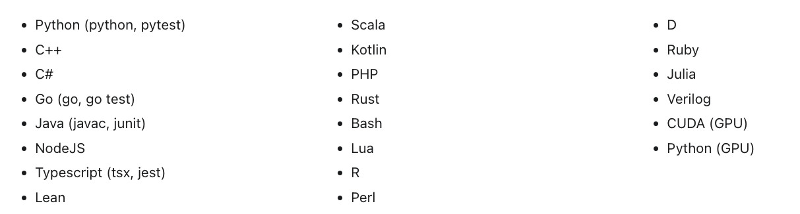
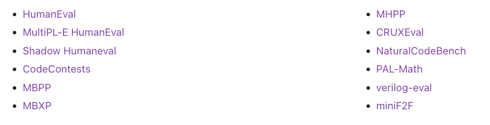

# veRL-multiturn Sandbox

当前版本的 `veRL` 在 `swedev` 任务下与环境交互的文档，尽可能还原了源码里 sandbox 的调用方式，用于快速搭建一个 sandbox for veRL

## 建立 session

- URL: `http://60.165.239.98:5000/start_instance`
- 方法: `POST`
- 请求参数
  - <string> `instance_hash` veRL 端根据训练数据中的 `instance_id` 传递过来，用于标识要处理的项目/任务/PR。
- 返回参数
  - <string> `sid` session id，用于标识当前会话。后续的 `/process_action`、`/postprocess`、`/compute_reward` 都会带上这个 `sid`，告诉 sandbox 是哪一个任务。

- 功能
  1. Sandbox 可以在此时建立一个 session 上下文并存到内存或数据库里：`context_map[sid] = {...}`；
  2. 后续的接口就可以通过 `sid` 找回任务状态。

**example**

- request

```json
{
    "instance_hash": "3864552457764042195"
}
```

- response

```json
{
  "sid": "5671949450826943757"
}
```

**对应源码**

```python
# verl.utils.swedev_utils.py
async def initialize_runtime(instance_id):
    url = get_api(type="start")
    payload = {"instance_hash": instance_id}
    try:
        async with aiohttp.ClientSession() as session:
            async with session.post(url, json=payload, timeout=600) as response:
                result = await response.json()
                return result
    except Exception as e:
        print(f"Initializing - API call failed: {e}")
        return None
```

```python
# 调用点：verl.workers.agentic.async_rollout.py AsyncRollout.generate_sequence.swedev_start()
async def swedev_start(index):
            try:
                result = await initialize_runtime(prompts.batch['instance_id'][index // n].item())
                print(result)
                return {
                    "prompt_ids": _pre_process_inputs(tokenizer.pad_token_id, input_ids[index]),
                    "sid": result["sid"],
                    "sids": int(result["sid"]), # will be treated as a obs metric, thus, will be gathered into batch, and later used in reward acquisition
                }
            except Exception as e:
                # TODO: return true for handle api instead of raising an error
                print(f"Error processing instance: {e}")
                # in original logic, mismatched sids count and instance_ids count will cause error eventually, better raise now
                raise
```

## 处理 action

- URL: `http://60.165.239.98:5000/process_action`
- 方法: `POST`
- 请求参数
  - <string> `sid`
  - <string> `content` prompt
- 返回参数
  - <string> `content` response

- 功能
  1. sandbox 把 `content` 视为一次action提交，如将用户/模型产生的代码写进临时文件并运行测试。

**example**

- request

```json
{
  "sid": "5671949450826943757",
  "content": "def solve():\n    pass"
}
```

- response

```json
{
  "content": "No errors found in test."
}
```

**对应源码**

```python
# verl.utils.swedev_utils.py
async def call_observation_api(sid, text: str):
    if isinstance(sid, torch.Tensor):
        sid = sid.item()
    url = get_api(type="action")
    payload = {
        "sid": sid,
        "content": text,
    }
    try:
        async with aiohttp.ClientSession() as session:
            async with session.post(url, json=payload) as response:
                return await response.json()
    except Exception as e:
        print(f"Observation - API call failed: {e}")
        return None
```

```python
# 调用点：verl.workers.agentic.tasks.py
async def swe_dev_obs(action_ids, sid, tokenizer, **kwargs):
    action = tokenizer.decode(action_ids, skip_special_tokens=False)
    if is_stop(action):
        print(f"Action stop: {action}")
        return {"done": True, "ids": [], "observation_times": 0}

    result = call_observation_api(sid, action)
    # TODO(haoran): handle here
    try:
        obs = result["content"]
    except:
        obs = "Error"
    return {"done": False, "ids": tokenizer.encode(obs), "observation_times": 1}
```

## 后处理

- URL: `http://60.165.239.98:5000/postprocess`
- 方法: `POST`
- 请求参数
  - <string> `sid` session id
- 返回参数
  - 自定义
- 功能
  1. 多轮对话结束后收尾，sandbox可在这里执行"清理资源""停止容器""合并最终日志"等。
  2. 返回 JSON 的内容不参与后续对话，但可记录到日志。

**example**

- request

```json
{
  "sid": "5671949450826943757"
}
```

- response

```json
{
}
```

**对应源码**

```python
# verl.utils.swedev_utils.py
async def call_postprocess_api(sid: str):
    url = get_api(type="postprocess")
    if isinstance(sid, torch.Tensor):
        sid = sid.item()
    payload = {"sid": sid}
    try:
        async with aiohttp.ClientSession() as session:
            async with session.post(url, json=payload, timeout=600) as response:
                return await response.json()
    except Exception as e:
        print(f"Postprocess - API call failed: {e}")
        return None
```

```python
# 调用点：verl.workers.agentic.tasks.py
async def swe_dev_end(sid, _done):
    await asyncio.to_thread(call_postprocess_api, sid)
```

## 计算 reward

- URL: `http://60.165.239.98:5000/compute_reward`
- 方法: `POST`
- 请求参数
  - <string> `sid` session id
- 返回参数
  - <int> `reward`
  - <int> `f2p_count` (Optional)
  - <int> `f2p_total` (Optional)

- 功能
  1. 根据前面 `/process_action` 的累计结果，执行自动化测试或其他判断，然后得出 reward 分数。

**example**

- request

```json
{
  "sid": "5671949450826943757"
}
```

- response

```json
{
  "reward": 0.9,
  "f2p_count": 9,
  "f2p_total": 10
}
```

**对应源码**

```python
# verl.workers.reward_manager.swedev.py SWEDevRewardManager.fetch_reward()
async def fetch_reward(self, sid: torch.Tensor, session: aiohttp.ClientSession) -> float:
        """Fetch reward from API for a single instance"""
        try:
            payload = {"sid": sid.item()}
            async with session.post(get_api(type="reward"), json=payload, timeout=aiohttp.ClientTimeout(total=300)) as response:
                if response.status == 200:
                    result = await response.json()
                    return float(calc_reward(result))
                else:
                    print(f"fetch_reward - API request failed with text {response.text} for sid: {sid}")
                    return 0.0
        except Exception as e:
            print(f"fetch_reward - Error fetching reward for sid {sid}: {e}")
            return 0.0
```

```python
# verl.utils.swedev_utils.py
def calc_reward(reward_json):
    # patch_is_None
    # patch_exists
    # patch_succesfully_applied
    # resolved
    # f2p_count
    # f2p_total
    # p2p_count
    # p2p_total

    if 'reward' in reward_json:
        return reward_json['reward']
    else:
        try:
            return reward_json['f2p_count'] / reward_json['f2p_total']
        except:
            return 0.0
```

```python
# verl.utils.swedev_utils.py
def get_api(type):
    base_url = random.sample([
        "http://60.165.239.98:5000",
        "http://60.165.239.99:5000"
    ], 1)[0]
    # TODO: only support shouyun1 now
    base_url = "http://60.165.239.98:5000"
    assert type in ["reward", "action", "start", "postprocess"]
    if type == "reward":
        return f"{base_url}/compute_reward"
    elif type == "action":
        return f"{base_url}/process_action"
    elif type == "start":
        return f"{base_url}/start_instance"
    elif type == "postprocess":
        return f"{base_url}/postprocess"
```

## 流程图

```
train.py
  └── main() / run_ppo()
        └── main_task()
              ├── 构造 reward_fn = SWEDevRewardManager(...)
              ├── 初始化 RayPPOTrainer(..., reward_fn=reward_fn)
              │     └── trainer.fit()
              │           └── rollout_wg.generate_sequences()
              │                 └── AsyncRollout.generate_sequences()
              │                       └── swedev_start()（/start_instance）
              │                       └── swe_dev_obs()（/process_action）
              │                       └── swe_dev_end()（/postprocess）
              │
              └── reward_fn(data)：
                    └── SWEDevRewardManager.__call__()
                          └── asyncio.run(fetch_reward())
                                └── POST /compute_reward
```

# SandboxFusion 集成方案

veRL-multiturn 可以使用 SandboxFusion 作为更强大的代码沙箱引擎，提供更广泛的语言支持和评估能力。以下是 SandboxFusion 的详细说明及其与 veRL 集成的方案。

## SandboxFusion 简介

SandboxFusion 是一个用于**代码执行**和**评估**的多功能平台，支持超过 20 种编程语言和 10 多个代码相关的评估数据集。为云部署而设计，它提供两个主要功能：运行代码和评估解决方案的正确性。该平台支持*脚本*和*Jupyter*两种执行模式，可通过*YAML文件*设置自定义安全隔离级别。每次执行时，它会创建一个临时目录，执行后自动删除，并使用 base64 编码处理文件传输。

主要功能：
- **运行代码**
- **评估问题的正确性**

### 支持的编程语言



### 实现的开源数据集



## 本地部署

```bash
docker run -it -p 8080:8080 volcengine/sandbox-fusion:server-20241204
```

## 使用方法

### 代码沙箱

> 💡 提示：
> 简单的演示页面：[http://localhost:8080/SandboxFusion/playground/sandbox](http://localhost:8080/SandboxFusion/playground/sandbox)

执行以下命令请求沙箱运行 Python 代码片段：

```bash
curl 'http://localhost:8080/run_code' \
  -H 'Content-Type: application/json' \
  --data-raw '{"code": "print(\"Hello, world!\")", "language": "python"}'
```

示例输出：

```json
{
  "status": "Success",
  "message": "",
  "compile_result": null,
  "run_result": {
    "status": "Finished",
    "execution_time": 0.016735315322875977,
    "return_code": 0,
    "stdout": "Hello, world!\\n",
    "stderr": ""
  },
  "executor_pod_name": null,
  "files": {}
}
```

也可以使用 Python 脚本发送类似请求。下面是运行 C++ 代码的示例：

```python
import requests
import json

response = requests.post('http://localhost:8080/run_code', json={
    'code': '''
#include <iostream>

int main() {
    std::cout << "Hello, world!" << std::endl;
    return 0;
}
''',
    'language': 'cpp',
})

print(json.dumps(response.json(), indent=2))
```

### 数据集

> 💡 提示：
> 简单的演示页面：[http://localhost:8080/SandboxFusion/playground/datasets](http://localhost:8080/SandboxFusion/playground/datasets)

SandboxFusion 集成了多种数据集类型，包括 HumanEval、AutoEval 和 CommonOJ，每种类型都有自己的数据格式和评估方法。用户通过 Python SDK 与这些数据集交互，使用 `run_code`、`get_prompts` 和 `submit` 等函数执行代码和评估。SDK 支持并发请求，允许通过环境变量或函数配置 API 端点。

获取 MBPP 所有问题的提示：

```bash
curl 'http://localhost:8080/get_prompts' \
  -H 'Content-Type: application/json' \
  --data-raw '{"dataset":"mbpp","config":{}}'
```

提交模型输出以获取问题的**正确性结果**：

```bash
curl 'http://localhost:8080/submit' \
  -H 'Content-Type: application/json' \
  --data-raw '{"dataset":"mbpp","id":"11","completion":"Here is a Python function that removes the first and last occurrence of a given character from a string:\n\n```python\ndef remove_Occ(s, char):\n    first_occ = s.find(char)\n    last_occ = s.rfind(char)\n    \n    if first_occ == -1 or first_occ == last_occ:\n        return s\n    \n    # Remove the first occurrence\n    s = s[:first_occ] + s[first_occ + 1:]\n    \n    # Adjust the index for the last occurrence since the string is now one character shorter\n    last_occ -= 1\n    \n    # Remove the last occurrence\n    s = s[:last_occ] + s[last_occ + 1:]\n    \n    return s\n\n# Test the function\nassert remove_Occ(\"hello\", \"l\") == \"heo\"\n```\n\nThis function works as follows:\n1. It finds the index of the first occurrence of the given character.\n2. It finds the index of the last occurrence of the given character.\n3. If the character does not exist in the string or only occurs once, it simply returns the original string.\n4. Otherwise, it constructs a new string by removing the first occurrence and then adjusts the index for the last occurrence before removing it.\n\nYou can run the provided test to ensure the function works as expected.","config":{}}'
```

## SandboxFusion API 使用

### 数据集管理

- **列出数据集**：`/list_datasets` - 列出所有已注册数据集。
- **列出 ID**：`/list_ids` - 列出指定数据集内的所有 ID。
- **按 ID 获取提示**：`/get_prompt_by_id` - 使用 ID 和数据集信息检索单个提示。
- **获取提示**：`/get_prompts` - 检索数据集中的所有提示。

### 代码执行

- **运行代码**：`/run_code` - 执行单个代码块。参数：语言、超时设置、输入/输出文件。
- **运行 Jupyter**：`/run_jupyter` - 在 Jupyter notebook 环境中执行多个代码单元。

### 评估

- **提交**：`/submit` - 在数据集内提交单个问题的解决方案，接收其正确性和执行详情的反馈。
- **获取指标**：`/get_metrics` - 检索数据集的聚合指标。
- **获取指标函数**：`/get_metrics_function` - 提供用于生成指标的函数。

### Python SDK 使用

安装：

```bash
pip install sandbox-fusion
```

配置 API 端点：

```python
from sandbox_fusion import set_endpoint
set_endpoint("http://your-api-endpoint.com")
```

运行代码示例：

```python
from sandbox_fusion import run_code, RunCodeRequest
run_code(RunCodeRequest(code='print(123)', language='python'))
```

提交示例：

```python
from sandbox_fusion import submit, SubmitRequest
submit(SubmitRequest(...))
```

并发请求示例：

```python
from sandbox_fusion import run_concurrent, run_code, RunCodeRequest
codes = [f'print({i})' for i in range(123, 456)]
results = run_concurrent(run_code, args=[[RunCodeRequest(code=c, language='python')] for c in codes])
```

## veRL 与 SandboxFusion 集成方案

将 veRL-multiturn 与 SandboxFusion 集成，可以构建一个适配器层，将 veRL 的 API 映射到 SandboxFusion 的 API：

1. `/start_instance` → 创建临时上下文，存储 `instance_hash` 和相关信息
2. `/process_action` → 调用 SandboxFusion 的 `/run_code` 或 `/submit`，根据内容类型和任务要求
3. `/postprocess` → 清理临时资源
4. `/compute_reward` → 根据代码执行结果和测试通过情况计算奖励

这种集成可以利用 SandboxFusion 的强大功能，同时保持与现有 veRL 系统的兼容性。

## 常见问题

**Q：为什么不采用创建Session+每个请求执行一个Cell的方式，而是要每次执行全部Cell？**

**A：**为了维持沙盒服务的无状态特性，降低维护和使用成本。沙盒服务于离线场景，吞吐的重要性大于延迟。

**潜在改进：**设计一个online sandbox来服务Server-based Multi-turn rollout

# R1-Searcher for veRL Multiturn Rollout

基于尽快搭建 sandbox 看到 multiturn veRL 训练效果的需求，整理了一下当前 veRL 源码中的改动点和需要考虑的问题。

## Current Implementation in veRL

1. 现在的 verl 里 hotpotqa 任务用的是 NaiveRewardManager，分数是本地计算的并且没有真正实现，且 hotpotqa.py 里算分按的是gsm8k的格式（这个问题同步一下 R1-Searcher/train/reward_server_qwen_zero.py 里的格式改改prompt就行）。
2. http 请求对应的类是 SWEDevRewardManager （应该改名叫 HTTPRewardManager），swedev 任务的 reward 计算比较复杂才用到的sandbox，所以这个类封装了请求。

## 现在的调用关系

```
main_ppo.py
  └── main() / run_ppo()
        └── main_task()
              ├── reward_fn = NaiveRewardManager (...)
              │		└── self.compute_score = _default_compute_score
              │           └── elif data_source in ['hotpotqa', 'hotpotQA']:
              │                 └── hotpotqa.compute_score(...extractor_urls=[], checker_urls=[]...)
```

## 需求

`main_ppo.py` 147行加一个分支，`HTTPRewardManager ` 直接复制 `SWEDevRewardManager`  的实现

```python
    if reward_manager_name == 'naive':
        from verl.workers.reward_manager import NaiveRewardManager
        reward_manager_cls = NaiveRewardManager
    elif reward_manager_name == 'prime':
        from verl.workers.reward_manager import PrimeRewardManager
        reward_manager_cls = PrimeRewardManager
    elif reward_manager_name == "swedev":
        from verl.workers.reward_manager import SWEDevRewardManager
        reward_manager_cls = SWEDevRewardManager
############################## NEW ##############################
    elif reward_manager_name == "http":
        from verl.workers.reward_manager import HTTPRewardManager
        reward_manager_cls = HTTPRewardManager
############################## NEW ##############################
    else:
        raise NotImplementedError
```

## 需要讨论的问题

1. process_action 和 postprocessing 具体做什么。我理解是 process_action 接收模型当下的回答然后给出反馈；postprocessing 在swedev 里是清除资源（关闭docker），之前的结果都写在文件里，所以最后计算 reward 的时候直接去读文件（personally agree，不知道有没有别的想法）。

