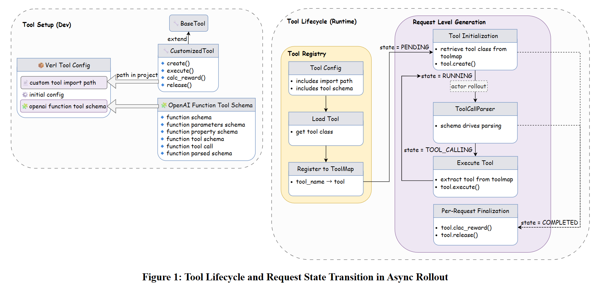
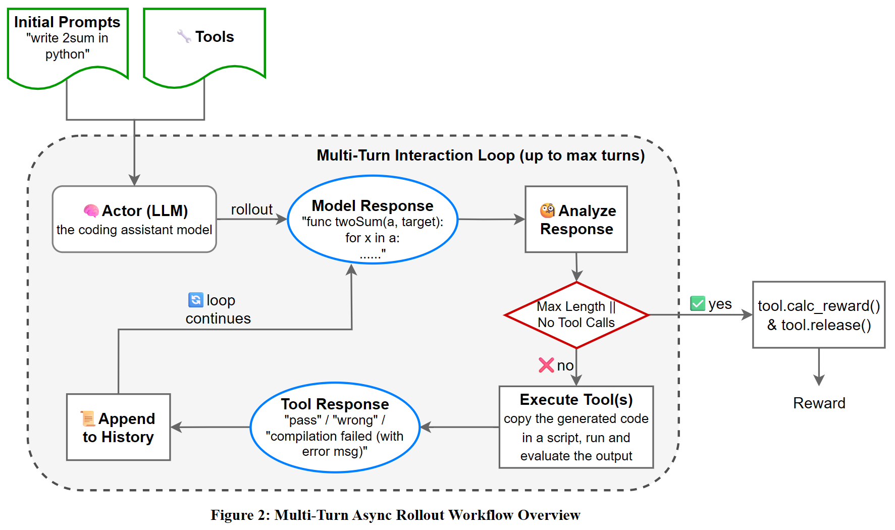

# SGLang, verl, OpenBMB 与清华大学团队联合开源：在主流 RLHF 框架上首次支持多轮交互与工具调用

作者：SGLang 团队，2025 年 5 月 12 日

大家好，经过两个月的密集开发和最后冲刺，我们很高兴与大家分享一个重要成果：由 SGLang 团队主导，联合清华大学、OpenBMB 和 verl 团队的研究人员共同打造的首个支持多任务、多工具混合训练的端到端多轮 RLHF 开源框架现已正式发布！该框架已在 verl 平台完成集成并开放使用，为 Agentic 强化学习训练提供了全新的解决方案。

PR 链接：[volcengine/verl#1037](https://github.com/volcengine/verl/pull/1037)

训练效果展示： [wandb log](https://wandb.ai/swordfaith/gsm8k_async_rl/runs/0pv3qwcy?nw=nwuserswordfaith)

注：在训练效果中，我们使用 Qwen2.5-3B-Instruct 模型在 GSM8K 任务上进行多轮训练，采用 GRPO 策略，FSDP+TP 混合并行，启用工具调用，在 8 块 H100 GPU 上使用 256 的 batch_size。

## 我们解决了什么问题？

多轮 RLHF 对于训练语言模型处理复杂和交互式对话至关重要，例如编码任务，前一轮生成的 code 需要反馈并作为下一轮生成的输入。然而，现有框架缺乏对多轮推理的支持，也没有标准化的工具调用方法。

我们的目标是：

- 高效支持异步多轮交互。
- 以易于扩展的方式将工具调用集成到 RLHF 工作流中。
- 支持多种多轮任务、多种工具集合一起训练
- 在复杂、适合多轮的任务上验证我们的训练性能。
- 在大规模、分布式环境中可靠运行。

## 我们的解决方案

1. **从 batch_level 到 request_level 的异步多轮推理**：我们扩展了 verl 的推理接口（rollout engine），以支持异步的、基于每个请求的多轮交互，其中每个对话都可以独立地进行带工具调用的多轮推理，与 batch 结构解耦。
2. **统一工具调用接口**：我们采用 `OpenAIFunctionToolSchema` 格式，可与 verl 的 Model Context Protocol 和 Agent2Agent Protocol 相互转换。这使得工具能够无缝集成到训练和推理工作流中。
3. **参数注入机制**：用户可在采样时动态选择工具（通过 `need_tools_kwargs`）并注入调用参数（`tool_kwargs`），从而简化自定义工具的集成。
4. **GRPO 策略优化**：我们采用 GRPO 策略（`adv_estimator = grpo`）来实现多轮序列上稳定的奖励传播。
5. **多任务、多工具混合训练**： 通过将样本级参数注入机制与 verl 基于 `data_source` 路由 reward_func 的机制相结合，支持了多任务、多工具混合训练。

## 如何使用

### 环境配置

**创建新的 Docker 容器**

```bash
docker run \
    -it \
    --shm-size 32g \
    --gpus all \
    -v /models/shared/.cache:/root/.cache \
    --ipc=host \
    --network=host \
    --privileged \
    --name sglang_{your-name} \
    lmsysorg/sglang:dev \
    /bin/zsh
```

如果退出容器后需要重新启动：

```bash
docker start -i sglang_{your-name}
```

**更新 Python 并使用虚拟环境**

```bash
apt update
apt install -y python3.10 python3.10-venv
python3 -m ensurepip --upgrade

# 创建虚拟环境
python3 -m venv ~/.python/veRL-multiturn-rollout

# 激活虚拟环境
source ~/.python/veRL-multiturn-rollout/bin/activate

# 安装 uv
python3 -m pip install uv
```

**安装 veRL upstream**

```bash
cd ~
git clone https://github.com/volcengine/verl.git
cd verl

# 安装 SGLang
python3 -m uv pip install -e ".[sglang]"

# 手动安装 flash-attn
python3 -m uv pip install wheel
python3 -m uv pip install packaging
python3 -m uv pip install flash-attn --no-build-isolation --no-deps

# 安装 verl
python3 -m uv pip install .
python3 -m uv pip install -r ./requirements.txt
```

### 在 8 H100 上展开测试

**设置 `WANDB_API_KEY`**

如果不理解如何获取 API Key，请参考 [此处](https://community.wandb.ai/t/where-can-i-find-the-api-token-for-my-project/7914)。

```bash
export WANDB_API_KEY={YOUR_WANDB_API_KEY}

# 定义时间戳函数
function now() {
    date '+%Y-%m-%d-%H-%M'
}
```

**预处理数据集**

```bash
python3 ./examples/data_preprocess/gsm8k_multiturn_w_tool.py
```

**进行测试**

```bash
# 确保 now() 函数已经定义
# 创建日志目录
mkdir -p logs

# 设置 GPU 并运行，使用合适的日志路径
export CUDA_VISIBLE_DEVICES=0,1,2,3,4,5,6,7

nohup bash examples/sglang_multiturn/run_qwen2.5-3b_gsm8k_multiturn.sh trainer.experiment_name=qwen2.5-3b_rm-gsm8k-sgl-multiturn-$(now) > logs/gsm8k-$(now).log 2>&1 &
```

### 自定义配置

**基础配置**

启用多轮推理需在配置中设置以下字段：

```yaml
actor_rollout_ref:
  rollout:
    name: "sglang_async"
    multi_turn:
      enable: True
```

此配置激活了 `AsyncSGLangRollout` 引擎，支持多轮交互。

**工具配置**

工具是该框架的核心，支持与环境交互（如执行脚本、查询 API 或计算奖励）。集成自定义工具需在单独的 `YAML` 文件中定义其行为，并在配置中引用。步骤如下：

1. 在 Python 中定义工具逻辑

每个工具需继承 `BaseTool`，实现以下方法：

- `create(instance_id, ...)`：为每个推理初始化工具状态。如果工具无需维护状态，可以跳过。
- `execute(instance_id, parameters, ...)`：执行工具的核心功能（例如评估输出、调用 API、执行搜索、运行代码解释器等），工具的响应将附加到消息历史中，后续将支持返回单步奖励和工具指标。
- `calc_reward(instance_id)`：根据工具状态和交互计算奖励。
- `release(instance_id)`：清理分配的任何资源。如果工具无需维护状态，可以跳过。

2. 在 `YAML` 中描述工具

使用 OpenAI 的 `function` 调用格式为每个工具提供一个 schema，包括名称、描述、参数和类型。然后在 `rollout` 配置中引用此 `YAML` 文件。

```yaml
actor_rollout_ref:
  rollout:
    multi_turn:
      tool_config_path: <path_to_tool_yaml_file>
      format: chatml
```

- `tool_config_path`：指向定义所有工具 schema 和关联 Python 类的 YAML 文件路径。
- `format`：工具交互消息的格式（目前仅支持 `chatml`）。



### 示例：GSM8K 工具配置

为了说明如何配置工具，我们提供了一个基于 `Gsm8kTool` 的示例，该工具旨在评估 GSM8K 数学问题的答案以计算奖励。该工具配置定义在[这里](https://github.com/volcengine/verl/blob/main/examples/sglang_multiturn/config/tool_config/gsm8k_tool_config.yaml)。

配置说明：

- **class_name**：指定实现工具逻辑的 Python 类。该类必须在代码库中可访问。
- **config**：一个可选字段，用于在 `__init__` 方法中使用的额外工具特定配置（例如 API 密钥、模型参数）。
- **tool_schema**：使用与 `OpenAIFunctionToolSchema` 兼容的 schema 定义工具接口。
- **type: "function"**：表示工具是基于函数的工具。
- **function.name**：工具的标识符 (`calc_gsm8k_reward`)，用于定位工具类。
- **function.description**：对工具用途的人类可读的描述，在 `chat template` 中使用供模型读取。
- **function.parameters**：描述工具期望的输入参数。required 字段定义了必须的参数，也在 `chat template` 中生效。

### 工具交互过程

在推理过程中的工作流如下：

1. 使用 `generate_sequences_with_tools` 预处理，将可用工具集合与该样本的 `tools_kwargs` 字段取交集，挑选出该样本真正需要调用的工具，嵌入 prompt 模板中，并以 message list 的形式组织，供后续推理使用。
2. LLM 基于 schema 生成包含结构化函数调用（工具调用）的响应。
3. `AsyncSGLangRollout` 使用 `FunctionCallParser` 检测并从输出中提取工具调用。
4. 推理引擎使用解析后的参数调用 `tool.execute()`。
5. 工具可能：
   - 返回文本工具响应，该响应将以 `tool` 角色附加到消息历史中。
   - 返回单步奖励和工具指标，可用于计算最终奖励和监控工具性能。
   - 更新工具内部的状态。
6. 引擎将工具响应附加到消息历史中，并继续对话。
7. 在完整的推理结束后，调用工具的 `calc_reward()` 计算最终奖励。

通过这种插件式的架构，工具可以在不同的任务和 Agent 中灵活复用，而无需更改训练的核心代码。



## 整体技术方案

我们在此分享整个开发过程中遇到的技术挑战与目前的解决方案，欢迎大家一同维护开发并且共建更好的方案；

- **多轮推理下的 Loss Masking**：大多数现有 RLHF 框架是单轮的，缺乏对多轮对话中细粒度、token 级别损失遮蔽的支持。然而，在多轮设置中——尤其是在工具交互中——并非每个生成的 `token` 都应被计算。例如，一些工具生成的响应应该从梯度中排除。我们通过设计一个自定义的多轮 loss masking 来解决这个问题，该机制允许对哪些 token 包含在策略梯度更新中进行细粒度控制，从而确保奖励计算的准确性。
- **通用工具 API 设计**：RLHF 训练场景中的环境可能很复杂，Agent 需要定制工具来与外部世界交互。为了支持灵活和可复用的工具集成，我们设计了一个通用的工具接口。这个设计使得用户可以将带有自定义功能的工具注册到推理过程中。通过以 schema 驱动的格式统一工具定义，我们的框架具有高度可扩展性，可以轻松添加工具并在不同任务和模型中复用，无需大量修改核心代码。
- **工具调用中的 SPMD 冲突**：在 TP 设定中，调用外部工具——如 API 调用、脚本评估或奖励计算——必须加以控制，以避免并发问题，否则可能导致在 TP ranks 之间多次调用同一个工具，从而导致不一致或死锁。为避免这种情况，所有工具调用都仅限于 TP rank 0，结果广播到其他 ranks。这避免了由于冗余调用造成的性能瓶颈。
- **多轮交互的异步推理**：同步 rollout 经常受到长尾问题的困扰，即批处理中最慢的样本会延迟整个 pipeline。这个问题在涉及可变长度对话和工具调用的多轮任务中尤为突出。为了解决这个问题，我们在请求级别实现了异步 rollout，允许每个对话独立进行。
- **异步执行中的事件循环冲突**：在测试期间，我们遇到 `async_generate` 死锁的问题。我们发现根本原因在于存在多个并发的事件循环，这违反了 Python 的 asyncio 设计。SGLang 内部管理自己的异步事件循环来协调 token 流、多轮交互和内存高效的生成。我们错误地添加了第二个事件循环，导致程序永久卡住。我们的修复方法是确保所有异步执行都在 SGLang 自己的循环中进行，通过运行现有循环而不是在 `async_generate` 内部调用 `asyncio.run()` 来实现。

## 致谢

感谢中美两地十余名贡献者的辛勤付出：

- ModelBest/OpenBMB
- Tsinghua University
- SGLang RLHF Team
- verl Team


## 后续开发计划

我们在 Roadmap 中持续更新我们的开发计划，请关注 [Multi-turn rollout Status & Roadmap](https://github.com/zhaochenyang20/Awesome-ML-SYS-Tutorial/issues/131) 以获取最新开发状态。

随着初始版本稳定并验证了训练效果，我们现在正在扩展多轮 RLHF 框架的能力和实际应用范围。我们下一阶段的目标包括：

### 第一阶段（已完成）

- 从批量级转向请求级异步推理与工具交互；
- 支持 FSDP 多轮训练并保证训练准确性。

### 第二阶段（进行中）

- 加入真实任务工具（如搜索任务、代码沙箱）；
- 提供 Qwen3 训练示例；
- 集成 FSDP2 以实现更具扩展性的内存高效训练。
- 支持多节点训练；
- 初步支持视觉语言模型（VLM）；
- 适配 Megatron 后端。

###  第三阶段

- 引入 Agentic Trainer，支持完全异步循环：*获取数据 → 推理→ 计算奖励 → 过滤 micro batch*；
- 支持 Partial Rollout 与 Replay Buffer，实现更细粒度的异步和并发；
- 扩展工具种类与任务类型。

### 第四阶段

- 引入用户模拟交互，支持真实用户反馈建模。

### 框架重构计划

- 合并 `sglang` 与 `sglang_async`，统一接口。

我们欢迎社区共同参与，共同推动 RLHF 研究和应用的前沿发展！
