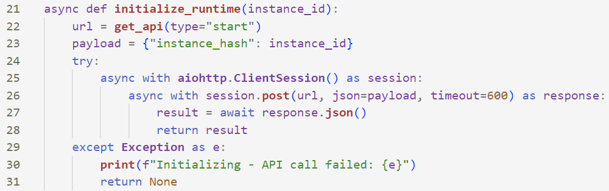
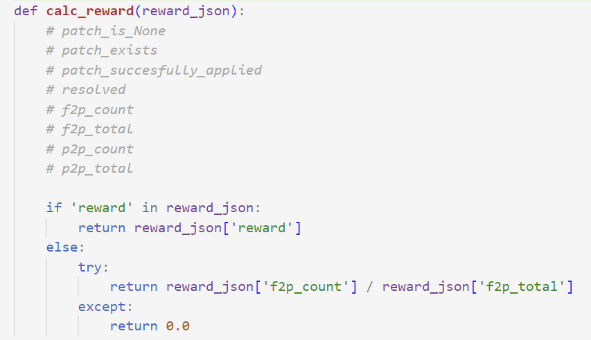

# veRL-multiturn Sandbox

### /start_instance

- URL: `http://http://60.165.239.98:5000/start_instance`
- 方法: `POST`
- 请求参数
  - <string> `instance_hash` VerL 端根据训练数据中的 `instance_id`传递过来，用于标识要处理的项目/任务/PR。
- 返回参数
  - <string> `sid` session id，用于标识当前会话。后续的 `/process_action`、`/postprocess`、`/compute_reward` 都会带上这个 `sid`，告诉 sandbox 是哪一个任务。

- 功能
  1. Sandbox 可以在此时建立一个session上下文 并存到内存或数据库里：`context_map[sid] = {...}`
  2. 后续的接口就可以通过 `sid` 找回任务状态。

#### example

- request

```json
{
    "instance_hash": "3864552457764042195"
}
```

- response

```json
{
  "sid": "5671949450826943757"
}
```

#### 对应源码

`verl.utils.swedev_utils.py initialize_runtime()`



调用点：`verl.workers.agentic.async_rollout.py AsyncRollout.generate_sequence.swedev_start()`


### /process_action

- URL: `http://http://60.165.239.98:5000/process_action`
- 方法: `POST`
- 请求参数
  - <string> `sid` 
  - <string> `content` prompt
- 返回参数
  - <string> `content` response

- 功能
  1. sandbox 把 `content` 视为一次action提交，如将用户/模型产生的代码写进临时文件并运行测试。

#### example

- request

```json
{
  "sid": "5671949450826943757",
  "content": "def solve():\n    pass"
}
```

- response

```json
{
  "content": "No errors found in test."
}
```

#### 对应源码

`verl.utils.swedev_utils.py call_observation_api()`


### /postprocess

- URL: `http://http://60.165.239.98:5000/postprocess`
- 方法: `POST`
- 请求参数
  - <string> `sid` session id
- 返回参数
  - 自定义

1. sandbox接收请求，处理文本内容（如翻译、解析等）。
2. sandbox返回处理后的文本内容（batch）。

#### example

- request

```json
{
  "sid": "5671949450826943757"
}
```

- response

```json
{
}
```

- 功能
  1. 多轮对话结束后收尾，sandbox可在这里执行“清理资源”“停止容器”“合并最终日志”等。
  2. 返回 JSON 的内容不参与后续对话，但可记录到日志。

#### 对应源码

`verl.utils.swedev_utils.py call_postprocess_api()`


### /compute_reward

- URL: `http://http://60.165.239.98:5000/compute_reward`
- 方法: `POST`
- 请求参数
  - <string> `sid` session id
- 返回参数
  - <int> `reward`
  - <int> `f2p_count` (Optional)
  - <int> `f2p_total` (Optional)

- 功能
  1. 根据前面 `/process_action` 的累计结果，执行自动化测试或其他判断，然后得出 reward 分数。

#### example

- request

```json
{
  "sid": "5671949450826943757"
}
```

- response

```json
{
  "reward": 0.9,
  "f2p_count": 9,
  "f2p_total": 10
}
```

#### 对应源码

`verl.workers.reward_manager.swedev.py SWEDevRewardManager.fetch_reward()`




## 流程图

train.py
  └── main() / run_ppo()
        └── main_task()
              ├── 构造 reward_fn = SWEDevRewardManager(...)
              ├── 初始化 RayPPOTrainer(..., reward_fn=reward_fn)
              │     └── trainer.fit()
              │           └── rollout_wg.generate_sequences()
              │                 └── AsyncRollout.generate_sequences()
              │                       └── swedev_start()（/start_instance）
              │                       └── swe_dev_obs()（/process_action）
              │                       └── swe_dev_end()（/postprocess）
              │
              └── reward_fn(data)：
                    └── SWEDevRewardManager.__call__()
                          └── asyncio.run(fetch_reward())
                                └── POST /compute_reward


## bkp(写多了，这里用不上)

### /observation_kilt/ (for d-r task)

- URL: `http://172.16.65.43:8888/observation_kilt/`
- 方法: `POST`
- 请求参数
  - <string> `content` prompt
  - <bool> `translate`: 是否进行翻译（bool）
- 返回参数
  - <list[string]> `content` 模型生成的文本内容

- 功能
  1. sandbox接收请求，处理文本内容（如翻译、解析等）。
  2. sandbox返回处理后的文本内容（batch）。

#### example

- request

```json
{
  "content": "Tell me about the Eiffel Tower",
  "translate": true
}
```

- response

```json
[
  {
    "content": "The Eiffel Tower is in Paris."
  },
  {
    "content": "It was completed in 1889."
  }
]
```

#### 对应源码

 `verl/workers/agentic/async_rollout.py AsyncRollout.generatr_sequences.dr_obs()`

