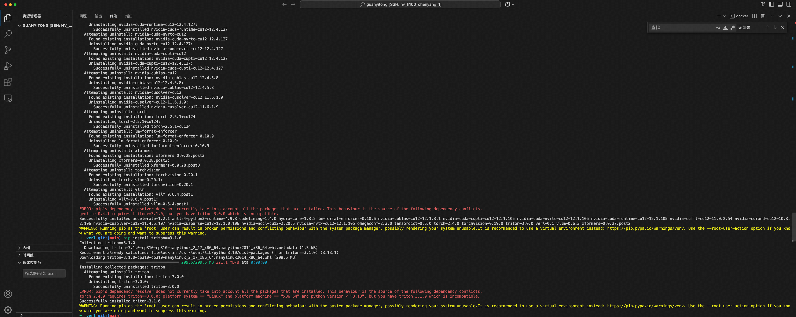
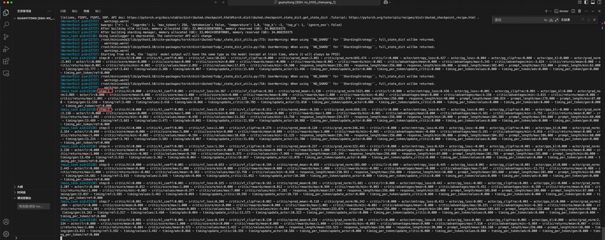

# verl quick start
## 环境设置
>  https://github.com/volcengine/veRL?tab=readme-ov-file#1-from-docker-image

这里使用`nv_h100_chenyang_1`
Chenyang推荐的docker容器会有pip包版本冲突，
```shell
# run
docker run -itd --shm-size 32g --gpus all -v /opt/dlami/nvme/.cache:/root/.cache --name sglang_ke lmsysorg/sglang:dev /bin/zsh

# exec
docker exec -it sglang_ke /bin/zsh
```


所以我这里还是采用verl文档的命令使用docker启动verl，
```shell
docker run --runtime=nvidia -it --rm --shm-size="10g" --cap-add=SYS_ADMIN verlai/verl:vemlp-th2.4.0-cu124-vllm0.6.3-ray2.10-te1.7-v0.0.3

# install the nightly version
git clone https://github.com/volcengine/verl && cd verl && pip3 install -e .
# or install from pypi via `pip3 install verl`
```

## 例子
> https://verl.readthedocs.io/en/latest/start/quickstart.html 

> 一个使用PPO后训练Qwen2.5-0.5B-Instruct的verl的例子，数据集使用GSM8K

> 注意下面python命令都是处于verl目录下

### 步骤 1:
> GSM8K是一个小学数学问题集，一个例子如下，

> 提示词：

> Katy makes coffee using teaspoons of sugar and cups of water in the ratio of 7:13. If she used a total of 120 teaspoons of sugar and cups of water, calculate the number of teaspoonfuls of sugar she used.

> 参考答案：

> The total ratio representing the ingredients she used to make the coffee is 7+13 = <<7+13=20>>20 Since the fraction representing the number of teaspoons she used is 7/20, she used 7/20120 = <<7/20120=42>>42 #### 42

- 把`GSM8K`的数据预处理为`parquet`的格式,这样做有两个好处：
  - `parquet`格式包含计算RL奖励的必要字段。
  - 模型读取数据更快。
```shell
python3 examples/data_preprocess/gsm8k.py --local_dir ~/data/gsm8k
```

### 步骤 2:
- 使用一个“指令微调”之后的模型，也就是SFT之后的模型，一般这种模型带有`-Instruct`尾缀。这里选用了`Qwen2.5-0.5B-Instruct`
- 使用下面命令下载模型
```shell
python3 -c "import transformers; transformers.pipeline('text-generation', model='Qwen/Qwen2.5-0.5B-Instruct')"
```

### 步骤3:
> 对`Qwen2.5-0.5B-Instruct`执行`PPO`训练

#### 奖励模型/函数
- - 这里采用一个预先规则定义好的奖励模型，我们强制模型生成的最后的答案在4 个 “#” 之后（比如#### 42）。我们从参考答案和使用正则表达式匹配模型的输出中提取最终答案。我们给正确答案分配 1 分的奖励，错误答案分配 0.1 分，没有答案分配 0 的奖励。

#### 训练脚本
- 使用如下shell代码启动PPO训练，具体关注`data.train_files` ,`data.val_files`, `actor_rollout_ref.model.path` 和 `critic.model.path`这个几个参数，主要是上述提及的模型`Qwen2.5-0.5B-Instruct`和预处理之后的数据集`GSM8K`。我这里指定了`CUDA_VISIBLE_DEVICES=7`
```shell
CUDA_VISIBLE_DEVICES=7 PYTHONUNBUFFERED=1 python3 -m verl.trainer.main_ppo \
  data.train_files=$HOME/data/gsm8k/train.parquet \
  data.val_files=$HOME/data/gsm8k/test.parquet \
  data.train_batch_size=256 \
  data.val_batch_size=1312 \
  data.max_prompt_length=512 \
  data.max_response_length=256 \
  actor_rollout_ref.model.path=Qwen/Qwen2.5-0.5B-Instruct \
  actor_rollout_ref.actor.optim.lr=1e-6 \
  actor_rollout_ref.actor.ppo_mini_batch_size=64 \
  actor_rollout_ref.actor.ppo_micro_batch_size=4 \
  actor_rollout_ref.rollout.log_prob_micro_batch_size=8 \
  actor_rollout_ref.rollout.tensor_model_parallel_size=1 \
  actor_rollout_ref.rollout.gpu_memory_utilization=0.4 \
  actor_rollout_ref.ref.log_prob_micro_batch_size=4 \
  critic.optim.lr=1e-5 \
  critic.model.path=Qwen/Qwen2.5-0.5B-Instruct \
  critic.ppo_micro_batch_size=4 \
  algorithm.kl_ctrl.kl_coef=0.001 \
  trainer.logger=['console'] \
  +trainer.val_before_train=False \
  trainer.default_hdfs_dir=null \
  trainer.n_gpus_per_node=1 \
  trainer.nnodes=1 \
  trainer.save_freq=10 \
  trainer.test_freq=10 \
  trainer.total_epochs=15 2>&1 | tee verl_demo.log

```
你应该会看到以下日志，指示训练正在进行中。关键指标val/test_score/openai/gsm8k 每 trainer.test_freq步计算一次：



见log，已经开始训练了，具体的checkpoint 默认保存在: `checkpoints/${trainer.project_name}/${trainer.experiment_name}`