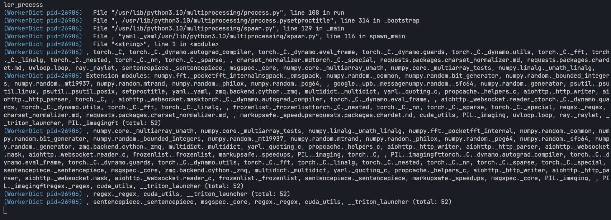

# VeRL-SGLang-memsaver-multinodes Installation and Testing Guide

## 环境配置

### 创建新的 Python 虚拟环境

```bash
python3 -m venv ~/.python/veRL-mem-saver
source ~/.python/veRL-mem-saver/bin/activate
python3 -m pip install --upgrade pip
python3 -m pip install --upgrade uv
```

## 安装和配置

### 安装 veRL 和依赖

```bash
# 克隆 veRL 代码库
git clone https://github.com/volcengine/verl.git
cd verl

# 安装 veRL 而不安装依赖
python3 -m uv pip install --no-deps .

# 安装 vllm 特定版本（SGLang 需要的版本）
python3 -m uv pip install "vllm>=0.6.4.post1,<=0.7.2"

# 安装其他必要依赖
python3 -m uv pip install tensordict
python3 -m uv pip install torch-memory-saver
python3 -m uv pip install flash-attn --no-build-isolation
```

### 安装指定版本的 SGLang

```bash
# 安装指定分支的 SGLang
python3 -m uv pip install "sglang[all] @ git+https://github.com/fzyzcjy/sglang.git@feat/patch_torch#egg=sglang&subdirectory=python" --find-links https://flashinfer.ai/whl/cu124/torch2.5/flashinfer-python
```

### 创建数据集

```bash
# 创建 GSM8K 数据集
cd ~/verl  # 确保你在 verl 目录下
python examples/data_preprocess/gsm8k.py
```

### 修改 sglang_rollout.py 文件

找到 `sglang_rollout.py` 文件（通常在 `verl/verl/workers/rollout/` 目录下），在 VerlEngine 初始化部分添加 `enable_memory_saver=True` 参数：

```python
self.inference_engine = VerlEngine(
    model_path=actor_module,
    dtype=config.dtype,
    mem_fraction_static=config.gpu_memory_utilization,
    device_mesh_cpu=device_mesh_cpu["tp"],
    base_gpu_id=0,
    gpu_id_step=1,
    enable_memory_saver=True,  # 添加此行
    # NOTE(Chenyang): if you want to debug the sglang engine
    # please set the following parameters
    # Otherwise, it will make the engine run too slow
    # log_level="INFO",
    # log_requests=True,
    # log_requests_level=2,
    # max_running_requests=1,
)
```

## 运行测试

使用以下命令运行测试脚本：

```bash
DATA_DIR=$HOME/data/gsm8k
TIME=$(date +"%Y-%m-%d-%H-%M")
python3 -m verl.trainer.main_ppo \
    actor_rollout_ref.rollout.name=sglang \
    data.train_files=$DATA_DIR/train.parquet \
    data.val_files=$DATA_DIR/test.parquet \
    data.train_batch_size=64 \
    data.val_batch_size=1312 \
    data.max_prompt_length=512 \
    data.max_response_length=1 \
    actor_rollout_ref.model.path=Qwen/Qwen2-7B-Instruct \
    actor_rollout_ref.actor.optim.lr=1e-6 \
    actor_rollout_ref.model.use_remove_padding=True \
    actor_rollout_ref.actor.ppo_mini_batch_size=64 \
    actor_rollout_ref.actor.ppo_micro_batch_size_per_gpu=16 \
    actor_rollout_ref.model.enable_gradient_checkpointing=True \
    actor_rollout_ref.actor.fsdp_config.param_offload=True \
    actor_rollout_ref.actor.fsdp_config.optimizer_offload=True \
    actor_rollout_ref.rollout.log_prob_micro_batch_size_per_gpu=16 \
    actor_rollout_ref.rollout.tensor_model_parallel_size=4 \
    actor_rollout_ref.rollout.gpu_memory_utilization=0.4 \
    actor_rollout_ref.rollout.free_cache_engine=True \
    actor_rollout_ref.ref.log_prob_micro_batch_size=16 \
    actor_rollout_ref.ref.fsdp_config.param_offload=True \
    critic.optim.lr=1e-5 \
    critic.model.use_remove_padding=True \
    critic.model.path=Qwen/Qwen2-7B-Instruct \
    critic.model.enable_gradient_checkpointing=True \
    critic.ppo_micro_batch_size=16 \
    critic.model.fsdp_config.param_offload=True \
    critic.model.fsdp_config.optimizer_offload=True \
    algorithm.kl_ctrl.kl_coef=0.001 \
    trainer.critic_warmup=0 \
    trainer.logger=['console'] \
    +trainer.val_before_train=True \
    trainer.default_hdfs_dir=null \
    trainer.n_gpus_per_node=4 \
    trainer.nnodes=1 \
    trainer.save_freq=-1 \
    trainer.test_freq=10 \
    trainer.total_epochs=1 2>&1 | tee verl_demo.log
```

运行脚本后，日志文件 `verl_demo.log` 将保存在当前目录中。您可以使用以下命令查找它：

```bash
find / -name verl_demo.log 2>/dev/null
```

## 常见问题

现在会稳定报错:
