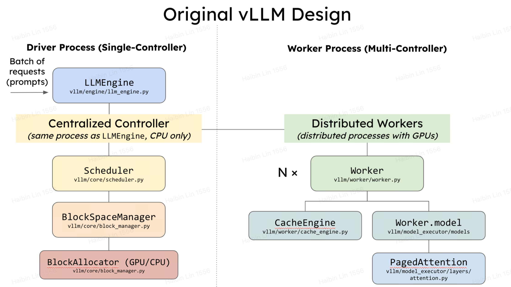
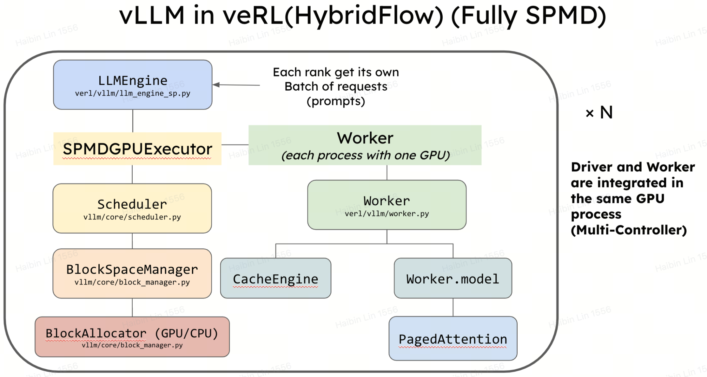
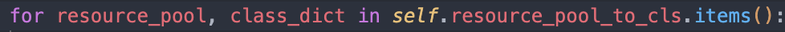

### sglang接入verl

## 问题背景
在开始前可以快速看一下:  
SPMD on vllm: https://github.com/vllm-project/vllm/issues/11400  
verl 希望inference engine能够支持SPMD




## 环境配置
```bash
git clone https://github.com/ocss884/verl verl-sglang
cd verl-sglang
git checkout dev_sglang
```
pip install一下Tom开发好的sglang版本, 用feat/overall_verl分支
```bash
pip install "sglang[all] @ git+https://github.com/fzyzcjy/sglang.git/@feat/overall_verl#egg=sglang&subdirectory=python" torch==2.5.1+cu121 --extra-index-url https://download.pytorch.org/whl/cu121
```
手动装一下flashinfer，直接find links现在会找不到，因为用torch2.5 build的都改名叫flashinfer-python了，但这个版本的sglang pyproject.toml还没更新
```bash
pip install flashinfer-python --find-links https://flashinfer.ai/whl/cu121/torch2.5/flashinfer/
```
或者直接用在torch2.4 build的flashinfer也可以在第一个pip的时候直接find，选择cu121是因为内部镜像只到cu121，就不手动装cu124了

开发配置  
sglang 0.4.1.post5  
torch2.5.1+cu121  
flashinfer 0.1.6+cu121torch2.4


## 运行PPO

先make一下数据集，默认会保存到`~/data/gsm8k`
```bash
python3 examples/data_preprocess/gsm8k.py
```

```bash
DATA_DIR=<你的数据路径> #用verl默认预处理保存在~/data/gsm8k
python3 -m verl.trainer.main_ppo \
    actor_rollout_ref.rollout.name=sglang \
    data.train_files=$DATA_DIR/train.parquet \
    data.val_files=$DATA_DIR/test.parquet \
    data.train_batch_size=64 \
    data.val_batch_size=1312 \
    data.max_prompt_length=512 \
    data.max_response_length=1 \
    actor_rollout_ref.model.path=Qwen/Qwen2-7B-Instruct \
    actor_rollout_ref.actor.optim.lr=1e-6 \
    actor_rollout_ref.model.use_remove_padding=True \
    actor_rollout_ref.actor.ppo_mini_batch_size=64 \
    actor_rollout_ref.actor.ppo_micro_batch_size=16 \
    actor_rollout_ref.actor.fsdp_config.param_offload=False \
    actor_rollout_ref.actor.fsdp_config.grad_offload=False \
    actor_rollout_ref.actor.fsdp_config.optimizer_offload=False \
    actor_rollout_ref.rollout.log_prob_micro_batch_size=16 \
    actor_rollout_ref.rollout.tensor_model_parallel_size=2 \
    actor_rollout_ref.rollout.gpu_memory_utilization=0.4 \
    actor_rollout_ref.ref.log_prob_micro_batch_size=16 \
    actor_rollout_ref.ref.fsdp_config.param_offload=True \
    critic.optim.lr=1e-5 \
    critic.model.use_remove_padding=True \
    critic.model.path=Qwen/Qwen2-7B-Instruct \
    critic.model.enable_gradient_checkpointing=False \
    critic.ppo_micro_batch_size=16 \
    critic.model.fsdp_config.param_offload=False \
    critic.model.fsdp_config.grad_offload=False \
    critic.model.fsdp_config.optimizer_offload=False \
    algorithm.kl_ctrl.kl_coef=0.001 \
    trainer.logger=['console'] \
    +trainer.val_before_train=False \
    trainer.default_hdfs_dir=null \
    trainer.n_gpus_per_node=4 \
    trainer.nnodes=1 \
    trainer.save_freq=10 \
    trainer.test_freq=10 \
    trainer.total_epochs=2 2>&1 | tee verl_demo.log
```

<details>
<summary>还没写完的code walk through</summary>
veRL的训练流程——以PPO为例
入口：verl/trainer/main_ppo.py
main_ppo里调用main_task，这里各种mapping定义了后面要用要用的worker类（注意没初始化）
接着调用RayPPOTrainer的init_worker和fit，fit就是训练流程了

### RayPPOTrainer.init_worker
这里开始会有点绕，直接跳到
  
可以看到遍历了resource pool to class，这里其实还是在对worker class做一些预处理，下面会逐个init_model critic, actor_rollout, ref, reword
这里开始会涉及sglang需要actor_rollout worker的修改  
跳到verl/worker/fsdp_workers.py，ActorRolloutRefWorker  


用vLLM跑个试运行  
首先需要设置一下vLLM的backend，目前vllm只能用xformers
```bash
export VLLM_ATTENTION_BACKEND=XFORMERS
```
</details>
