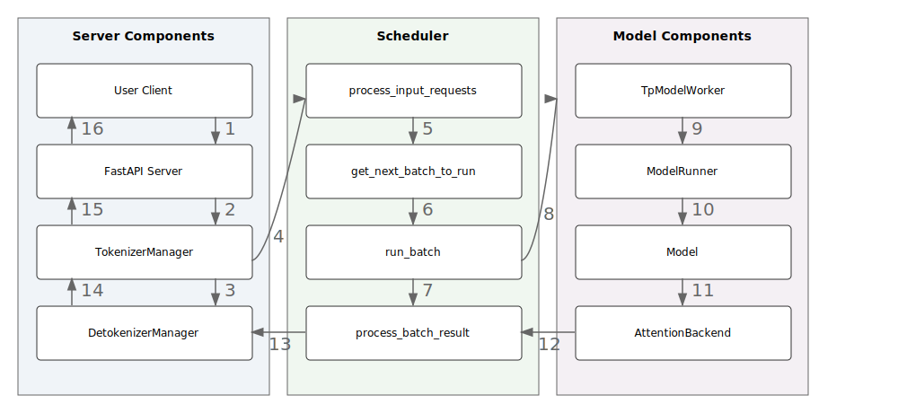

# SGLang Code Walk Through

## [English version](./README-eng.md) | [简体中文](./readme-CN.md)

<!-- [TODO: 概念和代码的名字？概念是概念，代码是代码，对我们的 workflow 图明确点，然后把 KV cache management 加进来] -->

This doc serve as a developer-level guidance and provide a brief code walkthrough of SGLang's backend, tracing the path of how requests are processed, as shown in the following figure.

    

Specifically, requests flow through the following process to get responses:

1. The user launches the Server, initializing the FastAPI app, TokenizerManager, DetokenizerManager, and Scheduler, each running with its infinite event loop.

2. The user sends `/v1/chat/completions` requests to the FastAPI Server, which routes them to TokenizerManager via the `v1_chat_completions` endpoint.

3. The `v1_chat_completions` function converts the incoming requests into a `ChatCompletionRequest`,transforms them into a `GenerateReqInput` and calls TokenizerManager's `generate_request` method.

4. TokenizerManager tokenizes the requests and forwards them to the Scheduler as Python objects (`pyobj`) while calling TokenizerManager‘s `_wait_one_response`.

5. The Scheduler loops its infinite `event_loop_normal` to handle the requests:
    - The Scheduler receives the requests via `recv_requests`, processes them through `process_input_requests`, handles the generation logic with `handle_generate_request`, and adds them to the `waiting_queue`.
    - From the `waiting_queue`, the Scheduler uses `get_next_batch_to_run` to create a `ScheduleBatch` for the upcoming requests.
    - The Scheduler executes the `run_batch` function, converting the `ScheduleBatch` into a `ModelWorkerBatch`.
    - The Scheduler calls TpModelWorker's `forward_batch_generation`, awaiting the `logits_output` and `next_token_ids`.
    - TpModelWorker initializes a `ForwardBatch`, forwards it to ModelRunner, and waits for the `logits_output`.
    - The ModelRunner processes the `ForwardBatch`, classifies it and calls `forward_extend` to execute the model's forward pass.
    - The model, accelerated by `AttentionBackend`, generates logits, which are returned to ModelRunner and subsequently to TpModelWorker.
    - TpModelWorker receives the `logits_output` from ModelRunner, calls ModelRunner's `sample` method to generate `next_token_ids`, and sends them back to the Scheduler.
    - The Scheduler processes batch results through `process_batch_result`, cache requests via `tree_cache.cache_finished_req(req)` and verifies completion status via `check_finished`, and handles caching. For unfinished requests, the Scheduler continues the event loop until the request meets the completion criteria; for finished requests, they are forwarded to Scheduler's `stream_output`.
    - In `stream_output`, Scheduler processes the outputs, wraps them into `BatchTokenIDOut`, and send to the DetokenizerManager.

6. The DetokenizerManager, running its own event loop, receives `BatchTokenIDOut`, processes it, and sends `BatchStrOut` back to TokenizerManager.

7. The TokenizerManager, within its event loop, receives the results, processes them via `handle_loop`, updates the internal state, and yields the response to the server.

8. The FastAPI Server packages the response and sends it back to the user.

## Acknowledge And Notation

<!-- [TODO: offical 可以不用 Acknowledge，仅供内部传阅，和宣传稿平级] -->

All the discussions are based on release [v0.4.0](https://github.com/sgl-project/sglang/tree/f8b0326934bacb7a7d4eba68fb6eddebaa6ff751). We sincerely appreciate [Chenyang Zhao](https://zhaochenyang20.github.io/Chayenne/), [Wenxuan Tan](https://github.com/Edenzzzz),  [Simon Veitner](https://simveit.github.io/), [Shuai Shi](https://shuaills.github.io/), [Shizhe Diao](https://shizhediao.github.io/), [Shending Hu](https://shengdinghu.github.io/), [Xiaoyu Zhang](https://github.com/BBuf), [agiping](https://github.com/agiping)、[Zhizhou Sha](https://jamessand.github.io/) for their contribution to this document.

**Note that this document is under construction and these parts will be included in the future.**

1. Radix Cache Management with Attention Backend.
2. `get_next_batch_to_run`: How to fetch and write KV cache for requests in each batch.
3. `get_model_worker_batch`.
4. `write_req_to_token_pool_trition`.
5. CUDA Graphs for Attention Backend.
6. Overlapping scheduling.

## Launch Server

SGLang features an SRT (SGLang Runtime) Server for [serving online HTTP requests](https://sgl-project.github.io/start/send_request.html) and an Engine for [offline model execution](https://sgl-project.github.io/backend/offline_engine_api.html) without HTTP protocol. Key functions, [`launch_server`](https://github.com/sgl-project/sglang/blob/f8b0326934bacb7a7d4eba68fb6eddebaa6ff751/python/sglang/srt/server.py#L507) and [`launch_engine`](https://github.com/sgl-project/sglang/blob/f8b0326934bacb7a7d4eba68fb6eddebaa6ff751/python/sglang/srt/server.py#L418), are in [server.py](https://github.com/sgl-project/sglang/blob/f8b0326934bacb7a7d4eba68fb6eddebaa6ff751/python/sglang/srt/server.py). The `launch_engine` function initializes core SRT Server components.

1. Set up configs (logger, server args, CUDA/NCCL env, inter-process ports) and download the model and tokenizer.
2. If `dp_size > 1`, run `run_data_parallel_controller_process` to start multiple data parallel replicas; otherwise, initialize a Scheduler for each `tp_rank` as a subprocess to handle requests from TokenizerManager and manage KV Cache.
3. Run TokenizerManager in the Engine's main process and DetokenizerManager as a subprocess: the former tokenizes requests and sends them to the Scheduler, and the latter converts token IDs returned by the Scheduler to text and sends them back to the Server. Note that for multi-node inference (e.g., deploying Llama 3.1 405B on two nodes with a total of 16 H100 GPUs), TokenizerManager and DetokenizerManager only run on the first node.
4. Configure chat template (if specified) and wait for Scheduler processes to signal that all processes are ready, along with their configuration information.

Note that in version 0.4.0, the [DataParallelController](https://github.com/sgl-project/sglang/blob/f8b0326934bacb7a7d4eba68fb6eddebaa6ff751/python/sglang/srt/managers/data_parallel_controller.py#L52) is used for round-robin scheduling of requests across multiple data parallel replicas. We will change this to [SGLang Router](https://sgl-project.github.io/router/router.html) for multiple replicas routing  in the future.

## Forward Requests From Server

The Server employs a FastAPI app to define API endpoints, forwarding [`/v1/chat/completions`](https://github.com/sgl-project/sglang/blob/f8b0326934bacb7a7d4eba68fb6eddebaa6ff751/python/sglang/srt/server.py#L354) requests to the TokenizerManager via [v1_chat_completions](https://github.com/sgl-project/sglang/blob/f8b0326934bacb7a7d4eba68fb6eddebaa6ff751/python/sglang/srt/openai_api/adapter.py#L1101).

1. Parse JSON from `raw_request` into a `ChatCompletionRequest`,  convert it to `GenerateReqInput` and configure `sampling_params` using `v1_chat_generate_request`.
2. Call the TokenizerManager's `generate_request` and wait for the response. After getting the response, handle streaming or non-streaming responses based on the `stream` parameter.
3. For streaming, process the `generate_request` output incrementally with `generate_stream_resp`; for non-streaming, wait the async result and convert it to a `ChatCompletionResponse` via `v1_chat_generate_response`.

## Generate Request In TokenizerManager

[TokenizerManager](https://github.com/sgl-project/sglang/blob/f8b0326934bacb7a7d4eba68fb6eddebaa6ff751/python/sglang/srt/managers/tokenizer_manager.py#L88) is initialized by [`launch_server`](https://github.com/sgl-project/sglang/blob/f8b0326934bacb7a7d4eba68fb6eddebaa6ff751/python/sglang/srt/server.py#L507) in the Server's main process to tokenize requests.

### [Initialization](https://github.com/sgl-project/sglang/blob/f8b0326934bacb7a7d4eba68fb6eddebaa6ff751/python/sglang/srt/managers/tokenizer_manager.py#L88)

1. Set up [ZeroMQ](https://libzmq.readthedocs.io/en/latest/) for inter-process communication, including sockets for the communication with DetokenizerManager and Scheduler.
2. Configure `server_args`, enable `metrics`, and initialize `model_config`, `tokenizer`, and placeholders for multi-modal image processors.

### [generate_request](https://github.com/sgl-project/sglang/blob/f8b0326934bacb7a7d4eba68fb6eddebaa6ff751/python/sglang/srt/managers/tokenizer_manager.py#L173)

1. If TokenizerManager's event loop is not initialized, initialize it here.
2. Pause processing if model weights are updating via `update_weights_from_disk` or `update_weights_from_distributed`.
3. Validate request type is aligned with the model's `is_generation` setting.
4. Normalize requests using `normalize_batch_and_arguments` to manage batching, parallel sampling, and default parameters.
5. Process single requests with `_tokenize_one_request`, send to the scheduler, and wait for responses from `_wait_one_response`.
6. Process batch requests with `_handle_batch_request`, tokenize inputs, manage parallel sampling, interact with the scheduler, and yield responses in both streaming and non-streaming modes.

## Scheduler Receive Requests and Process Batches

Here is the overview of the Scheduler:

[Scheduler](https://github.com/sgl-project/sglang/blob/f8b0326934bacb7a7d4eba68fb6eddebaa6ff751/python/sglang/srt/managers/scheduler.py#L97) runs as Server's subprocess, initialized via `run_scheduler_process` and executes its infinite event loop with `event_loop_normal` or `event_loop_overlap`.

### [Initialization](https://github.com/sgl-project/sglang/blob/f8b0326934bacb7a7d4eba68fb6eddebaa6ff751/python/sglang/srt/managers/scheduler.py#L97)

1. Set up [ZeroMQ](https://libzmq.readthedocs.io/en/latest/) for communication with TokenizerManager.
2. Configure `server_args`, `port_args`, `model_config`, `sessions`, and initialize TpModelWorker or TpModelWorkerClient based on overlap scheduling.
3. Initialize tokenizer and processor, manage caching using ChunkCache or RadixCache and configure SchedulePolicy.
4. Set up chunk prefill parameters and GrammarBackend for constraint decoding.

### [Event Loop](https://github.com/sgl-project/sglang/blob/f8b0326934bacb7a7d4eba68fb6eddebaa6ff751/python/sglang/srt/managers/scheduler.py#L376)

The Scheduler continuously executes its event loop, alternating between `process_input_requests`,`get_next_batch_to_run`, `run_batch` and `process_batch_result`.

### [process_input_requests](https://github.com/sgl-project/sglang/blob/f8b0326934bacb7a7d4eba68fb6eddebaa6ff751/python/sglang/srt/managers/scheduler.py#L508)

Iterates over incoming requests, identifying their types, and dispatches them to appropriate handlers.

### [get_next_batch_to_run](https://github.com/sgl-project/sglang/blob/f8b0326934bacb7a7d4eba68fb6eddebaa6ff751/python/sglang/srt/managers/scheduler.py#L768)

1. Merge `last_batch` with `running_batch` if applicable and prioritize prefill batches with `get_new_batch_prefill`.
2. If no prefill batch, update `running_batch` for decode batch by filtering requests, managing GPU memory, and adjusting decoding parameters.

### [run_batch](https://github.com/sgl-project/sglang/blob/f8b0326934bacb7a7d4eba68fb6eddebaa6ff751/python/sglang/srt/managers/scheduler.py#L956)

1. For generation models, use TpModelWorker’s `forward_batch_generation` to generate a new token or `forward_batch_idle` for idle tasks, returning results to `event_loop_normal`.
2. For embedding or reward models, execute `forward_batch_embedding`, and return embeddings.
 
### [process_batch_result](https://github.com/sgl-project/sglang/blob/f8b0326934bacb7a7d4eba68fb6eddebaa6ff751/python/sglang/srt/managers/scheduler.py#L987)

After `run_batch`, Scheduler processes batch results in `event_loop_normal`:

1. Decode mode processes outputs, updates request states, handles token and probability data, manages memory, and logs statistics.
2. Extend mode handles prefill results, processes input tokens, and prepares for further decoding or embedding.
3. Finished requests are cached via `cache_finished_req`, streamed to DetokenizerManager. Unfinished requests are updated and looped back into `get_next_batch_to_run` for further processing until completion.

Note that LLM inference is typically divided into Prefill and Decode phases based on their different computational characteristics. For the concepts of Prefill and Decode, you can refer to [this article](https://huggingface.co/blog/martinigoyanes/llm-inference-at-scale-with-tgi) from HuggingFace. However, in SGLang, [extend mode](https://github.com/sgl-project/sglang/blob/main/python/sglang/srt/layers/attention/flashinfer_backend.py) is used in most cases rather than prefill mode. While Prefill mode initializes KV-Cache for new requests, typically using Paged KV-Cache, Extend mode incrementally updates existing KV-Cache using Ragged Tensors, which is more efficient. This makes it particularly well-suited for long sequences or multi-turn dialogue requests that SGLang is designed for.

## TpModelWorker Manage Forward and Token Sampling

[TpModelWorker](https://github.com/sgl-project/sglang/blob/f8b0326934bacb7a7d4eba68fb6eddebaa6ff751/python/sglang/srt/managers/tp_worker.py#L40) manages ModelRunner's forward and sampling for batches of requests scheduled by Scheduler.

### [Initialization](https://github.com/sgl-project/sglang/blob/f8b0326934bacb7a7d4eba68fb6eddebaa6ff751/python/sglang/srt/managers/tp_worker.py#L40)

1. Initializes tokenizer, model configuration and ModelRunner.
2. Configures device settings and memory pool limits.

### [forward_batch_generation](https://github.com/sgl-project/sglang/blob/f8b0326934bacb7a7d4eba68fb6eddebaa6ff751/python/sglang/srt/managers/tp_worker.py#L148)

1. Create a `ForwardBatch`, compute logits and sample next tokens using ModelRunner's `forward` and `sample`.
2. Return `logits_output` and `next_token_ids` to Scheduler for `process_batch_result`.

### [forward_batch_embedding](https://github.com/sgl-project/sglang/blob/f8b0326934bacb7a7d4eba68fb6eddebaa6ff751/python/sglang/srt/managers/tp_worker.py#L160)

1. Create a `ForwardBatch`, get the `logits_output` and `embeddings` from ModelRunner's `forward`.
2. Embedding requests do not require sampling, so skip the ModelRunner's `sample` and directly return the `embeddings` to Scheduler.

## ModelRunner Manages Model Execution

[ModelRunner](https://github.com/sgl-project/sglang/blob/f8b0326934bacb7a7d4eba68fb6eddebaa6ff751/python/sglang/srt/model_executor/model_runner.py#L66) initialize the attention backend and manage the loaded model to perform forward passes for generation and embedding tasks.

### [Initialization](https://github.com/sgl-project/sglang/blob/f8b0326934bacb7a7d4eba68fb6eddebaa6ff751/python/sglang/srt/model_executor/model_runner.py#L66)

Initializes distributed environment, loads the model, applies tensor parallelism, and sets up memory pool and attention backend.

### [forward](https://github.com/sgl-project/sglang/blob/f8b0326934bacb7a7d4eba68fb6eddebaa6ff751/python/sglang/srt/model_executor/model_runner.py#L675)

The `forward` function determines the appropriate forward mode for processing batches based on the `forward_mode`:

1. `forward_decode`: Initializes forward metadata and call the Model's `forward` with input IDs and positions.
2. `forward_extend`: Initializes forward metadata and call the Model's `forward` for generation or embedding tasks.
3. `forward_idle`: Manages the forward pass when the forward mode is idle.

## Model Load Weights and Perform Forward

ModelRunner's `self.model` is a instance of the model class. All [supported models](https://sgl-project.github.io/references/supported_models.html) can be found in [python/sglang/srt/models](https://github.com/sgl-project/sglang/blob/f8b0326934bacb7a7d4eba68fb6eddebaa6ff751/python/sglang/srt/models). We take [Qwen2ForCausalLM](https://github.com/sgl-project/sglang/blob/f8b0326934bacb7a7d4eba68fb6eddebaa6ff751/python/sglang/srt/models/qwen2.py#L269) for example.

[`Qwen2ForCausalLM`](https://github.com/sgl-project/sglang/blob/f8b0326934bacb7a7d4eba68fb6eddebaa6ff751/python/sglang/srt/models/qwen2.py#L269) is structured as follows:

* `model`: weights used for the forward pass.
* `embed_tokens`: maps `input_ids` into `embeddings`.
* `lm_head`: projects the hidden states back to the vocabulary space.
* `logits_processor`: manipulates `logits` to perform tasks such as sampling and normalization.
* `pooler`: pooling mechanism for extracting embeddings or computing rewards.

### [forward](https://github.com/sgl-project/sglang/blob/f8b0326934bacb7a7d4eba68fb6eddebaa6ff751/python/sglang/srt/models/qwen2.py#L289)

The forward function in `Qwen2ForCausalLM` processes input IDs to produce logits for next-token prediction of chat completion requests or embeddings for reward/embedding requests:

1. Converts `input_ids` to embeddings using `embed_tokens`. Sequentially forwards embeddings through multiple Qwen2DecoderLayer layers.
2. Returns embeddings via `pooler` if `get_embedding` is True; otherwise, using `logits_processor` to compute `logits` and return.

The most import acceleration of SGLang comes from the interaction between `forward_batch` and AttentionBackend. 

## AttentionBackend Accelerate Model Forward

SGLang supports several [Attention Backends](https://github.com/sgl-project/sglang/blob/f8b0326934bacb7a7d4eba68fb6eddebaa6ff751/python/sglang/srt/layers/attention) which accelerate model forward and KV cache reuse. We take [FlashInferBackend](https://github.com/sgl-project/sglang/blob/f8b0326934bacb7a7d4eba68fb6eddebaa6ff751/python/sglang/srt/layers/attention/flashinfer_backend.py) for example.

### [Initialization](https://github.com/sgl-project/sglang/blob/f8b0326934bacb7a7d4eba68fb6eddebaa6ff751/python/sglang/srt/layers/attention/flashinfer_backend.py#L48)

1. Configures wrappers for sliding window and cross-attention scenarios.
2. Allocates necessary buffers for workspace and key-value indices.
3. Prepares forward metadata for efficient attention computation.
4. Integrates CUDA graph support for optimized execution paths.

### [init_forward_metadata](https://github.com/sgl-project/sglang/blob/f8b0326934bacb7a7d4eba68fb6eddebaa6ff751/python/sglang/srt/layers/attention/flashinfer_backend.py#L130)

1. Decode Mode: Updates indices for decoding using `indices_updater_decode` and sets `forward_metadata` to use `decode_wrappers`.
2. Extend Mode: Determines if ragged forward is needed based on token count and wrapper count, then updates indices with `indices_updater_prefill`.
3. Metadata Assignment: Sets `forward_metadata` with flags for ragged use and prefix extension.

### [forward_extend](https://github.com/sgl-project/sglang/blob/f8b0326934bacb7a7d4eba68fb6eddebaa6ff751/python/sglang/srt/layers/attention/flashinfer_backend.py#L223) and [forward_decode](https://github.com/sgl-project/sglang/blob/f8b0326934bacb7a7d4eba68fb6eddebaa6ff751/python/sglang/srt/layers/attention/flashinfer_backend.py#L277)

1. For `forward_extend`, selects the appropriate wrapper based on ragged or paged attention. For `forward_decode`, picks the decode wrapper.
2. Computes attention, manages key-value caching, and returns the reshaped output.

## DetokenizerManager Detokenize and Send to TokenizerManager

[DetokenizerManager](https://github.com/sgl-project/sglang/blob/f8b0326934bacb7a7d4eba68fb6eddebaa6ff751/python/sglang/srt/managers/detokenizer_manager.py#L53) is initialized by [`launch_server`](https://github.com/sgl-project/sglang/blob/f8b0326934bacb7a7d4eba68fb6eddebaa6ff751/python/sglang/srt/server.py#L507) as a subprocess of Server to detokenize token ids returned by Scheduler and send back to TokenizerManager.

### [Initialization](https://github.com/sgl-project/sglang/blob/f8b0326934bacb7a7d4eba68fb6eddebaa6ff751/python/sglang/srt/managers/detokenizer_manager.py#L53)

Sets up ZeroMQ communication sockets and the tokenizer. Manages decoding status with `LimitedCapacityDict`.

### [event_loop](https://github.com/sgl-project/sglang/blob/f8b0326934bacb7a7d4eba68fb6eddebaa6ff751/python/sglang/srt/managers/detokenizer_manager.py#L93) and [trim_eos](https://github.com/sgl-project/sglang/blob/f8b0326934bacb7a7d4eba68fb6eddebaa6ff751/python/sglang/srt/managers/detokenizer_manager.py#L78)

1. Receives processed requests from the Scheduler, forwarding `BatchEmbeddingOut` directly or processing `BatchTokenIDOut` for detokenization.
2. Splits token IDs into `read_ids` and `surr_ids`. Converts token IDs to text using `batch_decode`. Updates `DecodeStatus` with new offsets and detokenized text.
3. Trims outputs at stop sequences, combines detokenized text with metadata into `BatchStrOut`, and sends it to TokenizerManager.

## [FastAPI Wraps the Output](https://github.com/sgl-project/sglang/blob/f8b0326934bacb7a7d4eba68fb6eddebaa6ff751/python/sglang/srt/server.py#L287)

1. DetokenizerManager sends `BatchStrOut` to TokenizerManager via [ZeroMQ](https://libzmq.readthedocs.io/en/latest/).
2. TokenizerManager updates request states and prepares detokenized text for FastAPI.
3. Finally in FastAPI, for streaming, use an async generator and `StreamingResponse` to send the response to the user.
4. For non-streaming, collect and send the complete response using `ORJSONResponse` and return to the user.
