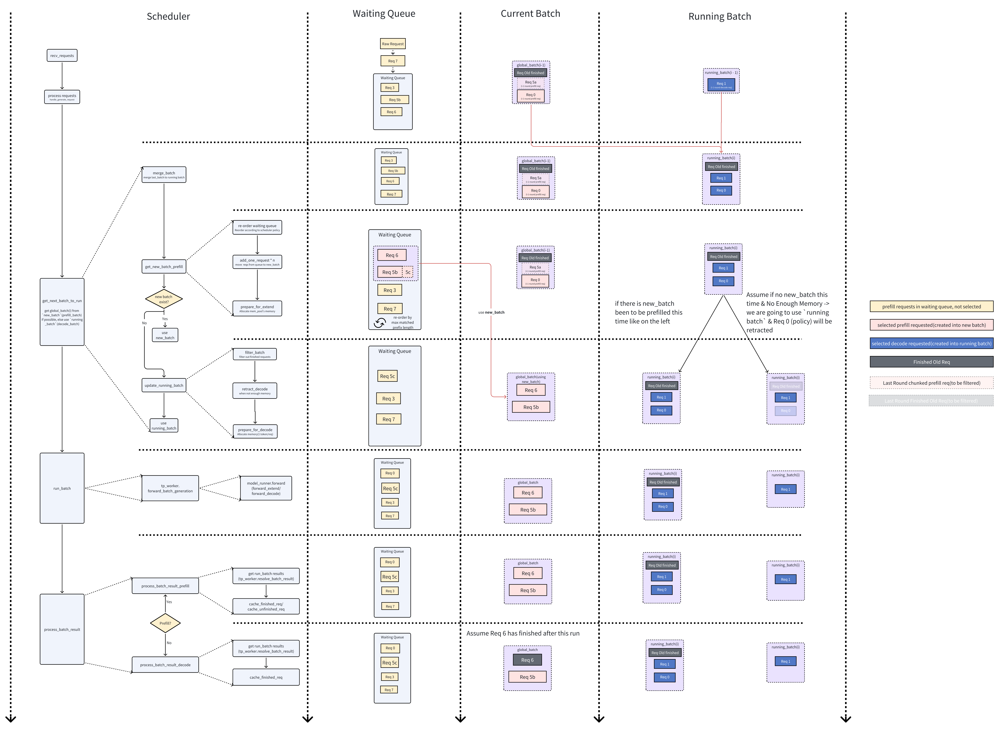

# KV Cache Code Walkthrough
This document provides an overview of the KV cache management implementation. Our narrative start with the `Scheduler` components which orchestrat the requests in batch. After that, we zoom into a single request, follow its journey through prefill and decode phases, detailing how the KV cache and memory pools are updated step-by-step.

To facilitate this explanation, we will make a few assumptions in our examples:
- We use FlashInfer as backend.
- We use Longest Prefix as priority for requests in `waiting_queue` (e.g., the longest-prefix-match scheduling in SGLang paper).
- We don't consider jump forward decoding/speculative decoding.
- We don't enable `enable_mixed_chunck`.
- We use `Radix Cache` as `tree_cache`.

<!-- todo: 看完之后只大概理解了functional design，并没有感知到什么design tradeoff (orz)，如果理解整个design的tradeoff对理解code有益的话，可以在最开头补充performance metrics和sys big picture，这样可以减少”为什么要这么schedule和设计cache“的疑惑 -->

## Scheduler Overview

This section provides a high-level overview of the `Scheduler` which is responsible for managing active requests.


The figure illustrates how the **Scheduler** directs requests from the `waiting_queue` into a `new_batch` (for prefill/extend phase) and then into the `running_batch` (for decode phase). Let's firstly understand each of these building blocks:

#### `waiting_queue`
A data structure designed to hold active requests. The queue would be reordered on demand based on requests priority(in our assumption, the requests with longest prefix) or available memory to optimize batch processing time.
- **What to Enqueue?** 
  - Newly arrived requests.
  - Requests that are returned from `retract_decode`. 
    > **retract** 
    > 
    > If available memory is insufficient during decode, the scheduler may retract certain requests (via `retract_decode`) from the `running_batch`, returning them to the waiting queue for later processing.
<!--TODO: 可以callback一下priority和longest prefix之间的关系 -->

#### `new_batch`
A batch of requests that are ready for prefill/extend stage.
> "prefill" vs "extend" 
>
> The key difference is whether it builds upon an existing prefix in the cache  **Prefill** handles the initial processing of a request’s input tokens to populate the KV cache with their key-value (KV) pairs when no prior cache exists or when the prefix match is incomplete. **Extend** builds upon an existing prefix in the cache, appending new tokens’ KV pairs.

#### `running_batch`  
A batch of requests that are ready for decode stage.

#### `cur_batch`
The batch of requests that are currently being processed in the main loop of Scheduler (`run_batch` function).  
- **How is `cur_batch` being formed?**  
If there's requests ready for prefill (`new_batch`) in this cycle, use `new_batch` as `cur_batch`. Otherwise, `cur_batch` would process those that are ready for decode, thus use `running_batch` as `cur_batch`. 

### Sequences

<!-- todo: 这里的sequence是？ 看了图也没发现是哪个sequence？是箭头方向的execution flow吗？-->

Let's walk through the sequence in the diagram now.

#### 1. **New Request arrived**
The Scheduler continuously calls `recv_requests` to collect newly arrived requests, validate them and place them into the `waiting_queue`. 

In our example, `Req 7` are received and enqueued.
<!-- SV: The Scheduler listens in `event_loop_normal` and `process_input_requests` where the `_request_dispatcher` decides on how to handle the request. -->

#### 2. **Merge Batches**
Before form the `cur_batch` for this round, Scheduler would merge the last round's `cur_batch` into `running_batch`. In the diagram, `cur_batch` from last round are shown as `cur_batch(i-1)` and `running_batch` are shown as `running_batch(i-1)`. In our example, `Req 0` and `Req 1` will be merged together into the new `running_batch`. 

- **Chunked Prefill Fragment Being Removed**

  If a request requires more tokens than the available memory (`remaining_tokens`), it may be **chunked** into smaller parts. During the **Merge Batches** step, the scheduler also removes the last round's `being_chunked_request`. These chunked requests (like `Req 5a`) are temporary fragments created solely for populate KV cache in prefill, they are not needed to proceed to decode phase, thus they can be removed once the prefill for it being finished.

  To better understand the chunking process, let's look at how `Req 5` is handled:
  1. Initially, `Req 5` enters the waiting queue as a single long request
  2. During the first prefill attempt, due to memory constraints, it's split into `Req 5a` and `Req 5b`
  3. After `Req 5a` is processed and its KV cache is stored, it's removed as a `being_chunked_request`
  4. In the current round, when trying to process `Req 5b`, it still exceeds the resource limit
  5. Therefore, `Req 5b` is further split into a new `Req 5b` (which goes into the global batch) and `Req 5c` (which stays in the waiting queue)

#### 3. **Forming the `new_batch`**:
The process of forming a `new_batch` consists of three main steps:
<!-- SV: A new batch is formed after after the Scheduler performed merging in `get_next_batch_to_run` by calling `get_new_batch_prefill`. -->

1. **Reorder Waiting Queue**:
  - The scheduler reorders requests based on its scheduling policy
  - By default, it prioritizes requests with the longest prefix in the radix cache
<!-- SV: The Scheduler reorders requests based on its `SchedulePolicy`. -->
<!-- SV: By default we sort requests by longest prefix, for different policies and their implementation please refer to `schedule_policy.py` -->

2. **Request Selection**:
  - Requests are selected one by one from the reordered queue
  - In our example:
    - `Req 6` is selected first as it has the longest prefix match in the cache
    - `Req 5b` is selected next as there's still available memory
    - However, `Req 5b` exceeds the memory limit and is further split into `Req 5b` and `Req 5c`
    - `Req 5b` is added to the `new_batch` while `Req 5c` remains in the waiting queue

3. **Prepare for Extend**:
  Allocateing spaces in `req_to_token_pool` and `token_to_kv_pool` for the `new_batch` requests
  - If no `new_batch` can be formed, the scheduler will fallback to use `running_batch` as `cur_batch`, it will firstly remove finished requests like `Old Finished Req`. 
  - If GPU memory becomes insufficient, some decoding requests may be retracted according to the retraction policy. In our example, `Req 0` is retracted during this process.
<!-- SV: After determination of the `new_batch` inside `get_new_batch_prefill` we `prepare_for_extend`. -->

#### 4. **Running the Batch**: 
Once the **Global Batch** is determined, `run_batch` is called to run a forward pass.
<!-- SV: In `event_loop_overlap` after determination of the `batch`, `run_batch` is called to forward pass the `batch`. -->

#### 5. **Result Processing**:
After `run_batch`, the Scheduler calls `process_batch_result` to to determine which requests have finished and which continue. In our example, `Req 6` is finished and turns grey, `Req 5b` remains unfinished.

#### 6. **Iteration**:
The loop repeats until all requests are eventually completed. If insufficient memory is encountered, requests may be chunked (in prefill) or retracted (in decode), then reinserted into the waiting queue for later processing.
<!-- SV: `event_loop_overlap` keeps running until the `last_batch` is processed. -->

## A Request's Lifecycle
This section zoom into one request's lifecycle, we would step-by-step walkthrough the key functions that updates the KV Cache & Memory Pools.


Let's firstly understand some of the important building blocks for managing KV. 

There are two-level memory pools to manage KV cache. 

<!-- todo 我觉得两层mapping是可以画个图的，比文字好看 -->

#### `req_to_token_pool`
A map from a request to its tokens' KV cache indices.
- **Shape:** Max Allowed Requests Number (being set by argument `max-running-requests` for the maximum number of requests to run concurrently) * Max Context Length for each request (being set by config `model_config.context_len`)
- **Access:** 
    - Dim0: `req_pool_indices` identify the specific request
    - Dim1: token positions in req (starting from 0, 1, 2...), identify the specific token in the request
    - Value: `out_cache_loc` for token, it points to the KV cache indices associated with the token identified by Dim0 and Dim1
<!-- SV: To make connection to the above more clear it could be benefical to point out that this is updated in  `get_next_batch_to_run -->
#### `token_to_kv_pool`
`req_to_token_pool` maintained the map between request to tokens KV cache indices, `token_to_kv_pool` further maps token from its KV cache indices to its real KV cache data.  Note that, for different attention implementation, like [`MHA`](https://arxiv.org/abs/1706.03762), [`MLA`](https://arxiv.org/abs/2405.04434), [`Double Sparsity`](https://arxiv.org/abs/2408.07092), `token_to_kv_pool` could have different implementation.
- **Layout:** Number of Layers * Max Allowed Tokens Number * Number of Head * Head Dimension
- **Access:** 
    - Dim0: `layer_id` identify the specific layer
    - Dim1: `out_cache_loc` identify the specific KV cache indices (free slots)
    - Dim2: Head
    - Dim3: Head Dimension
    - Value: `cache_k` for k_buffer and `cache_v` for v_buffer, the real KV Cache Data

    Note that we normally retrieve the KV Cache for entire layer all together, because we would need all prior tokens' KV in a request to do forward.

<!-- todo: 如果能讲讲tree cache是什么就更好了，如果它的设计跟perf metric (cache reuse)有关的话 -->
#### `tree_cache`
`tree_cache` is a tree structure to enhance the reuse of prefix KV Cache across requests. `tree_cache` is responsible for updating `req_to_token_pool` and `token_to_kv_pool` on a token level for each request. Across `tree_cache`, `req_to_token_pool`, and `token_to_kv_pool`, tokens are linked via it's KV Cache indices.
- **Access:**
  - Key: Token ID, same token's KV Cache is agnostic from requests
  - Value: Token's KV Cache Indices

### Sequence
Let's walk through the sequence in the diagram now.
#### Prefill Batch
##### Step 1. Function `get_new_batch_prefill` 
  - Update prefix from radix tree cache for request
    - When `ABC` come in, say the current radix cache have one node `AFG` thats currently being referenced.
    - `match_prefix` would try to find the prefix for `ABC` in the current radix cache, and it matched up to the first token `A` in the node.
    - Radix Cache Split the node into `A` and `FG`, node `A` is the current last node for this request.
  - Invoke `prepare_for_extend`
    - `req_to_token_pool`
      - Allocate to `req_pool_indices`
      - Add prefix to `req_to_token_pool`
    - `token_to_kv_pool`
      - Allocate (the sum of each reqs (number of input id tokens - number of prefix tokens)) `out_cache_loc`
      - In our example of request ABC, the batch size is 1
        - number of input id tokens = 3 -> A,B,C 
        - number of prefix tokens = 1 -> A
        - We will allocate 2 slots to `out_cache_loc` for token B, C
        
##### Step 2. Function `run_batch` 
Run `forward_extend` on the current batch, this will eventually invoke the Attention Backend, who is responsible for 
- Set the kv cache of extend tokens.
  - Set KV cache for extends token to `token_to_kv_pool` (Function `save_kv_cache`)
  - In our example: from above steps, we get 2 slots for token B, C in `out_cache_loc`, their corresponding K, V would be set to this 2 slots here.
- Run forward attention calculation, the input would be
  - Q = extend tokens, in our example token B, C
  - KV = All cached tokens from `req_to_token_pool` by `out_cache_loc` including A(prefix tokens), B, C(extend tokens) (Function `create_flashinfer_kv_indices_triton`).
<!-- SV: Trace the way to `forward_extend` more clearly, i.e. `self.tp_worker.forward_batch_generation` to `self.model_runner.forward` to `self.forward_extend` -->

##### Step 3. Function `process_batch_result_prefill`
  `cache_finished_req` and `cache_unfinished_req` are responsible for managing the KV cache in Radix Cache, ReqToTokenPool, and TokenToKVPool.
  - If the request is finished, invoke `cache_finished_req` (refer to [this secion](#radixcache-cache_finished_req--cache_finished_req) for details of `cache_finished_req` )
  - else invoke `cache_unfinished_req` (refer to [this secion](#radixcache-cache_finished_req--cache_finished_req) for details of `cache_unfinished_req` )

  In our example, `cache_unfinished_req` is invoked after extend/prefill phase, `BC` was added as a child node for `A`, both nodes `A` and `BC` increase the lock reference, node `BC` become the `last_node` for the request.

#### Decode Batch
##### Step 4. Function `update_running_batch` 
  - Invoke `prepare_for_decode`
    - `req_to_token_pool` No change
    - `token_to_kv_pool`
      - Allocate (batch size * 1) slot to `out_cache_loc` because we only generate one token for each batch in decode mode
      - For example: in above diagram, the round that generate D from C
        - We will allocate 1 slots to `out_cache_loc` for token D
<!-- SV: Maybe mention dynamic changing of the forward mode? -->

##### Step 5. Function `run_batch`
Run `forward_decode` on the current batch, this will eventually invoke the Attention Backend, who is responsible for 
- Save the kv cache of decode token.
  - Save KV cache for decode token to `token_to_kv_pool` (Function `save_kv_cache`)
  - For example: In above step, we get 1 slots for token D in `out_cache_loc`, it's corresponding K, V would be saved to this 1 slot here.
- Run forward, the input would be:
  - Q = decode token, in our example token D
  - KV = All cached tokens from `req_to_token_pool` by `out_cache_loc` including A, B, C(from previous round), D (Function `create_flashinfer_kv_indices_triton`)
<!-- SV: See above comment for run_batch -->

##### Step 6. Function `process_batch_result_decode`
  If the request is finished, invoke `cache_finished_req` (refer to [this secion](#radixcache-cache_finished_req--cache_finished_req) for details of `cache_finished_req` ). No operation for cache is needed for unfinished request in decode phase.
  
  In our example, `DE` is appended to node `BC`, and the lock reference for node `A` and `BCDE` got decreased. 

#### RadixCache `cache_finished_req` & `cache_finished_req`
This section would go deeper on `cache_finished_req` & `cache_finished_req`'s flow.

##### **Quick Overview of `cache_finished_req()` vs. `cache_unfinished_req()`**
| Sequence | `cache_unfinished_req()` | `cache_finished_req()` |
|------|--------------------------|--------------------------|
| **1. Get `kv_indices`** from `req_to_token_pool.req_to_token` | - | - |
| **2. Update Radix Cache** (`insert()`) | - | - |
| **3. Free KV Cache** (`self.token_to_kv_pool.free()`) | - | release duplicate kv cache storage |
| **4. Handle `req_to_token_pool`** | **Writes and updates** `req_to_token_pool | **Releases** `req_to_token_pool` as the request is completed. |
| **5. Handle `req.last_node`** | **Increases** the reference count of `req.last_node` | **Decreases** the reference count of `req.last_node`, as `req` is finished. |

As we can observe, the core functionality is essentially the same for `cache_unfinished_req()` and `cache_finished_req()`, we are going to walk through the code for how req_to_token_pool, token_to_kv_pool and tree_cache are updated during `cache_unfinished_req()`, and explain the key difference between `cache_unfinished_req()` and `cache_finished_req()`.

##### `cache_unfinished_req`
1. Get KV Index: Get KV index from `req_to_token_pool.req_to_token`

2. Update Radix Cache
```python
new_prefix_len = self.insert(token_ids, kv_indices.clone())
```
This method inserts token_ids and their corresponding kv_indices into the Radix Cache. If successful, it returns a new prefix length (new_prefix_len).

3. `Free KV Cache` 

4. Update `prefix_indices` and `last_node`
  
    Calls `match_prefix()` to update the request’s `prefix_indices` and `last_node`. This is important as `prefix_indices` and `last_node` will be used in next iteration.
  - `prefix_indices` is used to calculate the needed size of extend/prefill tokens.
  - `last_node` is used to keep track of a requests last node in the radix tree so that it can be used to trace back towards root node when updating lock.

5. Lock Management for Memory Safety
To prevent unintended deletion of active cache nodes. Keeping a lock on a node shields it from being freed while still needed. After above state transition, the old `last_node` is unlocked using dec_lock_ref(), allowing it to be freed when no longer in use. The new `last_node` is locked, protecting it from deletion.

##### `cache_finished_req`

###### **Similar to `cache_unfinished_req()`, `cache_finished_req()` also has the following steps:**
1. When a request `req` is completed, its `token_ids` are stored in the **Radix Cache**. Update Radix Cache 
2. **Release** redundant **KV Cache space** in `token_to_kv_pool` (removing duplicates) by marking the KV indices as free slots.
3. **Release `req_to_token_pool`** and **update `tree_cache`**.  
