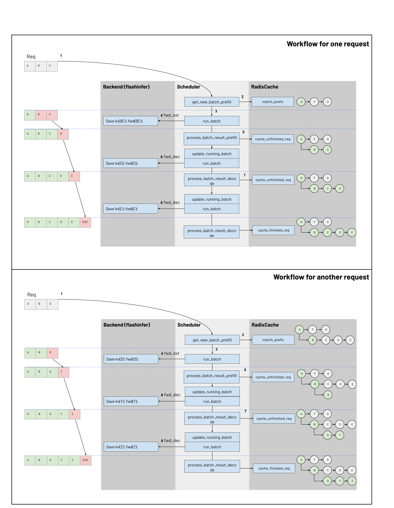

# KV Cache

This document explains on a high level how the KV cache is managed following the lifecycle of a request.

## Overview

The figure illustrates how the **Scheduler** directs requests from the **Waiting Queue** into a **New Batch** (prefill phase) and then into the **Running Batch** (decode phase). It provides a high-level view of the batching lifecycle—covering prefill, decode, and the decision logic behind when to switch modes—alongside the main functions in the code (e.g., `recv_requests`, `get_new_batch_prefill`, `run_batch`, `process_batch_result`).

### Resources

1. Waiting Queue (Requests)  
- **New requests** arrive and are placed into the waiting queue.  
- Each request may include tokenized input IDs (e.g., text/image tokens) or embedding vectors.  
- The queue may be **reordered** (by priority or memory availability) before requests are pulled to form a batch.

2. Scheduler  
*(For brevity, only key steps are highlighted)*  
1. **Polling for requests**: Continuously retrieves new requests (`recv_requests`) and enqueues them if they are valid.  
2. **Prefill batch creation**: When feasible, combines as many waiting requests as possible into a single **New Batch** (`get_new_batch_prefill`). Checks available memory (`token_to_kv_pool`, `req_to_token_pool`) and stops if memory is insufficient or a batch limit is reached.  
3. **Prefill/Decode switching**: When no new prefill batch can be formed—or there are ongoing requests still in progress—triggers the decode phase (`update_running_batch`).  
4. **Running the batch**: Invokes `run_batch` to execute a forward pass (prefill or decode) on the current batch.  
5. **Processing results**: Calls `process_batch_result` to determine which requests have finished and which continue. Finished requests are handled via `cache_finished_req`, while incomplete requests are handled via `cache_unfinished_req`.

3. New Batch (for Prefill)  
- **Definition**: A group of requests pulled from the waiting queue via scheduling logic (e.g., priority, memory constraints) that will undergo the **prefill** stage.  
- **Existence**: Only exists during `get_new_batch_prefill`. Once that function finishes, if a new batch was created, it becomes the **Global Batch** for the upcoming iteration.  
- **Splitting large requests**: If a request requires more tokens than the available memory (`remaining_tokens`), it may be **chunked** into smaller parts (e.g., `Req 5b` and `Req 5c` in the figure).  
- **Prefill mode**: The scheduler prepares the input space—accounting for any prefixes already cached (e.g., in a `radixcache`)—and performs a forward pass on these new requests to initialize their hidden states, KV caches, etc.

4. Running Batch  
- **Definition**: Consists of requests that finished **prefill** but are not yet complete. These requests proceed to the **decode** phase to generate additional tokens.  
- **Decode mode**: The scheduler steps through token generation (one token at a time per request) using `prepare_for_decode` and `run_batch`.  
- **Memory constraints**: If available memory is insufficient during decode, the scheduler may **retract** certain requests (via `retract_decode`) from the running batch, returning them to the waiting queue for later processing.  
- **Completion & resource release**: Once decode ends or a request hits a stop condition, the request is flagged as finished, and its allocated memory is freed.

5. Global Batch  
- **Definition**: The batch that the Scheduler processes in each iteration of its main loop by calling `run_batch`.  
- **Selection**:  
  - If a **New Batch** was successfully created in the current cycle, that becomes the **Global Batch** (for prefill).  
  - Otherwise, the **Running Batch** is used (for decode).  
- **Execution**: Every time the Scheduler runs `run_batch` on the **Global Batch**, it performs a complete forward or decode step, updating each request’s status accordingly.

### Putting Them Together

1. **Continuous Polling**: The Scheduler loops, calling `recv_requests` to collect newly arrived requests, which are placed into the waiting queue.  
2. **Forming the Prefill Batch**: It attempts to build a **New Batch** (`get_new_batch_prefill`) by checking memory availability and packing as many requests as possible.  
3. **Prefill or Decode**:  
   - If a **New Batch** is formed, those requests enter the prefill phase.  
   - If no new prefill batch is formed—or existing requests are still in progress—decode begins or continues.  
4. **Running the Batch**: Once the **Global Batch** is determined (prefill vs. decode), `run_batch` is called to run a forward pass.  
5. **Result Processing**: After `run_batch`, the Scheduler calls `process_batch_result` to update request statuses. Finished requests go through `cache_finished_req`; others are retained via `cache_unfinished_req`.  
6. **Iteration**: The loop repeats until all requests are eventually completed. If insufficient memory is encountered, requests may be chunked (in prefill) or retracted (in decode), then reinserted into the waiting queue for later processing.

## Resources

There are two-level memory pools to manage KV cache. `req_to_token_pool` maps a request to its tokens' KV cache indices. `token_to_kv_pool` maps a token KV cache indices to its KV cache data, `token_to_kv_pool` has model-specific implementation like MHA, MLA, DoubleSparse.

### **req_to_token_pool**
- **Layout:** #Requests * #Tokens
- **Access:** 
    - Dim0: `req_pool_indices`
    - Dim1: token positions in req, starting from 0
    - Value: `out_cache_loc` for token
  
### **token_to_kv_pool**
- **Layout:** #Layers * #Tokens * #Head * Head Dimension
- **Access:** 
    - Dim0: `layer_id`
    - Dim1: `out_cache_loc`
    - Dim2: Head
    - Dim3: Head Dimension
    - Value: `cache_k` for k_buffer and `cache_v` for v_buffer

### **Radix Tree Cache**
A tree structure to enhance the reuse of prefix KV cache
- **Access:**
  - Key: Token ID
  - Value: Token's KV Indices

## Workflows

Following the graph, this section provides a step-by-step walkthrough of the key functions that interact with the two resources. To facilitate this explanation, we will make a few assumptions:
- We use Flash Infer as backend

### Scheduler And Attention Backend ([scheduler.py](https://github.com/sgl-project/sglang/blob/main/python/sglang/srt/managers/scheduler.py)) ([schedule_batch.py](https://github.com/sgl-project/sglang/blob/main/python/sglang/srt/managers/schedule_batch.py)) ([Attention Batckend](https://github.com/sgl-project/sglang/tree/main/python/sglang/srt/layers/attention))
<!-- 
- Must have detailed explanation for interaction between `Scheduler` and `Radix Cache` - init_next_runs, cache_unfinished, cache_finished
- Must have detailed event sequences for how 2 pools being updated in schedulers functions listed in the diagram
  - prepare_for_ext, prepare_for_dec, potentially process_batch_result?
- Could have ScheduleBatch -> Model Runner Batch -> Forward Batch flow 
-->
#### Prefill Batch
##### 1. Function `get_new_batch_prefill` 
  - Update prefix from radix tree cache for request, the `prefix_indices` will be updated too based on the prefix we get
  - Invoke `prepare_for_extend`
    - `req_to_token_pool`
      - Allocate to `req_pool_indices`
      - Add prefix to `req_to_token_pool`
    - `token_to_kv_pool`
      - Allocate (the sum of each reqs (number of input id tokens - number of prefix tokens)) `out_cache_loc`
      - For example: in above diagram, the batch size is 1
        - number of input id tokens = 3 -> A,B,C 
        - number of prefix tokens = 1 -> A
        - We will allocate 2 slots to `out_cache_loc` for token B, C
        
##### 2. Function `run_batch` 
Run `forward_extend` on the current batch, this will eventually invoke the Attention Backend, who is responsible for 
- Set the kv cache of extend tokens.
  - Set KV cache for extends token to `token_to_kv_pool` (Function `save_kv_cache`)
  - For example: In above step, we get 2 slots for token B, C in `out_cache_loc`, their corresponding K, V would be set to this 2 slots here.
- Run forward attention calculation, the input would be
  - Q = extend tokens, in our example token B, C
  - KV = All cached tokens from `req_to_token_pool` by `out_cache_loc` including A(prefix tokens), B, C(extend tokens) (Function `create_flashinfer_kv_indices_triton`).

##### 3. Function `process_batch_result_prefill`
  - If the request is finished, invoke `cache_finished_req` (refer to [PLACEHOLDER] for details of `cache_finished_req` )
  - else invoke `cache_unfinished_req` (refer to [PLACEHOLDER] for details of `cache_unfinished_req` )

#### Decode Batch
##### 1. Function `update_running_batch` 
  - Invoke `prepare_for_decode`
    - `req_to_token_pool` No change
    - `token_to_kv_pool`
      - Allocate (batch size * 1) slot to `out_cache_loc` because we only generate one token for each batch in decode mode
      - For example: in above diagram, the round that generate D from C
        - We will allocate 1 slots to `out_cache_loc` for token D

##### 2. Function `run_batch`
Run `forward_decode` on the current batch, this will eventually invoke the Attention Backend, who is responsible for 
- Save the kv cache of decode token.
  - Save KV cache for decode token to `token_to_kv_pool` (Function `save_kv_cache`)
  - For example: In above step, we get 1 slots for token D in `out_cache_loc`, it's corresponding K, V would be saved to this 1 slot here.
- Run forward, the input would be:
  - Q = decode token, in our example token D
  - KV = All cached tokens from `req_to_token_pool` by `out_cache_loc` including A, B, C(from previous round), D (Function `create_flashinfer_kv_indices_triton`)

##### 3. Function `process_batch_result_decode`
  - If the request is finished, invoke `cache_finished_req` (refer to [PLACEHOLDER] for details of `cache_finished_req` )
  - No operation for cache is needed for unfinished request

### Radix Cache (radix_cache.py)
<!-- 
- Must Have explanation on each functions based on their callers
- Must have diagram for radix tree updates
- Must have diagram for radix tree updates under multiple requests
- Could compare between chunked cache and radix cache 
-->


### cache_finished_req & cache_finished_req

# `cache_unfinished_req`

This function primarily stores unfinished requests in the **Radix Cache**.  
But what exactly is an **unfinished request**?  

From the code in `scheduler.py`, we can see that **being_chunked_req** is stored.  
Two key points to observe:  
- The code uses `last_batch` and `being_chunked_req`.  

When reading the code, we spent a long time understanding:
- Why is it `last_batch`?  
- Why is it `being_chunked_req` instead of `being_chunked_reqs`?

---

### 1. Entry: `cache_unfinished_req`
```python
def cache_unfinished_req(self, req: Req, token_ids: Optional[List[int]] = None):
```

Retrieve the corresponding req and token_ids for the current request. Caution: token_ids here are actual integer token IDs after tokenization.

### 2. Get KV Index: `req_to_token_pool.req_to_token`
```python
kv_indices = self.req_to_token_pool.req_to_token[req.req_pool_idx, : len(token_ids)]
```

This maps the request's tokens to actual KV cache positions (kv_indices) using req_to_token_pool.

Key details about req_to_token_pool: It is a 2D matrix of size (max_num_reqs + 1, context_len + 4). The second dimension stores the KV cache positions (kv_indices).


### 3. Insert into Radix Cache: self.insert()
```python
new_prefix_len = self.insert(token_ids, kv_indices.clone())
This method inserts token_ids and their corresponding kv_indices into the Radix Cache. If successful, it returns a new prefix length (new_prefix_len).
```
Purpose of Radix Cache:

Manages token prefix matching.
Improves KV cache reuse.
Important: We are handling last_batch!

When self.last_batch is set to the current last_batch, each request’s prefix_indices and last_node are already initialized. Refer to schedule_policy.py -> calc_priority() and _compute_prefix_matches(). The _compute_prefix_matches() method calls self.tree_cache.match_prefix().

Example of insert() / _insert_helper():

```python
req.token_ids = [A, B, C, D, E]
Current Radix Cache:
```

```python
cached_tokens = [A, B]
req.prefix_indices = [A, B]
```

Current KV indices:

```python
kv_indices = [333, 666, 999]
```

Execution:

```python
new_prefix_len = self.insert(token_ids, kv_indices.clone())
```

Insertion process:

[A, B] already exists in the cache.
We insert [C, D, E].
new_prefix_len returns 5, indicating [A, B, C, D, E] is now fully cached.
Updated Radix Cache:

```python
cached_tokens = [A, B, C, D, E]
req.prefix_indices remains [A, B]
```

### 4. KV Space Management: self.token_to_kv_pool.free()
```python
self.token_to_kv_pool.free(kv_indices[len(req.prefix_indices) : new_prefix_len])
```

Purpose:
Frees up KV cache space by removing duplicate parts.

Example:
* Assume the Radix Cache already contains [A, B, C, D, E].
* Prefill step 1: We find [A, B, C] in the Radix Cache (no need to store them again).
* Prefill step 2: We want to add [D, E, F, G, H].
* [D, E] are already in the cache, so only [F, G, H] must be stored anew.
* Consequently, [D, E] should be freed from token_to_kv_pool to avoid wasting memory.


### 5. Update prefix_indices: `self.match_prefix()`

```python
new_indices, new_last_node = self.match_prefix(token_ids)
assert len(new_indices) == len(token_ids)

self.req_to_token_pool.write(
    (req.req_pool_idx, slice(len(req.prefix_indices), len(new_indices))),
    new_indices[len(req.prefix_indices) :],
)
```

Purpose:

Calls match_prefix() to update the request’s prefix_indices and last_node.
Ensures Radix Cache is in sync with the request.

Important:
new_indices and new_last_node reflect the latest state after insertion.

### 6. `self.dec_lock_ref()` and `self.inc_lock_ref()`

```python
self.dec_lock_ref(req.last_node)
self.inc_lock_ref(new_last_node)
req.prefix_indices = new_indices
req.last_node = new_last_node
```

Purpose:

dec_lock_ref: Unlocks the old last_node, reducing its lock count to allow potential memory release.
inc_lock_ref: Locks the new last_node, preventing unintended deletion.
req.last_node retires (can be freed if needed). new_last_node must be protected from deletion.

### 7. `req_to_token_pool`, `token_to_kv_pool`, and `tree_cache` Relationship

Purpose:

* req_to_token_pool	Maps requests to their KV indices, ensuring correct KV Cache mapping.
* token_to_kv_pool	Manages token-to-KV Cache space, handling memory allocation and freeing.
* tree_cache (Radix Cache)	Optimizes KV Cache reuse by storing token prefixes.

### 8. Usage in `cache_unfinished_req`

* req_to_token_pool: Provides kv_indices mappings.
* token_to_kv_pool: Frees unused KV space.
* tree_cache: Inserts new prefixes, updates prefix_indices & last_node.


# `cache_finished_req`

On the basis of understanding `cache_unfinished_req()`, `cache_finished_req()` becomes much easier to grasp because their **core functionality is essentially the same**.  

### **Key Steps of `cache_finished_req()`**
1. When a request `req` is completed, its `token_ids` are stored in the **Radix Cache**.
2. **Release** redundant **KV Cache space** in `token_to_kv_pool` (removing duplicates).
3. **Release `req_to_token_pool`** and **update `tree_cache`**.

### **Comparison: `cache_finished_req()` vs. `cache_unfinished_req()`**
| Step | `cache_unfinished_req()` | `cache_finished_req()` |
|------|--------------------------|--------------------------|
| **1. Get `kv_indices`** | Obtains from `req_to_token_pool`. | Obtains from `req_to_token_pool`. |
| **2. Update Radix Cache** | Calls `insert()` to update. | Calls `insert()` to update. |
| **3. Free KV Cache** | Calls `self.token_to_kv_pool.free()`. | Calls `self.token_to_kv_pool.free()` (requires verification). |
| **4. Handle `req_to_token_pool`** | Performs a **write** operation to update. | **Releases** `req_to_token_pool` as the request is completed. |
| **5. Handle `req.last_node`** | Increases the reference count of `req.last_node`. | **Decreases** the reference count of `req.last_node`, as `req` is finished. |

### **Key Difference**
- `cache_unfinished_req()` **writes and updates** `req_to_token_pool`, while  
- `cache_finished_req()` **releases** `req_to_token_pool`, since the request is done.  
- `cache_unfinished_req()` **increases** the reference count of `req.last_node`, while  
- `cache_finished_req()` **decreases** the reference count of `req.last_node`, as it no longer needs protection.  

### **Conclusion**
Apart from these differences, both functions follow the **same fundamental logic**.

