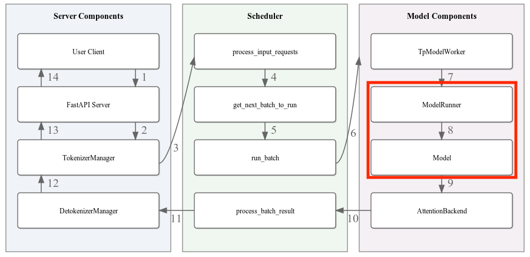
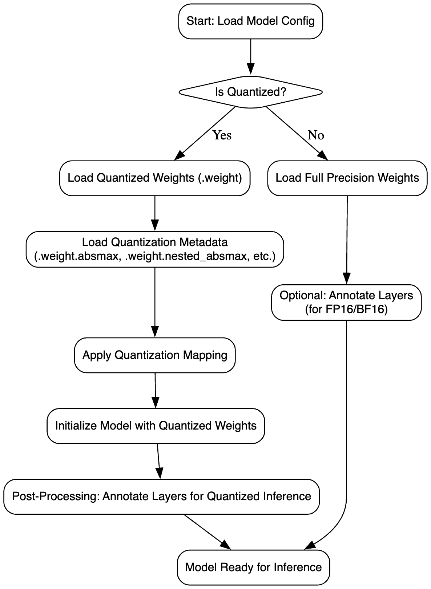
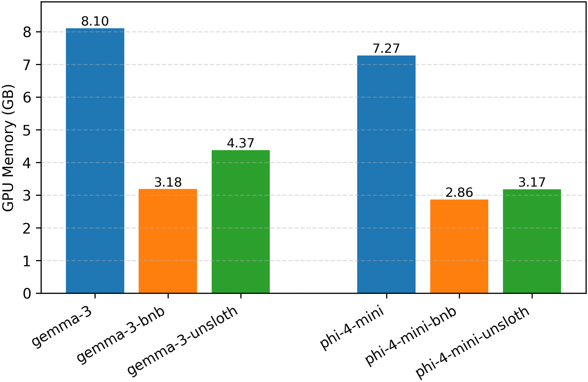
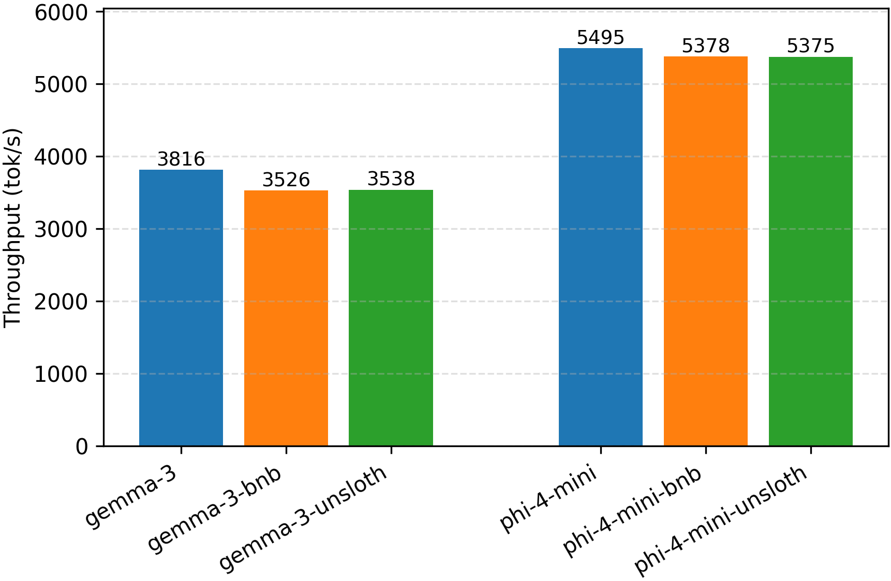
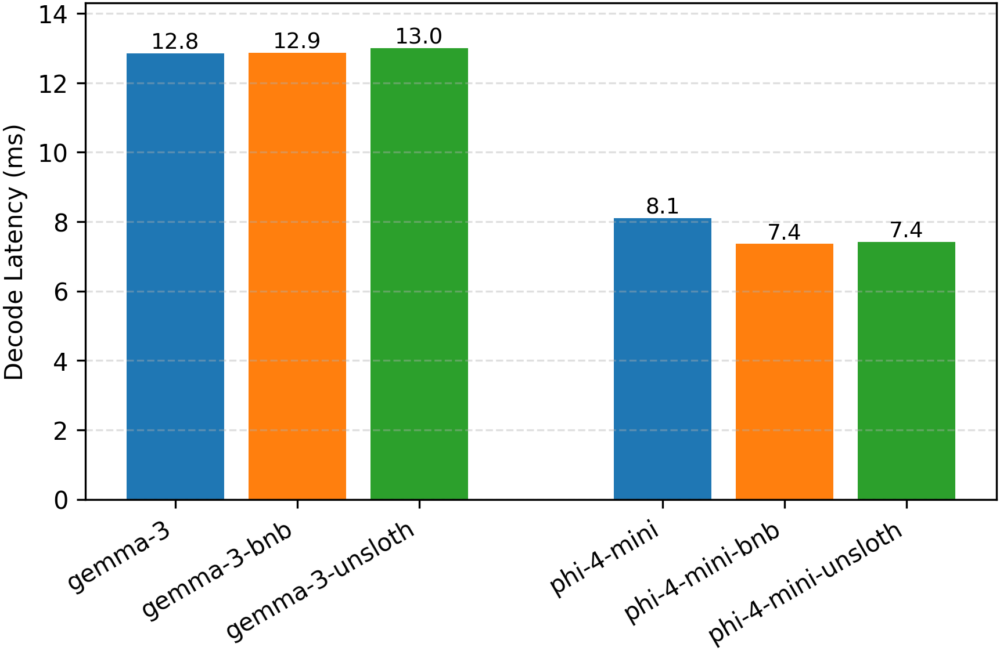
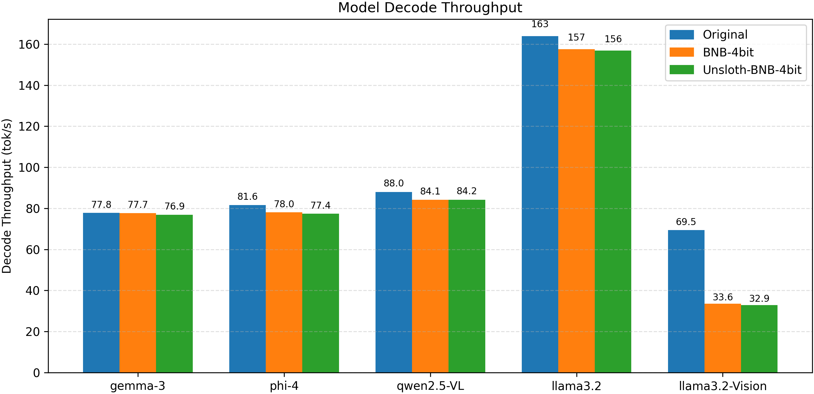
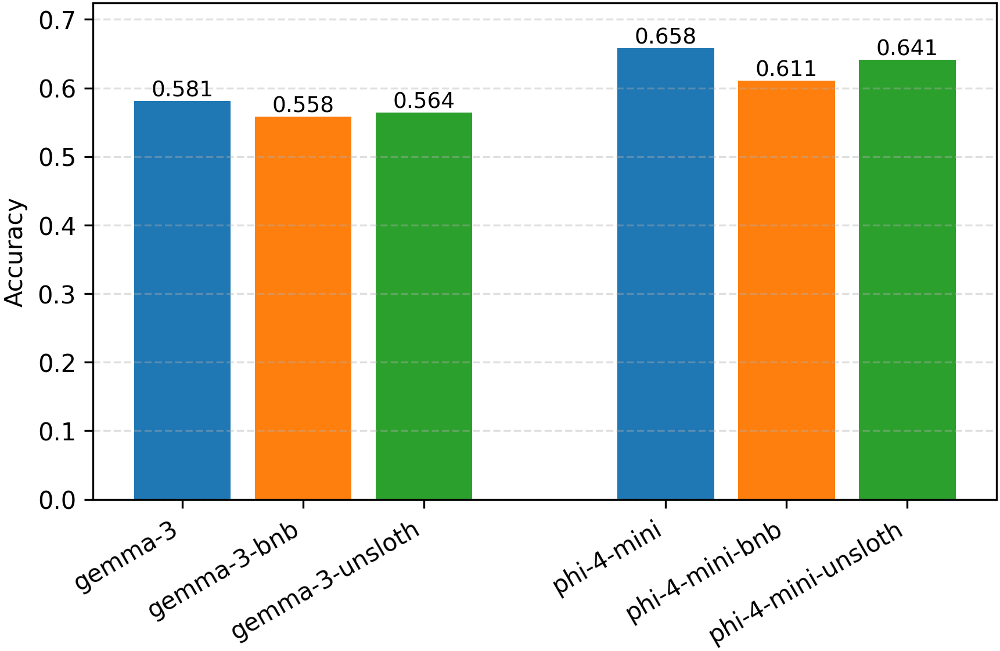

# Motivation

The size of state-of-the-art large language models (LLMs) and multi-modal models has continued to increase rapidly, making it challenging to deploy them efficiently on limited hardware resources. Although model quantization techniques, such as those implemented by **Unsloth** and **BitsAndBytes** (BNB), significantly reduce memory footprint, most inference frameworks—including **SGLang**—do not fully support loading and running all of these quantized models.

This limitation leads to several challenges:
- **Compatibility**: Quantized models require specialized loading and tensor management that differs from standard full-precision models.
- **Efficiency**: Without native support, using quantized models may involve inefficient workarounds that negate the memory and speed benefits of quantization.
- **Accuracy Preservation**: Ensuring that the quantized models run correctly without introducing additional accuracy loss beyond the inherent trade-offs of quantization.

Our goal is to extend **SGLang** to directly support inference with **Unsloth**-quantized models. We benchmarked a set of Unsloth models on **SGLang** and found that **Phi-4-mini** and **Gemma-3** families are not fully supported. Specifically, we aim to:
- Implement seamless loading of quantized model weights within **SGLang**. 
- Preserve model execution fidelity with minimal additional overhead.
- Validate the effectiveness of our solution on models through empirical evaluation of memory savings, throughput, latency, and accuracy.

# Model Families Used in Experiments

To validate our approach, we focus on models from the **Phi-4-mini** family. Phi-4-mini-instruct models are lightweight instruction-tuned LLMs trained on a combination of synthetic and filtered web data, emphasizing high-quality reasoning and long-context capabilities. We also support multi-modality model families such as **Gemma-3**  to further figure out the approach to support diverse model architectures.

# Support Method

## Overview
### General Weight Loading

As shown in the figure below,  SGLang loads the model weights in the ModelRunner initialization stage. In each model loading, it will initialize the model architecture and quantization method based on the model configuration and quantization configuration file. Then it will generate weight iterators to handle various file formats. By iterating all checkpoints, it will load weights to the stacked parameter classes, such as gate_up_proj and qkv_proj, and update the parameter name with shard information (shard id and offset). This model loading flow is shown in the figure below. 

Stacked parameters are for layer fusions. Our target models - **Phi-4-mini** and **Gemma-3** families will go through the weight stacking process for gate_up_proj and qkv_proj, which corresponds to the ColumnParallelLinear layer and QKVParallelLinear layer. ColumnParallelLinear provides parallelism along the second dimension for as $A = [A1, A2, ..., Ap]$ in $Y = XA+b$. QKVParallelLinear concatenates query, key, and value along the output dimension. Since the weights are stacked for this layer, shard size and offset for each stack should be adjusted for quantization.

### BitsAndBytes Loader
BitsAndBytes (bnb) quantization introduces a set of specialized files to represent compressed model weights efficiently. Instead of storing full-precision parameters, the model saves quantized versions along with additional metadata to support dequantization at inference time. 

In addition to the main weights, multiple auxiliary files are used to store quantization-specific information. Table~\ref{tab:bnb-files} summarizes the meaning and usage of each auxiliary file suffix.

### Table: Auxiliary files generated for BitsAndBytes quantized weights

| **Weight Suffix**                               | **Description**                                                                 |
|--------------------------------------------------|----------------------------------------------------------------------------------|
| `.weight`                                        | The quantized low-bit weight tensor (e.g., NF4 or INT4 format).                 |
| `.weight.absmax`                                 | Global absolute maximum value used for scaling during quantization.            |
| `.weight.nested_absmax`                          | Layer-wise or block-wise absolute maximum values for nested quantization.      |
| `.weight.nested_quant_map`                       | Mapping from blocks to corresponding nested quantization scales.               |
| `.weight.quant_map`                              | Mapping from quantized values to approximate floating-point values.            |
| `.weight.quant_state.bitsandbytes__nf4`          | Metadata specifying quantization type (e.g., Normal Float 4 - NF4).            |

These auxiliary files enable efficient and accurate reconstruction of approximate floating-point tensors during inference, allowing large models to maintain high performance while significantly reducing memory footprint.

SGLang already supports all of these quantization metadata handling in its BitsAndBytesModelLoader, which inherits the basic ModelLoader. Generally, the BNB quantized model integration on SGLang is supported by this BitsAndBytesModelLoader. For each model, it loads the weights with corresponding quantization metadata, and indexes the weights by layer name and shard information. Based on the quantization information, it updates the quantization states, shard information, and other states for inference. Therefore, we can skip the quantization process of the whole framework, but focus on support new model architecture and its weight loading manner.

### Unsloth Dynamic Quantization Support
The dynamic quantization provided by Unsloth selects to skip quantization for certain layers to achieve best performance tradeoff between quantization and non-quantization. The skipped layers are specified by llm\_int8\_skip\_modules of the model quantization configuration. The imported dependency VLLM on SGLang already handles this skipping mannar by [bitsandbytes bypass source code](https://github.com/vllm-project/vllm/blob/main/vllm/model_executor/layers/quantization/bitsandbytes.py#L126).  

## Model Specific Support Method
In this section we introduce how to implement support for two Unsloth BnB quantized model class, **Phi-4-mini** and **Gemma-3**.

### Phi-4-mini
To support these models on SGLang, we can reuse most of the existing weight loading logics of Phi-3, but need to fix the shard offsets. For these models, the weights for gate projection and up projection are already concatenated, while the existing gate_up_project weight loading assumes the hugging face model provides non-stacked weights at sharding. Therefore, we would need to handle pre-concatenated weights in checkpoint files, by adjusting shard metadata (size and offset). Details could be found at: [Phi-4-mini Implementation Pull Request](https://github.com/sgl-project/sglang/pull/4982).

### Gemma-3

The Gemma-3 model family includes pure text models (e.g., the 1B model) and vision-text multimodal models ($\geq$ 4B), where the latter utilize SigLIP as the vision tower. SGLang fully supports the pure text models of Gemma-3 but does not support multimodal Unsloth quantization. This limitation arises because SGLang does not natively support SigLIP; instead, it uses the AutoModel method from the Transformers library to import the Gemma-3 vision tower parameters. However, this method does not allow specifying complex quantization configurations, such as Unsloth’s use of llm\_int8\_skip\_modules to indicate layers to be skipped during quantization. Moreover, it does not integrate SGLang's optimized operators, leading to foreseeable performance degradation.

To address these issues, we implemented a SigLIP Vision Model using SGLang operators, based on the reference implementation from Transformers, and integrated it as the vision tower for Gemma-3. Additionally, we fixed bugs related to the concatenation of QKV and gate up/down projection weights when loading the vision tower, as well as mismatches in weight naming for the self attention output projection, ensuring that the vision tower weights are correctly loaded. Further details can be found in the [Gemma-3-mm Implementation Pull Request](https://github.com/sgl-project/sglang/pull/5339/files).

# Evaluation
After integrating supports for **Phi-4-mini** and **Gemma-3**, more Unsloth models are fully supported on SGLang framework. We evaluated the performance of the two families of models, with addition to their un-quantized models, benchmarking the following metrics: GPU memory usage (GB), Decode throughput (token/s), Throughput (token/s), Decode Latency (ms), Accuracy (MMLU). The results are included in the table below. 

| **Model Name**                            | **GPU Memory (GB)** | **Decode Throughput (token/s)** | **Throughput (token/s)** | **Decode Latency (ms)** | **Accuracy (MMLU)** |
|-------------------------------------------|----------------------|----------------------------------|---------------------------|--------------------------|----------------------|
| Gemma-3-4b-it                             | 8.10                 | 77.81                            | 3816                      | 12.85                    | 0.581                |
| Gemma-3-4b-it-bnb-4bit                    | 3.18                 | 77.72                            | 3526                      | 12.87                    | 0.558                |
| Gemma-3-4b-it-unsloth-bnb-4bit           | 4.37                 | 76.92                            | 3538                      | 13.00                    | 0.564                |
| Phi-4-mini-instruct                       | 7.27                 | 123.36                           | 5495                      | 8.11                     | 0.658                |
| Phi-4-mini-instruct-bnb-4bit             | 2.86                 | 135.79                           | 5378                      | 7.36                     | 0.611                |
| Phi-4-mini-instruct-unsloth-bnb-4bit     | 3.17                 | 134.70                           | 5375                      | 7.42                     | 0.641                |

For better illustration, we could compare the performance of three classes of Phi-4-mini and Gemma-3 models: unquantized version (Gemma-3-4b-it, Phi-4-mini-instruct), BNB quantization version (Gemma-3-4b-it-bnb-4bit, Phi-4-mini-instruct-bnb-4bit), and Unsloth dynamic BNB quantization version (Gemma-3-4b-it-unsloth-bnb-4bit, Phi-4-mini-instruct-unsloth-bnb-4bit). The evaluation results in the table above demonstrate that all models achieve good accuracy, with MMLU scores consistently above 0.55. 

Bits-and-bytes (bnb) quantization significantly reduces GPU memory usage across models. For example, for GPU memory perspective show in figure below,  compared to their non-quantized counterparts, fully quantized versions achieve drastic memory savings, while dynamic quantized models (e.g., Unsloth-bnb-4bit) exhibit intermediate memory usage, as they skip quantization for certain layers to balance performance and memory consumption.

In terms of end-to-end throughput shown in figure below,  all models achieve relatively similar token-level throughput, though quantized versions tend to have slightly lower throughput. This phenomenon can be attributed to the nature of LLM workloads being compute-bound: quantization reduces memory bandwidth pressure but introduces additional compute overhead, which limits throughput gains. 

The performances of decoding speed are shown in the figure below.   For Phi-4-mini-instruct, the decode latency improves in quantized versions, suggesting that decoding becomes more memory-bound and benefits from faster memory access. For the Gemma models, quantized models provide lower speed than non-quantized model. This is because **SGLang** does not natively provide full support for bits-and-bytes optimizations. Similar performance degradations are observed in many other models as shown in figure below. 

We evaluated the accuracy of the models as shown in the figure below.  For both the Phi-4-mini and Gemma model families, the non-quantized versions achieved the highest MMLU scores, while the fully quantized versions obtained the lowest. As anticipated, the dynamically quantized models yielded intermediate MMLU scores.

# Acknowledgement
We would like to acknowledge that part of the implementation for weight loading in our project draws inspiration from the tutorial post [how-model-is-loaded](https://github.com/zhaochenyang20/Awesome-ML-SYS-Tutorial/tree/main/sglang/how-model-is-loaded). This resource provided valuable insights into the internal mechanisms of model weight initialization and significantly informed our approach.