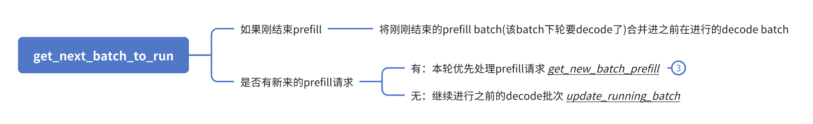
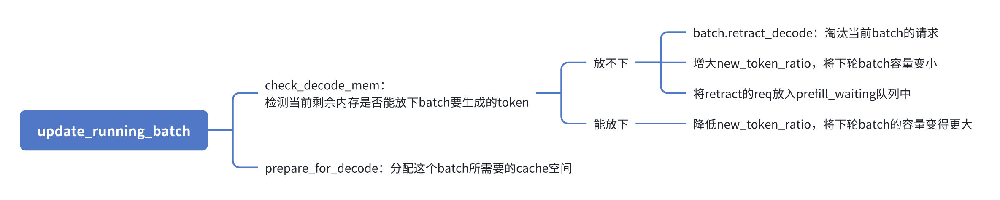
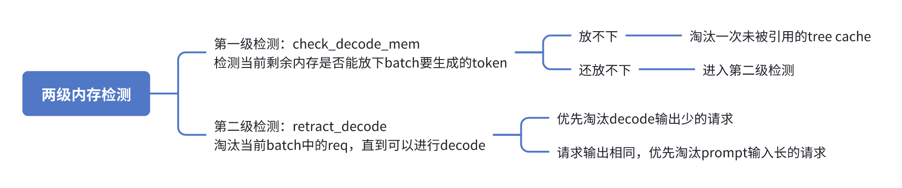
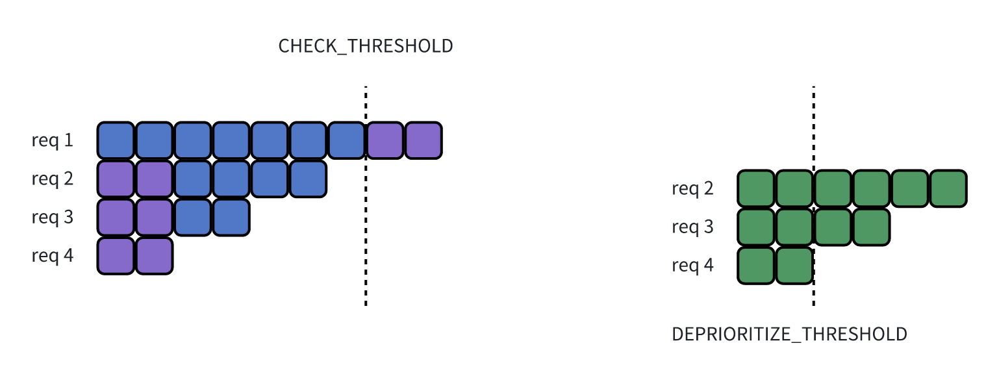
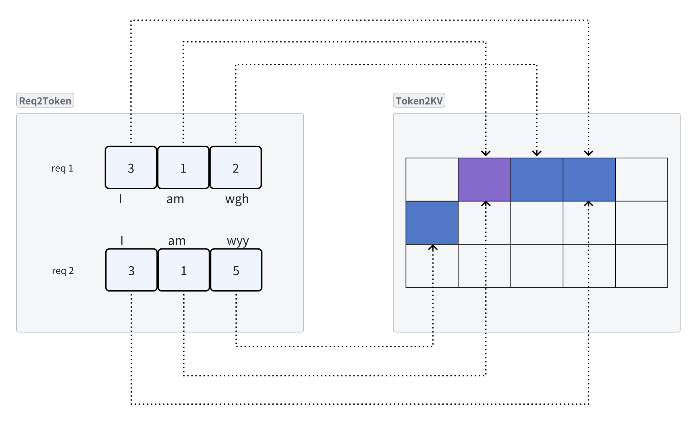
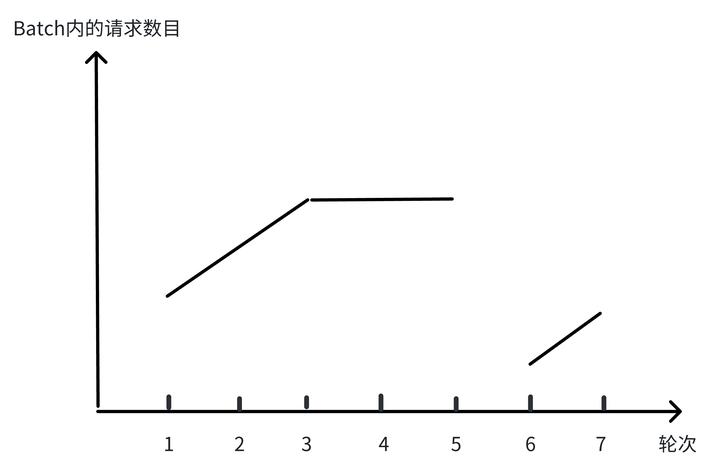

# scheduler 整体概览

Scheduler结构体位于sglang工程文件夹的`python/sglang/srt/managers/scheduler.py`中，是SGLang调度的核心。其从 tokenizer 接受大量的推理请求，选出一批请求来进行执行，负责的数据链路概览如下：

```python
recv_from_tokenizer -> batch -> schedule
    -> forward -> get_forward_res ->send_to_detokenier
```

Scheduler接收来自 tokenizer 的大量推理请求，但我们的 GPU 显存有限，无法同时运行所有请求。因此，我们**以 GPU 显存为约束**，力图**最大化显存利用率**，并从收到的推理请求中尽可能多的选出一批可运行请求。

由于该结构体函数和字段繁多，且部分代码的效果如草蛇灰线，为避免过度陷入代码细节，本文将从整体功能出发，先介绍一个调度器应该实现哪些功能，然后将这些思想对应到 SGLang 代码的函数中。本文不会逐函数进行解释，如果想要看完整的代码流程，可以从`event_loop_normal`函数看起，相信大家看完本文之后再去看eventloop能够阅读的更加通顺。本文所探讨的优化点，大多为任何推理系统所必备，希望大家看完本文之后，对于其他的推理系统也能够触类旁通。

那么，如何最大化显存利用率呢？可以从以下几个方面入手：

- Continue Batch：动态的构建调度 batch，提高吞吐率。传统 LLM 推理批处理系统中，一个 decode batch 必须等待所有请求完成（即推理出停止符）后才能返回并调度下一个 batch。这种方式显然不够高效。例如：

  > 让 LLM 讲隋唐历史和问 LLM 今天成都的天气两个请求，明显成都天气几个 token 说完就可以返回了，而隋唐历史要输出大量 token。我们没必要等 LLM 推理完隋唐历史再让成都天气和跟隋唐历史在一批内同时返回。

  Continue Batch 由 Orca 提出，思想是动态的构建 batch：对于 batch 中的请求，如果有请求完成，就将其移除 batch 并返回，如果有新的请求到来，根据 GPU 资源状态决定是否将其加入。在 SGLang 中，请求的动态加入在 `get_next_batch_to_run` 函数中实现；而请求的动态移除在 `process_batch_result` 函数中完成。
- Page Attention：对于一个请求，传统批处理系统直接按照模型的 `max_length` 来分配 KVcache 的空间。例如，使用 llama3-70B-8k 模型时，一个简单的天气查询请求就会预分配 200G 显存，这显然造成了大量浪费！Page Attention 由 VLLM 提出，我们可以借鉴 OS 中的页表思想，为了解决预分配显存中存在的大量内碎片浪费，利用一个映射，动态的分配当前这个请求需要的 KV cache，而不做提前分配。
  SGLang 使用 `ReqToTokenPool` 和 `TokenToKVPool` 来实现这个动态映射机制。
- Radix Attention：不同请求之间可能存在相同的前缀。对于内容相同且位置编码一致的 token，无需重复计算其前缀的 KVcache。例如，多个用户的 AI agent 可能共享相同的 prompt 前缀，我们只需要计算一遍相同前缀的 KVcache 就行，然后其他用户复用这个前缀，不需要每个用户的请求都独立计算一遍。
- Radix cache aware scheduling：既然请求可能复用相同的前缀，那么在调度时，选择前缀相同的请求越多，GPU 资源利用率就越高。因此，我们可以按照最长前缀匹配原则对请求进行排序，优先选择匹配最长的请求加入批次。
- 推理“拥塞避免”：类似 TCP 拥塞避免机制的动态调整策略，一步一步加大拥塞窗口来试探到网络的极限，Scheduler 通过 `new_token_ratio` 和 `new_token_ratio_decay` 两个字段也实现了类似的做法，试探到 GPU 的极限。当一个批次成功执行时，Scheduler 会逐步增加下一批次的规模，以获得更高的吞吐量；而当一个批次失败时，Scheduler 则会减少下一批次的规模，以避免资源过载。这种动态调整机制不仅能够逼近 GPU 显存的最大利用率，还能确保推理性能的相对稳定。

通过以上的基础优化策略，SGLang 在最大化 GPU 显存利用率的同时，显著提升了推理系统的效率和性能。接下来我们具体看看每个策略是怎么做的。

## ContinueBatch

SGLang 通过 `get_next_batch_to_run` 函数动态地将请求加入批次（batch），并通过 `process_batch_result` 函数处理请求的动态退出。其核心流程如下：



SGLang 当前是以 **prefill** 为主导的，如果有新的 prefill 请求到来，系统在当前正在运行的 decode 请求 forward 完成之后，会暂时中断运行中的 decode 请求，转而运行一次新的 prefill 请求，将其转变为 decode 阶段，然后将其和之前的 decode batch 合并，继续运行。

这时我们可能会问两个问题：为什么要去中断当前的 decode 请求以prefill优先呢？处理一批新的 prefill 请求会消耗大量的 GPU 资源，不会导致用户体验很差吗？

如果我们以 decode 优先，而推理完一个请求的时间又很长，那么会导致新到的推理请求很久都不能被执行，用户的 TTFT（Time To First Token）大幅增加，从而引发用户不满。而在目前的计算模型中，对一个 batch 进行全量 prefill 的开销和对一个 batch 进行一次 decode 的开销是近似的，可以把它们理解为 cost 相同一步。所以 decode 被 prefill 中断不会导致已经 decode 的请求被很长时间阻塞在 prefill batch 上，相反，通过一步操作将 prefill 转换为 decode，反而更有利于系统的持续运行，从而提升整体效率。（当然现在也有 PD 分离和 chunked prefill 去解决这个问题）

### 调度 prefill 请求

调度 prefill 请求的函数是 `get_new_batch_prefill`，该函数决定是否将一条请求加入Prefill Batch。其隐含的输入包括当前系统资源状态和 prefill 请求等待队列 `waiting_list`，输出是调度出的 ScheduleBatch。其核心进行两层调度：

- 等待队列优先级计算：根据选择的 SchedulePolicy 来动态的计算当前 waiting_queue 中哪些 req 权重更高，从而决定它们更早被执行。这一阶段的调度是资源无关的，即无论当前是否有足够的资源执行这些请求，都会先计算它们的权重。
- PrefillAdder：在获取到按权重降序排列的请求后，根据当前 GPU 资源量动态决定将waiting_queue的哪些请求加入 Batch。

在 `get_new_batch_prefill` 函数的末尾，会调用 `prepare_for_extend` 函数，来具体分配 cache和设置前缀复用。关于前缀复用的详细内容，请参见下文的 Page Attention。

### 调度 decode batch

调度 decode 请求的是 `update_running_batch` 函数，该函数检测当前GPU是否有足够的资源进行decode，如果没有，则去淘汰请求，其主要流程如下：



该函数有一个两级内存淘汰机制来保证一定能从GPU中分配出该batch所需要的KV cache空间：



- `check_decode_mem` 函数检查当前系统内存，如果内存不足，则调用 `tree_cache.evict` 先驱逐一次**目前未被任何 req 引用的无用 cache。注意，此时淘汰的KV cache不影响正在运行的 decode 请求。**
- `retract_decode` 在 while 循环中逐请求淘汰 req，直到当前剩余空间足够进行推理。需要注意的是，当进入这个函数时，表明内存资源已经严重不足，发生了 OOM（Out of Memory）。因此，该函数的淘汰策略非常激进，为了防止反复进入 OOM，它需要淘汰出足够支持这个 batch 推理 `retract_decode_steps` 个轮次的 cache 空间。`retract_decode_steps` 默认设置为 20，这意味着如果发生一次 OOM，我们需要淘汰出能够保证这个 decode batch 运行 20 步的空间。其淘汰思路如下：
  - 优先淘汰 output_id 很少的请求：认为生成的 token 越多，越容易结束。早结束早释放完资源
  - 如果 output_id 相同，释放 origin_input_ids 多的 req：认为 `origin_input_ids` 越多，需要生成的 token 也越多，因此优先淘汰这些请求。

当内存检测完成后，我们在 `prepare_for_decode` 这个函数中分配该 batch 需要的 cache 空间（就是分配cache空间并设置 batch 的 out_cache_loc 字段），并通过_self_`.input_ids = ` _self_ `.output_ids`。完成 transformer 的自回归性质。

### 请求动态退出

完成这一轮次推理完成之后，我们在 `process_batch_result` 函数中进行检查，遍历当前 batch 来检查是否有推理完成的 req ，如果有，就 free 掉req的 kvcache。需要注意的是，这里的 free 从宏观流程上来看，更多的是释放掉它的 cache 引用，并不是直接将其淘汰(evict)出 cache，当推理内存不足时，我们会调用 evict 函数中再进行淘汰。

`process_batch_result` 函数有一个小优化是：我们可以在释放 cache 之前启用 TokenToKVPool 的 free_group，这样如果 batch 中要释放一堆 req 的cache，我们可以先在 free_group 中缓存一下，然后调用 `free_group_end` 统一释放，效率会好一些。

看到这里大家可能会有问题：**如果是长上下文的流式对话，我们直接 free 掉一个 req 的 kvcache，用户继续进行对话的话，岂不是有很大可能进行重算，系统的效率会高吗？**我的理解是：

在在线处理中，如果当前请求量较少，那么该 session 的 cache 虽然在 `process_batch_result` 被 free 掉了，但其不会被 `check_decode_memory` 淘汰。这样，当该 session 的下一个对话请求到来时，可以很好地匹配 cache 中的前缀，继续运算。

然而，如果请求量很大，GPU 显存占用率很高，我们不能保证用户一定会连续对话，此时为其维持 cache 的代价就太大了。考虑到进行一次 prompt prefill 和 decode 一个 token 的计算时间相近，我们可以只保存该用户的文字 prompt，而将其 kv cache 淘汰出去。当该用户继续发送消息，并且资源足够支持其推理时，我们只需为其计算一次 prefill 即可进行推理。

## Radix cache

### 最长前缀匹配

在选择新到的 prefill 请求时，我们可以根据其前缀匹配的长度进行调度，选择前缀相同的请求越多，GPU 资源利用率就越高。最长前缀匹配的思路很简单，在数据结构中查找请求是否有前缀就行，大家可以在`radix_cache.py`中看具体逻辑，这里不过多介绍。

### in batch 优化

如果一个 req 的在**全局**的前缀请求很长，那么直接执行绝对很好。

如果一个 req **全局的**前缀没那么长，但是在当前**这一个 batch 中**，有很多 req 他们之间匹配到了很多前缀，那么我们可以从当前 batch 有相同前缀的 reqs 中**只选一个执行**，而其他的都不执行，这么做可以提高缓存命中率。

为什么只执行一个请求会提高缓存命中率，这个结论看起来很反直觉哇？

因为如果只处理其中一个，**后续的请求可以利用这个前缀的结果，减少重复计算。**而如果同时处理多个，可能每个都需要计算相同的前缀，浪费资源。因此，**通过临时降级其他请求，优先处理一个，后续的请求可以利用已计算的前缀，提高命中率。**比如下图中，紫色方框代表每个请求在全局的前缀匹配token，绿色代表这一个batch内，req之间的前缀匹配token。 234 请求在全局都没有很长的前缀匹配，但是他们之间有相似前缀，如果我们将其全部运行，我们要 prefill 12 个 token。但是如果我们只选择了 req2 先执行，我们只需计算 6 个 token，之后的req3 和 4 会复用 req2 计算出来的 token。



该算法在`_compute_prefix_matches`函数中实现，有两个核心变量，即上图的 `CHECK_THRESHOLD` 和 `DEPRIORITIZE_THRESHOLD`。

- `IN_BATCH_PREFIX_CACHING_CHECK_THRESHOLD`：如果 req 在全局中的前缀匹配大于这个阈值，直接执行，不做 in batch 优化。如果小于这个阈值，则开启 inbatch 匹配，看 batch 内部是否有重复前缀。上图中的 req1 即直接执行，234 要做 inbatch 的优化。
- `IN_BATCH_PREFIX_CACHING_DEPRIORITIZE_THRESHOLD`：如果 inbatch 内的阈值小于这个，那就证明前缀匹配的太短了，我们就没必要做优化。比如英文中常见的"i am"，"the"这种常见短词。上图中 23 进行 in batch 优化，但是 4 太短了，不进行 in batch 优化。

## Page attention

Page attn 的思路就不说了，市面上有很多资料讲的都很好，我们主要讲 SGLang 怎么通过 `ReqToTokenPool` 和 `TokenToKVPool` 两个数据结构来实现page attn的思想的。

TokenToKVPool 可以理解为**页表，负责管理 token 的逻辑地址到具体 GPU 资源的映射**。当我们使用 `token2kv[idx]` 来访问元素的时候，我们可以把 idx 想象成虚拟地址，通过 `token2kv[idx]` 来获得其 KVcache 在 GPU 中的实际值。而 ReqToTokenPool 中存储着一个 req 中每个 token 的逻辑地址。`req2token[i, j]` 可以理解为：现在系统中第 i 条req 当前文本中的第 j 个 token 的逻辑地址（就是在 `token2kv` 中的索引）是多少。

注意，这两个数据结构没有保存 req 中 token_ids 的原始值是多少，这两个数据结构只是做地址的映射。token_ids 的原始值存储在 req 的_origin_input_ids_字段中。



上图中，req1 的 ReqToToken 字段保存了 `3, 1, 2` 这几个token的KVcache的逻辑地址。我们希望访问第一个 token 的 KVcache 是什么，只需要在 token2kv 中索引 `token2kv[3]` 就可以了。访问第 i 条 req 的第 j 个 token 的 kvcache 的逻辑是：`token2kv[req2token[i, j]]`。

因为我们实现了 paged attn，我们天然的就可以复用之前已经算好的 kvcache，只需要在 req2token 中，将逻辑地址存入其中就行。比如上图中req1和req2的前两个token，可以复用3号和1号KV cache。

## 推理“拥塞避免”

这个调度调整目前只在SGLang上看到了，先来说一下为什么要这么做。

PrefillAdder 在添加推理请求之前会先计算目前系统内已经被占用的内存资源 `rem_total_token_offset`。对于一个 req 还没有生成的 token，我们也要计算其未来的开销，预留空间以保证这个 req 能够顺利的推理完成。但是在这个请求执行的过程中，请求可能不会推理到 `max_token_length`，且当前请求推理的时候，也可能有其他请求动态的进出，如果我们定死了未生成 req token 的开销，会极大的限制 scheduler 的灵活性。

PrefillAdder 在计算未生成 token 的开销时，会将其乘以 `new_token_ratio` 来降低其比重，通常这个 ratio 小于 1，意味着未生成的token不需要留那么多空间。代码如下：

```python
if _running_batch_ is not None:
    _self_.rem_total_token_offset += sum(
        [
            min(
                (r.sampling_params.max_new_tokens - len(r.output_ids)),
                CLIP_MAX_NEW_TOKENS_ESTIMATION,
            )
            * _self_.new_token_ratio  
            for r in _running_batch_.reqs
        ]
    )
```

那么怎么调整 `new_token_ratio` 呢？SGLang 的做法是在 `update_running_batch` 中基于当前是否 decode OOM。当一个批次成功执行时，Scheduler 会减小 `new_token_ratio`，即逐步增加下一批次的规模；而当一个批次OOM时，Scheduler 则会增加 `new_token_ratio`，即减少下一批次的规模，以避免资源过载。



batchsize 反映在图中即如上图所示，头两个轮次 decode 成功执行，bs 逐逐渐加大；34 轮次也执行成功，但是到了我们自己设置的上限，再增加可能会导致 OOM，所以保持当前的 bs；第 5 轮次出现了 decode OOM，我们要让调度变得保守，减小 bs；6 轮次执行成功，bs 逐渐增大。

这个图像极了TCP的线性拥塞避免，TCP中通过增大cwnd来逼近网络的极限，这里增大batchsize来逼近GPU的极限。TCP中丢包会降低cwnd，这里OOM会降低batchsize。

