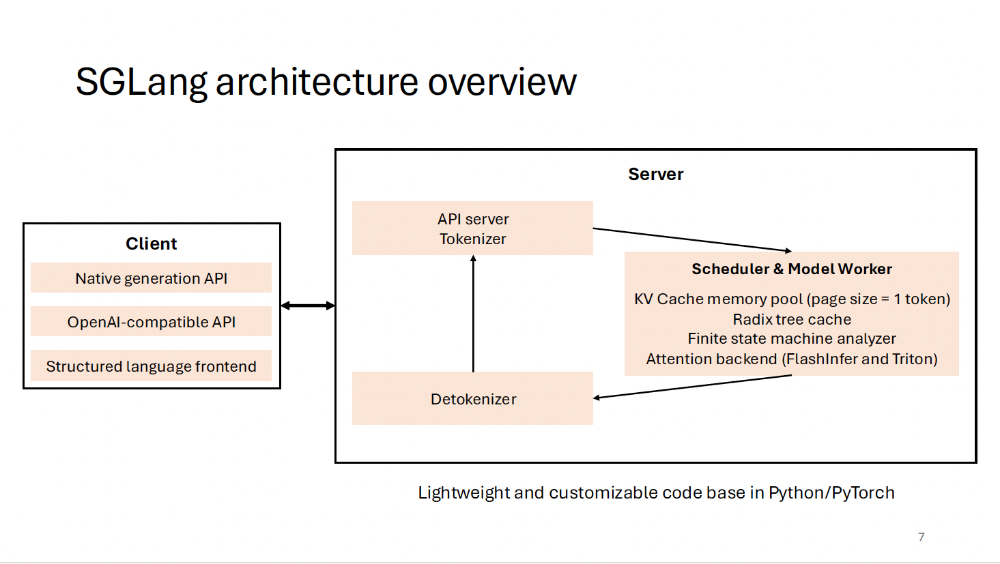
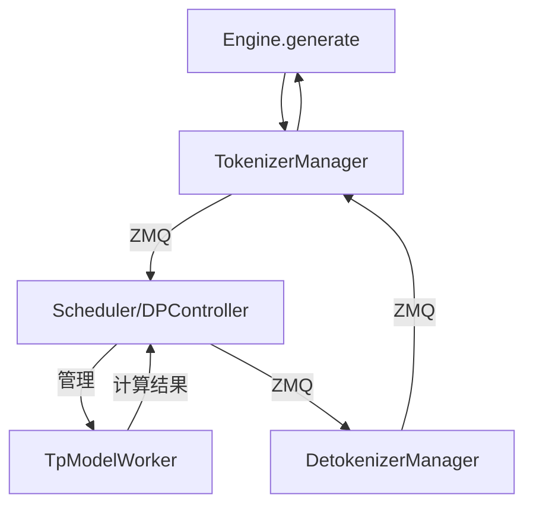
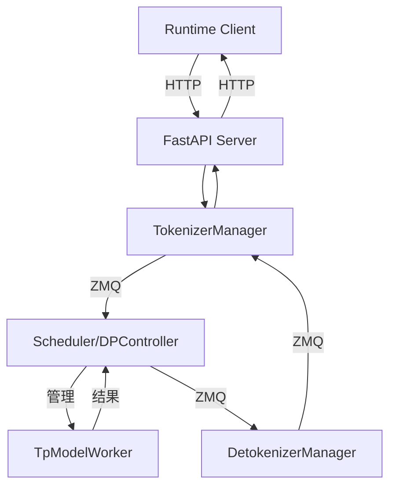

# Walk Through SGLang / VLLM Worker
[English Version](readme.md)

为了实现 SGLang 支持 OpenRLHF 的接口，我们需要在 SGLang 中接入这[两个接口](https://github.com/OpenRLHF/OpenRLHF/blob/main/openrlhf/trainer/ray/vllm_worker_wrap.py)：

- `init_process_group`
- `update_weight`

<details>
<summary>OpenRLHF 的 VLLM Worker Wrap</summary>

```python
class WorkerWrap(Worker):
    def init_process_group(self, master_address, master_port, rank_offset, world_size, group_name, backend="nccl"):
        """Init torch process group for model weights update"""
        assert torch.distributed.is_initialized(), f"default torch process group must be initialized"
        assert group_name != "", f"group name must not be empty"

        rank = torch.distributed.get_rank() + rank_offset
        self._model_update_group = init_process_group(
            backend=backend,
            init_method=f"tcp://{master_address}:{master_port}",
            world_size=world_size,
            rank=rank,
            group_name=group_name,
        )
        print(
            f"init_process_group: master_address={master_address}, master_port={master_port}, ",
            f"rank={rank}, world_size={world_size}, group_name={group_name}",
        )

    def update_weight(self, name, dtype, shape, empty_cache=False):
        """Broadcast weight to all vllm workers from source rank 0 (actor model)"""
        if torch.distributed.get_rank() == 0:
            print(f"update weight: {name}, dtype: {dtype}, shape: {shape}")

        assert dtype == self.model_config.dtype, f"mismatch dtype: src {dtype}, dst {self.model_config.dtype}"
        weight = torch.empty(shape, dtype=dtype, device="cuda")
        torch.distributed.broadcast(weight, 0, group=self._model_update_group)

        self.model_runner.model.load_weights(weights=[(name, weight)])
```

</details>

`WorkerWrap` 类继承并包装了 vllm 的 `Worker` 类，实现了 `init_process_group` 和 `update_weight` 方法，这两个接口当然不麻烦，但是我们可以借一步来捋清楚 SGLang 和 VLLM 的相关代码模块，也作为 SGLang code walk through 的一部分。因此，本文先从 vllm 的 `Worker, Executor, LLMEngine` 开始引入代码，然后对 SGLang 进行简单的 code walk through。

这里放一张 SGLang 的镇楼，此图出自 [slides/lmsys_1st_meetup_sglang.pdf](https://github.com/sgl-project/sgl-learning-materials/blob/main/slides/lmsys_1st_meetup_sglang.pdf)，欢迎大家关注我们的 [learning materials](https://github.com/sgl-project/sgl-learning-materials)：




# vllm

## `Worker`

代码见 [vllm/vllm/worker/worker.py](https://github.com/vllm-project/vllm/blob/main/vllm/worker/worker.py)。`Worker` 类有清晰的注释：

```python
    """A worker class that executes (a partition of) the model on a GPU.

    Each worker is associated with a single GPU. The worker is responsible for
    maintaining the KV cache and executing the model on the GPU. In case of
    distributed inference, each worker is assigned a partition of the model.
    """
```

可见 `Worker` 类负责单一 GPU 的管理，维护 KV cache，并执行模型推理。再分类看看 `Worker` 类的方法：

1. **初始化**

```python
def __init__(self, vllm_config, local_rank, rank, distributed_init_method, ...)
def init_device(self) -> None  # 初始化GPU设备
def load_model(self)  # 加载模型
def initialize_cache(self, num_gpu_blocks: int, num_cpu_blocks: int) -> None  # 初始化 KV cache
```

2. **内存管理**

```python
def determine_num_available_blocks(self) -> Tuple[int, int]  # 确定可用的 KV cache 块数
def get_cache_block_size_bytes(self) -> int  # 获取缓存块大小
```

3. **推理**

```python
def prepare_worker_input(self, execute_model_req: ExecuteModelRequest) -> WorkerInput
def execute_worker(self, worker_input: WorkerInput) -> None
def _execute_model_spmd(self, execute_model_req, intermediate_tensors) -> Optional[List[SamplerOutput]]
```

4. **LoRA**

```python
def add_lora(self, lora_request: LoRARequest) -> bool
def remove_lora(self, lora_id: int) -> bool
def pin_lora(self, lora_id: int) -> bool
def list_loras(self) -> Set[int]
```

5. **Prompt Adapter**

```python
def add_prompt_adapter(self, prompt_adapter_request: PromptAdapterRequest) -> bool
def remove_prompt_adapter(self, prompt_adapter_id: int) -> bool
def pin_prompt_adapter(self, prompt_adapter_id: int) -> bool
def list_prompt_adapters(self) -> Set[int]
```

6. **状态保存**

```python
def save_sharded_state(self, path: str, pattern: Optional[str], max_size: Optional[int])
def save_tensorized_model(self, tensorizer_config: TensorizerConfig)
```

7. **性能分析**

```python
def start_profile(self)
def stop_profile(self)
```

8. **属性访问**

```python
@property
def do_metadata_broadcast(self) -> bool
@property
def kv_cache(self) -> Optional[List[List[torch.Tensor]]]
@property
def max_model_len(self) -> int
@property
def vocab_size(self) -> int
```

写的可以说是非常全面，基本在一张 GPU 上的方方面面都有涉及。

## `ExecutorBase`

`Worker` 类负责管理单张 GPU，很自然我们进一步看看 `Worker` 类之上更大的管理类。[ExecutorBase](https://github.com/vllm-project/vllm/blob/main/vllm/executor/executor_base.py) 负责做的是一个抽象的管理基类（各种 Executor 的基类），定义各类 Executor 的接口规范。

1. **定义接口**：

- 模型执行 (`execute_model`)
- KV cache 管理 (`initialize_cache`, `determine_num_available_blocks`)
- LoRA 和 Prompt Adapter 管理
- 服务状态检查

2. **具体的 Executor 子类**：

- [GPUExecutor](https://github.com/vllm-project/vllm/blob/main/vllm/executor/gpu_executor.py): 单 GPU 执行器，内部会创建和使用一个 Worker
- [MultiprocessingGPUExecutor](https://github.com/vllm-project/vllm/blob/main/vllm/executor/multiproc_gpu_executor.py): 使用多进程管理多个 Worker
- [RayGPUExecutor](https://github.com/vllm-project/vllm/blob/main/vllm/executor/ray_gpu_executor.py): 使用 Ray 框架管理分布式 Worker

## `LLMEngine`

[LLMEngine](https://github.com/vllm-project/vllm/blob/main/vllm/engine/llm_engine.py#L136)：是 `ExecutorBase/Executor` 之上的管理类，负责处理用户请求，并根据配置选择合适的 `Executor`。


1. **初始化**

```python
def __init__(self, vllm_config: VllmConfig, executor_class: Type[ExecutorBase], ...):
    # 管理各种配置：模型、缓存、并行、调度等
    self.model_config = vllm_config.model_config
    self.cache_config = vllm_config.cache_config
    self.parallel_config = vllm_config.parallel_config
    # ...
    
    # 初始化关键组件
    self.tokenizer = self._init_tokenizer()
    self.input_preprocessor = InputPreprocessor(...)
    self.model_executor = executor_class(vllm_config=vllm_config)
    self.scheduler = [Scheduler(...) for _ in range(parallel_config.pipeline_parallel_size)]
```

2. **处理请求**

```python
def add_request(self, request_id: str, prompt: PromptType, params: Union[SamplingParams, PoolingParams], ...):
    # 处理新的生成请求
    # 预处理输入
    # 创建序列组
    # 将请求添加到调度器
```

3. **执行调度与生成**

```python
def step(self) -> List[Union[RequestOutput, EmbeddingRequestOutput]]:
    # 核心执行循环
    # 调度序列组
    # 执行模型前向传播
    # 处理输出
    # 更新序列状态
```

4. **资源管理**

```python
def _initialize_kv_caches(self):
    # 初始化 KV cache
    num_gpu_blocks, num_cpu_blocks = self.model_executor.determine_num_available_blocks()
    self.model_executor.initialize_cache(num_gpu_blocks, num_cpu_blocks)
```

5. **LoRA 和 Prompt Adapter 管理**

```python
def add_lora(self, lora_request: LoRARequest) -> bool
def remove_lora(self, lora_id: int) -> bool
def add_prompt_adapter(self, prompt_adapter_request: PromptAdapterRequest) -> bool
```

6. **监控和统计**

```python
def do_log_stats(self, scheduler_outputs: Optional[SchedulerOutputs] = None, ...):
    # 记录性能指标
    # 统计资源使用情况
    # 追踪请求状态
```

7. **请求状态管理**

```python
def abort_request(self, request_id: Union[str, Iterable[str]]):
    # 中止指定请求
    
def has_unfinished_requests(self) -> bool:
    # 检查是否有未完成的请求
```

可见，`LLMEngine` 是 vLLM 的核心协调类，负责整体工作流程：

   - 请求管理和调度
   - 资源分配和管理
   - 执行流程协调
   - 状态监控和统计

其下具有多个主要组件：

   - `Executor` 负责计算
   - `Scheduler` 负责调度
   - `Tokenizer` 处理文本
   - `InputPreprocessor` 处理输入

# SGLang

相比于 vllm 中 all in one 的 `Worker` 类，SGLang 中对于单张 GPU 上的模型管理分拆为了 [TpModelWorker](https://github.com/sgl-project/sglang/blob/main/python/sglang/srt/managers/tp_worker.py) 和 [ModelRunner](https://github.com/sgl-project/sglang/blob/main/python/sglang/srt/model_executor/model_runner.py) 类：

- `TpModelWorker`：类似于 vllm 的 `Worker`，也是管理单个 GPU 上的模型。但功能相对简单，主要负责初始化模型和分布式环境、管理内存池、执行模型的前向传播、分类处理 embedding 和生成任务。
- `ModelRunner`：负责执行模型推理，并提供接口给 `TpModelWorker` 调用。

对比来看:

- sglang 的 `TpModelWorker` 更类似于 vllm 的 `Worker`，都是高层次的模型管理器
- sglang 将具体的模型执行逻辑分离到了 `ModelRunner` 中，而 vllm 的这部分逻辑大多在 `Worker` 类中
- sglang 的设计更模块化，将模型执行和管理分成了两个类
- vllm 的 `Worker` 功能更丰富，包含了更多高级特性的支持，但是维护和二次开发相对复杂

## `TpModelWorker`

源码地址：[sglang/sglang/srt/managers/tp_worker.py](https://github.com/sgl-project/sglang/blob/main/python/sglang/srt/managers/tp_worker.py)

1. **初始化**
```python
def __init__(self, server_args, gpu_id, tp_rank, dp_rank, nccl_port)
```

- 初始化模型配置和 `ModelRunner`
- 初始化 `Tokenizer`
- 设置内存和请求相关参数
- 同步多 GPU 间的随机种子（`TpModelWorker` 只管理单张 GPU）

2. **读取工作状态**

```python
def get_worker_info(self)  # 返回worker关键参数
def get_pad_input_ids_func(self)  # 获取padding函数
def get_tp_cpu_group(self)  # 获取tensor parallel CPU组
def get_memory_pool(self)  # 获取内存池
```

3. **前向计算**

```python
def forward_batch_generation(self, model_worker_batch)  # 生成任务
def forward_batch_embedding(self, model_worker_batch)  # embedding 任务
```

4. **模型更新**

```python
def update_weights(self, recv_req)  # 更新模型权重
```

注意到其中有大量的请求实际上是调用 `ModelRunner` 的接口。比如：

1. `forward_batch_generation` 和 `forward_batch_embedding` 都是调用 `ModelRunner` 的 `forward` 方法；
2. `update_weights` 调用 `ModelRunner` 的 `update_weights` 方法，而这是 OpenRLHF 的一个关键接口；

从中可见，OpenRLHF 在 vllm `Worker` 的基础上扩充的[两个接口](https://github.com/OpenRLHF/OpenRLHF/blob/main/openrlhf/trainer/ray/vllm_worker_wrap.py)，应该在 `TpModelWorker` 中实现。

## `ModelRunner`

`ModelRunner` 类负责实际上的模型推理，并提供接口给 `TpModelWorker` 调用。

源码地址：[sglang/sglang/srt/model_executor/model_runner.py](https://github.com/sgl-project/sglang/blob/main/python/sglang/srt/model_executor/model_runner.py)

1. 负责具体的模型执行逻辑
2. 管理模型的内存和计算资源
3. 处理模型的前向计算和采样
4. 优化计算性能(CUDA 图、attention backend 等)
5. 支持模型权重的动态更新

1. **初始化**

```python
def __init__(self, model_config, mem_fraction_static, gpu_id, tp_rank, tp_size, nccl_port, server_args)
```
- 初始化模型配置和设备
- 设置分布式训练参数
- 初始化内存池和注意力后端
- 配置 CUDA Graphs

2. **模型加载与更新**

```python
def load_model(self)  # 加载模型权重
def update_weights(self, model_path, load_format)  # 更新模型权重
```

3. **前向计算**

```python
def forward(self, forward_batch)  # 执行前向计算
def forward_decode(self, forward_batch)  # 解码阶段的前向计算
def forward_extend(self, forward_batch)  # 扩展阶段的前向计算
```

4. **采样和 logits 处理**

```python
def sample(self, logits_output, forward_batch)  # 采样下一个 token
def apply_logits_bias(self, logits, sampling_info)  # 应用 logits 偏置和惩罚
```

5. **内存管理**

```python
def profile_max_num_token(self, total_gpu_memory)  # 计算最大 token 数
def init_memory_pool(self, total_gpu_memory, max_num_reqs, max_total_tokens)  # 初始化内存池
```
6. **CUDA 和性能优化**

```python
def init_cublas(self)  # 初始化 cuBLAS
def init_cuda_graphs(self)  # 初始化 CUDA 图
def init_attention_backend(self)  # 初始化注意力后端
```

## `TpModelWorkerClient`

在 vllm 的 `Worker` 类之上封装了一层 `Executor`，二者完成对一张 GPU 的管理，而 `Executor` 之上又封装了一次 `LLMEngine`，管理多卡间的多种并行策略。

在 SGLang 中，`ModelRunner` 其上封装了 `TpModelWorker`，而 `TpModelWorker` 之上又封装了一层 `TpModelWorkerClient`。注意到，这并不是一个多 GPU 的管理类，而是对 `TpModelWorker` 进行的异步包装，支持 SGLang 0.3.5 （即将发布）的 overlap 优化，通过多线程实现计算和数据传输的重叠，提高吞吐量。因此，`TpModelWorkerClient` 和 `TpModelWorker` 还在同一个层面。

源码地址：[sglang/sglang/srt/managers/tp_worker_client.py](https://github.com/sgl-project/sglang/blob/main/python/sglang/srt/managers/tp_worker_overlap_thread.py)

1. 通过多线程实现计算和数据传输的重叠
2. 使用 future token 机制处理依赖关系
3. 支持异步批处理
4. 优化 GPU-CPU 数据传输
5. 保持与 `TpModelWorker` 接口的兼容性

1. **初始化**
```python
def __init__(self, server_args, gpu_id, tp_rank, dp_rank, nccl_port)
```
- 创建底层的 TpModelWorker
- 初始化 future token 映射
- 启动前向计算和数据复制线程

2. **异步计算线程**

```python
def forward_thread_func(self)  # 前向计算线程入口
def forward_thread_func_(self)  # 实际的计算逻辑
```

- 从输入队列获取批次数据
- 解析 future tokens
- 执行模型前向计算
- 更新 future token 映射
- 异步复制结果到 CPU

3. **数据复制线程**

```python
def copy_thread_func(self)  # 数据复制线程
```

- 等待 GPU 计算完成
- 将结果从 GPU 复制到 CPU
- 处理 logprobs
- 将结果放入输出队列

4. **批处理接口**

```python
def forward_batch_generation(self, model_worker_batch)  # 生成任务
def forward_batch_embedding(self, model_worker_batch)  # embedding 任务
```

- 提交批次到输入队列
- 分配 future token IDs
- 返回占位符结果

5. **结果获取**

```python
def resulve_batch_result(self, bid)  # 获取计算结果
```

- 从输出队列获取结果
- 等待批次启动完成
- 返回实际结果

`TpModelWorkerClient` 的代码量不大，还是负责单卡的管理，那么再往上呢？

## `Scheduler`

`Scheduler` 还是在管理单卡，这次是为了 `TpModelWorker/TpModelWorkerClient` 做调度，确实是一个调度器。

源码地址：[sglang/sglang/srt/managers/scheduler.py](https://github.com/sgl-project/sglang/blob/main/python/sglang/srt/managers/scheduler.py)

1. **初始化与配置**

```python
def __init__(self, server_args, port_args, gpu_id, tp_rank, dp_rank)
```

- 初始化进程间通信（ZMQ sockets）
- 创建 tokenizer 和 model config
- 根据 overlap 特性初始化 TpModelWorker/TpModelWorkerClient
- 初始化内存池和缓存系统
- 设置调度策略和批处理参数

2. **请求管理**

- 维护请求队列（waiting_queue）
- 管理当前运行的批次（running_batch）
- 处理请求的生命周期（添加、执行、完成）
- 支持请求的中止和撤回

3. **批处理调度**

```python
def event_loop_normal(self)  # 普通调度循环
def event_loop_overlap(self)  # 重叠调度循环
```

- 实现两种调度模式：普通和重叠
- 动态批处理大小管理
- 请求优先级处理
- 负载均衡

4. **内存管理**

- 管理 token 池和 KV 缓存
- 实现 RadixCache 和 ChunkCache
- 支持缓存刷新和重置
- 内存使用优化

5. **性能优化**

- 支持 chunked prefill
- 实现 grammar cache
- 提供性能指标收集
- 支持性能分析（profiling）

6. **结果处理**

- 处理批处理结果
- 管理 token 生成
- 处理 logprobs
- 更新请求状态

7. **监控和维护**

- watchdog 线程监控
- 指标收集和统计
- 错误处理和恢复
- 日志记录

## `DataParallelController`

从 `DataParallelController` 开始，终于到了管理多 GPU 的控制器。目前为止，我们梳理过：

```python
ModelRunner -> TpModelWorker / TpModelWorkerClient -> Scheduler
```

到这里，所有的文章都是集中在单卡上的 TP 做的，为什么突然就到了 DP 多卡呢？直观上，显然 DP 相比 TP 是更上一层，为什么 SGLang 没有 `TensorParallelController`，而直接到了 `DataParallelController`？

**事实上，SGLang 的 `DataParallelController` 同时也进行了 TP 和 DP 的统一管理。TP 需要管理的内容不多，大家都是一致的，做好 `broadcast input` 和 `allreduce activations` 即可。所以，`DataParallelController` 将 TP 的管理和更上层的 DP 管理统一到了这一层，换言之，这是个多级并行控制器。**

源码地址：[sglang/sglang/srt/managers/data_parallel_controller.py](https://github.com/sgl-project/sglang/blob/main/python/sglang/srt/managers/data_parallel_controller.py)


1. **多级并行架构管理**

```python
def __init__(self, server_args, port_args):
    # 初始化多级并行结构
    self.workers = []  # DP workers
    for dp_rank in range(server_args.dp_size):
        # 每个 DP worker 内部包含多个 TP workers
        self.launch_tensor_parallel_group(...)
```
- 管理数据并行(DP)和张量并行(TP)的多级结构
- 为每个 DP 组分配独立的 GPU 资源块
- 支持多节点分布式部署

2. **负载均衡**

```python
class LoadBalanceMethod(Enum):
    ROUND_ROBIN = auto()
    SHORTEST_QUEUE = auto()
```
- 实现多种负载均衡策略
- 在 DP workers 间分发请求
- 动态调整工作负载


目前 DP  router 的实现还很 naive，但是之后会实现更高效的 cache aware DP scheduling，敬请参见 [rust router](https://github.com/sgl-project/sglang/tree/main/rust)。

3. **进程间通信**

- 使用 ZMQ 管理复杂的进程间通信
- 处理 tokenizer 到 worker 的请求转发
- 支持控制消息的广播

4. **请求调度**

```python
def event_loop(self):
    # 请求分发与处理
    if isinstance(recv_req, (TokenizedGenerateReqInput, TokenizedEmbeddingReqInput)):
        self.dispatching(recv_req)
```

- 接收和分发推理请求
- 处理特殊控制消息
- 维护请求的生命周期

5. **资源协调**

- 协调 GPU 资源分配
- 管理进程启动和同步
- 确保并行组间的资源隔离

6. **错误处理与监控**

- 异常捕获和日志记录
- 进程存活性监控
- 支持优雅的错误恢复

7. **性能优化**

- 支持灵活的负载均衡策略
- 优化跨进程通信效率
- 提供性能监控机制

## `TokenizerManager`

目前为止，我们梳理过：

```python
ModelRunner -> TpModelWorker / TpModelWorkerClient -> Scheduler -> DataParallelController
```

这条脉络，基本把 TP control 自底向上描述了一番。距离我们完整搭建一个 SGLang Architecture 余下不多了。这里继续完成余下的 
`RunTime, Engine, TokenizerManager, DetokenizerManager`。

`TokenizerManager` 是整个推理系统的前端处理器。源码地址：[sglang/sglang/srt/managers/tokenizer_manager.py](https://github.com/sgl-project/sglang/blob/main/python/sglang/srt/managers/tokenizer_manager.py)

1. **文本预处理**

```python:
async def _tokenize_one_request(self, obj):
    # 处理输入文本和图像
    input_text = obj.text
    if obj.input_ids is None:
        input_ids = self.tokenizer.encode(input_text)
    
    if self.is_generation:
        image_inputs = await self.image_processor.process_images_async(...)
```

2. **请求分发与结果聚合**

```python
def __init__(self, server_args, port_args):
    # 初始化进程间通信
    self.recv_from_detokenizer = get_zmq_socket(...)
    self.send_to_scheduler = get_zmq_socket(...)
```

3. **模型更新协调**

```python
async def update_weights(self, obj: UpdateWeightReqInput, request: Optional[fastapi.Request] = None):
    async with self.model_update_lock:
        # 等待现有请求完成
        while len(self.rid_to_state) > 0:
            await asyncio.sleep(0.001)
        
        # 向下游广播更新请求
        self.send_to_scheduler.send_pyobj(obj)
```

对于 OpenRLHF 接口而言，我们格外关注 `update_weights` 接口。显然，从顶向下都有 `update_weights` 接口。

1. **TokenizerManager 的 update_weights**:

   - 作为前端控制器
   - 负责协调更新过程
   - 确保更新时没有正在处理的请求
   - 向所有下游组件广播更新指令

2. **TpModelWorker 的 update_weights**:

   - 作为实际执行者
   - 负责实际加载新的模型权重
   - 管理 GPU 内存
   - 执行具体的模型更新操作

这是一个典型的控制器-执行者模式:
- TokenizerManager: 控制器，协调整个更新流程
- TpModelWorker: 执行者，实际执行模型更新

## `DetokenizerManager`

`DetokenizerManager` 处理模型输出的 token ids 到文本的转换，特别是处理增量解码(incremental decoding）。源码地址：[sglang/sglang/srt/managers/detokenizer_manager.py](https://github.com/sgl-project/sglang/blob/main/python/sglang/srt/managers/detokenizer_manager.py)

1. **增量解码状态管理**

```python
@dataclasses.dataclass
class DecodeStatus:
    """存储增量解码的状态"""
    vid: int                # version id，用于跟踪解码版本
    decoded_text: str       # 已解码的文本
    decode_ids: List[int]   # 解码的token ids
    surr_offset: int        # surrogate偏移量
    read_offset: int        # 读取偏移量
```

2. **批处理解码**

```python
def event_loop(self):
    while True:
        recv_obj = self.recv_from_scheduler.recv_pyobj()
        
        # 处理特殊请求类型
        if isinstance(recv_obj, (BatchEmbeddingOut, UpdateWeightReqOutput, GetMemPoolSizeReqOutput)):
            self.send_to_tokenizer.send_pyobj(recv_obj)
            continue
            
        # 处理正常的token解码请求
        bs = len(recv_obj.rids)
        read_ids, surr_ids = [], []
        for i in range(bs):
            # ... 准备批处理解码数据 ...
```

3. **增量文本生成**

```python
# 增量解码处理
if recv_obj.finished_reason[i] is None:
    # 流式输出：更新解码状态
    if len(new_text) > 0 and not new_text.endswith("�"):
        s.decoded_text = s.decoded_text + new_text
        s.surr_offset = s.read_offset
        s.read_offset = len(s.decode_ids)
        new_text = ""
    else:
        new_text = find_printable_text(new_text)
```

4. **EOS(End of Sequence)处理**

```python
def trim_eos(self, output: Union[str, List[int]], finished_reason, no_stop_trim):
    if no_stop_trim:
        return output

    # 处理停止字符串
    if isinstance(finished_reason, FINISH_MATCHED_STR) and isinstance(output, str):
        pos = output.find(finished_reason.matched)
        return output[:pos] if pos != -1 else output
```

5. **缓存管理**

```python
class LimitedCapacityDict(OrderedDict):
    """有限容量的缓存字典"""
    def __init__(self, capacity=1 << 15, *args, **kwargs):
        super().__init__(*args, **kwargs)
        self.capacity = capacity

    def __setitem__(self, key, value):
        if len(self) >= self.capacity:
            self.popitem(last=False)  # 移除最旧的元素
        super().__setitem__(key, value)
```

工作流程：

1. 接收来自 `Scheduler` 的 token ids
2. 维护每个请求的解码状态
3. 进行批量解码
4. 处理特殊字符和 EOS
5. 将解码后的文本发还给 `TokenizerManager`

## `Engine`

Engine 是一个无 HTTP 服务的纯推理引擎实现。源码地址：[sglang/sglang/srt/server.py](https://github.com/sgl-project/sglang/blob/main/python/sglang/srt/server.py)

核心实现:

```python

class Engine:
    """SRT Engine without an HTTP server layer"""
    def __init__(self, *args, **kwargs):
        # 1. 初始化配置
        server_args = ServerArgs(*args, **kwargs)
        
        # 2. 启动引擎核心组件
        launch_engine(server_args=server_args)

    def generate(self, prompt: Optional[Union[List[str], str]] = None, ...):
        # 构造请求对象
        obj = GenerateReqInput(
            text=prompt,
            input_ids=input_ids,
            sampling_params=sampling_params,
            ...
        )
        
        # 直接调用生成函数
        loop = asyncio.get_event_loop()
        ret = loop.run_until_complete(generate_request(obj, None))
```

组件集成流程:

1. **初始化阶段** (`launch_engine`):

```python
def launch_engine(server_args):
    # 1. 根据 dp_size 启动计算节点
    if server_args.dp_size == 1:
        # 直接启动 TP workers
        for tp_rank in tp_rank_range:
            proc = mp.Process(
                target=run_scheduler_process,  # 每个 scheduler 管理一组 TpModelWorker
                args=(server_args, port_args, gpu_id, tp_rank, None, writer)
            )
    else:
        # 通过 DP controller 管理
        proc = mp.Process(
            target=run_data_parallel_controller_process,
            args=(server_args, port_args, writer)
        )

    # 2. 启动 Detokenizer
    detoken_proc = mp.Process(
        target=run_detokenizer_process,
        args=(server_args, port_args)
    )

    # 3. 初始化 TokenizerManager
    tokenizer_manager = TokenizerManager(server_args, port_args)
```

这里可以看到，当 dp size 为 1 时，会绕过 `DataParallelController` 而直接启动 `Scheduler`（【TODO：这里 scheduler 是在管理多卡么？？？】）。

2. **请求处理流程**:



3. **进程间通信**:

```python
# TokenizerManager 中的通信初始化
def __init__(self, server_args, port_args):
    self.recv_from_detokenizer = get_zmq_socket(...)
    self.send_to_scheduler = get_zmq_socket(...)
```

关键特点:

1. **直接集成**
- 无 HTTP 层，直接通过进程间通信
- 更低的延迟和更高的性能
- 适合嵌入到其他 Python 程序中

2. **异步支持**

```python
async def async_generate(self, prompt, ...):
    obj = GenerateReqInput(...)
    ret = await generate_request(obj, None)
```

3. **流式处理**

```python
def generate(self, ..., stream=False):
    if stream:
        def generator_wrapper():
            while True:
                chunk = loop.run_until_complete(generator.__anext__())
                if chunk.startswith(STREAM_END_SYMBOL):
                    break
                yield json.loads(chunk[len(STREAM_CHUNK_START_SYMBOL):])
        return generator_wrapper()
```

4. **资源管理**

```python
def shutdown(self):
    kill_child_process()  # 清理所有子进程
```

## `Runtime`

`Runtime` 是 SGLang 的入口，可以理解为 https 封装的 `Engine`，负责初始化和管理整个推理系统。源码地址：[sglang/sglang/srt/runtime.py](https://github.com/sgl-project/sglang/blob/main/python/sglang/srt/runtime.py)


1. **初始化流程**:

```python

class Runtime:
    def __init__(self, log_level: str = "error", *args, **kwargs):
        # 1. 初始化配置
        self.server_args = ServerArgs(*args, log_level=log_level, **kwargs)
        
        # 2. 分配端口
        for port in range(10000, 40000):
            if is_port_available(port):
                break
        self.server_args.port = port
        self.url = self.server_args.url()
        
        # 3. 启动服务器进程
        pipe_reader, pipe_writer = mp.Pipe(duplex=False)
        proc = mp.Process(
            target=launch_server,  # 注意这里是 launch_server 而不是 launch_engine
            args=(self.server_args, pipe_writer)
        )
        
        # 4. 创建 HTTP 客户端
        self.endpoint = RuntimeEndpoint(self.url)
```

2. **HTTP 服务封装**:

```python

# FastAPI 应用
app = FastAPI()
app.add_middleware(CORSMiddleware, ...)

# API 端点
@app.get("/health")
async def health() -> Response:
    return Response(status_code=200)

@app.post("/generate")
async def generate(obj: GenerateReqInput, request: Request):
    return await tokenizer_manager.generate_request(obj, request)
```

3. **客户端接口**:
```python:sglang/srt/server.py
class Runtime:
    def generate(self, prompt: Union[str, List[str]], ...):
        # 同步调用
        response = requests.post(
            self.url + "/generate",
            json=json_data,
        )
        return json.dumps(response.json())
    
    async def async_generate(self, prompt: str, ...):
        # 异步调用
        async with session.post(self.generate_url, json=json_data) as response:
            async for chunk in response.content.iter_chunks():
                # 处理流式响应
```

4. **组件集成架构**:



关键特点：

1. **多层封装**

- HTTP 层：FastAPI 服务器
- 客户端层：RuntimeEndpoint
- 进程间通信层：与 Engine 相同的架构

2. **请求处理流程**:

```
Client Request (HTTP)
    ↓
FastAPI Server
    ↓
TokenizerManager
    ↓
Scheduler/DP Controller
    ↓
TpModelWorker(s)
    ↓
DetokenizerManager
    ↓
TokenizerManager
    ↓
FastAPI Response (HTTP)
```

3. **灵活的接口支持**:

- 同步/异步 API
- 流式输出
- OpenAI 兼容接口

`Runtime` 相比 `Engine` ，增加了 HTTP 服务层，提供了更完整的 API 接口，支持远程调用，更适合作为独立服务部署。


