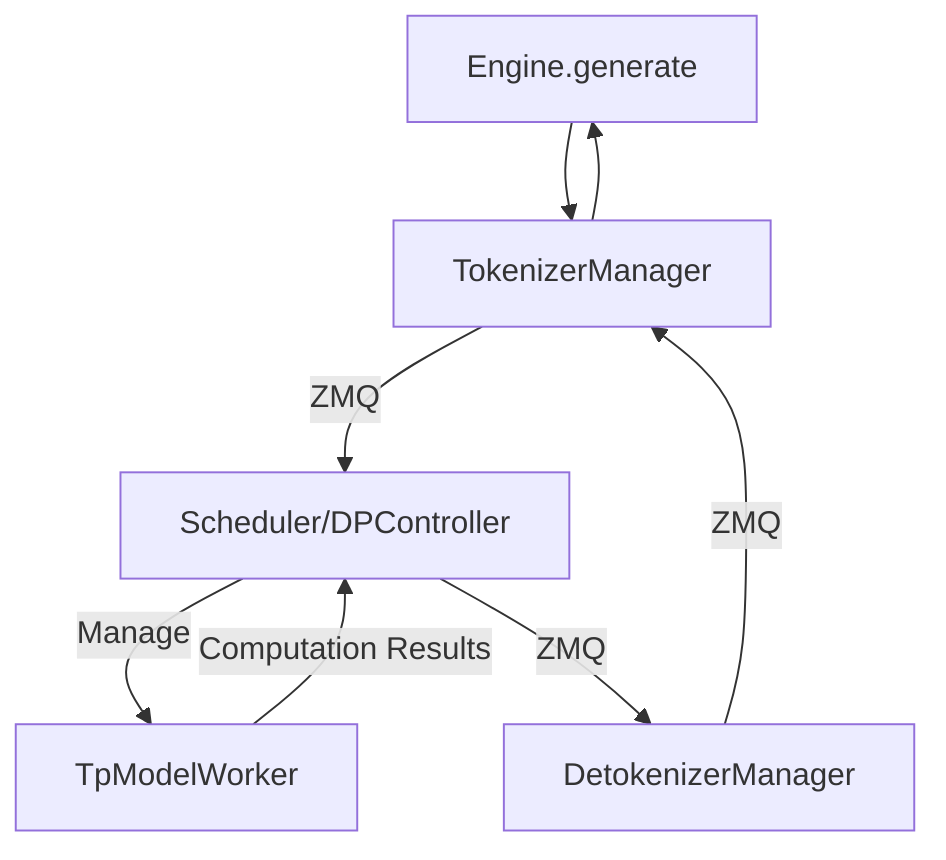
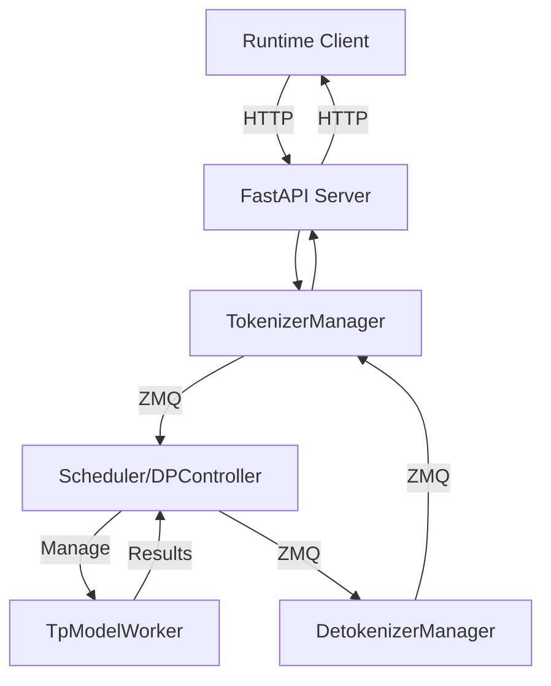

# Walk Through SGLang / VLLM Worker

## [English version](./readme.md) | [简体中文](./readme-CN.md)

To enable SGLang to support OpenRLHF interfaces, we need to implement two [interfaces](https://github.com/OpenRLHF/OpenRLHF/blob/main/openrlhf/trainer/ray/vllm_worker_wrap.py) in SGLang:
- `init_process_group`
- `update_weight`

<details>
<summary>OpenRLHF's VLLM Worker Wrap</summary>

```python
class WorkerWrap(Worker):
    def init_process_group(self, master_address, master_port, rank_offset, world_size, group_name, backend="nccl"):
        """Init torch process group for model weights update"""
        assert torch.distributed.is_initialized(), f"default torch process group must be initialized"
        assert group_name != "", f"group name must not be empty"

        rank = torch.distributed.get_rank() + rank_offset
        self._model_update_group = init_process_group(
            backend=backend,
            init_method=f"tcp://{master_address}:{master_port}",
            world_size=world_size,
            rank=rank,
            group_name=group_name,
        )
        print(
            f"init_process_group: master_address={master_address}, master_port={master_port}, ",
            f"rank={rank}, world_size={world_size}, group_name={group_name}",
        )

    def update_weight(self, name, dtype, shape, empty_cache=False):
        """Broadcast weight to all vllm workers from source rank 0 (actor model)"""
        if torch.distributed.get_rank() == 0:
            print(f"update weight: {name}, dtype: {dtype}, shape: {shape}")

        assert dtype == self.model_config.dtype, f"mismatch dtype: src {dtype}, dst {self.model_config.dtype}"
        weight = torch.empty(shape, dtype=dtype, device="cuda")
        torch.distributed.broadcast(weight, 0, group=self._model_update_group)

        self.model_runner.model.load_weights(weights=[(name, weight)])
```

</details>

The `WorkerWrap` class inherits from and wraps vllm's `Worker` class, implementing the `init_process_group` and `update_weight` methods. While these two interfaces are straightforward, we can use this opportunity to understand the code modules of SGLang and VLLM, as part of our SGLang code walk-through. Therefore, this article will first introduce the code from vllm's `Worker`, `Executor`, and `LLMEngine`, then proceed with a simple code walk-through of SGLang.

Here's an architectural diagram of SGLang to guide us through this article. This image is from [slides/lmsys_1st_meetup_sglang.pdf](https://github.com/sgl-project/sgl-learning-materials/blob/main/slides/lmsys_1st_meetup_sglang.pdf). We welcome everyone to check out our [learning materials](https://github.com/sgl-project/sgl-learning-materials):


# vllm

## Worker

The code can be found at [vllm/vllm/worker/worker.py](https://github.com/vllm-project/vllm/blob/main/vllm/worker/worker.py). The `Worker` class has clear documentation:

```python
    """A worker class that executes (a partition of) the model on a GPU.

    Each worker is associated with a single GPU. The worker is responsible for
    maintaining the KV cache and executing the model on the GPU. In case of
    distributed inference, each worker is assigned a partition of the model.
    """
```

As we can see, the `Worker` class is responsible for managing a single GPU, maintaining the KV cache, and executing model inference. Let's examine the `Worker` class methods by category:

1. **Initialization**

```python
def __init__(self, vllm_config, local_rank, rank, distributed_init_method, ...)
def init_device(self) -> None  # Initialize GPU device
def load_model(self)  # Load model
def initialize_cache(self, num_gpu_blocks: int, num_cpu_blocks: int) -> None  # Initialize KV cache
```

2. **Memory Management**

```python
def determine_num_available_blocks(self) -> Tuple[int, int]  # Determine available KV cache blocks
def get_cache_block_size_bytes(self) -> int  # Get cache block size
```

3. **Inference**

```python
def prepare_worker_input(self, execute_model_req: ExecuteModelRequest) -> WorkerInput
def execute_worker(self, worker_input: WorkerInput) -> None
def _execute_model_spmd(self, execute_model_req, intermediate_tensors) -> Optional[List[SamplerOutput]]
```

4. **LoRA**

```python
def add_lora(self, lora_request: LoRARequest) -> bool
def remove_lora(self, lora_id: int) -> bool
def pin_lora(self, lora_id: int) -> bool
def list_loras(self) -> Set[int]
```

5. **Prompt Adapter**

```python
def add_prompt_adapter(self, prompt_adapter_request: PromptAdapterRequest) -> bool
def remove_prompt_adapter(self, prompt_adapter_id: int) -> bool
def pin_prompt_adapter(self, prompt_adapter_id: int) -> bool
def list_prompt_adapters(self) -> Set[int]
```

6. **State Saving**

```python
def save_sharded_state(self, path: str, pattern: Optional[str], max_size: Optional[int])
def save_tensorized_model(self, tensorizer_config: TensorizerConfig)
```

7. **Profiling**

```python
def start_profile(self)
def stop_profile(self)
```

8. **Property Access**

```python
@property
def do_metadata_broadcast(self) -> bool
@property
def kv_cache(self) -> Optional[List[List[torch.Tensor]]]
@property
def max_model_len(self) -> int
@property
def vocab_size(self) -> int
```

The implementation is quite comprehensive, covering virtually every aspect of managing a single GPU.

## `ExecutorBase`

The `Worker` class is responsible for managing a single GPU, so it naturally follows to look at a higher-level management class above the `Worker` class.  `ExecutorBase` is responsible for serving as an abstract management base class (the base class for various Executors), defining interface specifications for different Executors.

1. **Interface Definitions**:
- Model execution (`execute_model`)
- KV cache management (`initialize_cache`, `determine_num_available_blocks`)
- LoRA and Prompt Adapter management
- Service status checks

2. **Concrete Executor Subclasses**:
- [GPUExecutor](https://github.com/vllm-project/vllm/blob/main/vllm/executor/gpu_executor.py): Single GPU executor, creates and uses one Worker internally
- [MultiprocessingGPUExecutor](https://github.com/vllm-project/vllm/blob/main/vllm/executor/multiproc_gpu_executor.py): Uses multiprocessing to manage multiple Workers
- [RayGPUExecutor](https://github.com/vllm-project/vllm/blob/main/vllm/executor/ray_gpu_executor.py): Uses Ray framework to manage distributed Workers

## LLMEngine

[LLMEngine](https://github.com/vllm-project/vllm/blob/main/vllm/engine/llm_engine.py#L136): This is the management class above `ExecutorBase/Executor`, responsible for handling user requests and selecting appropriate `Executor` based on configuration.

1. **Initialization**

```python
def __init__(self, vllm_config: VllmConfig, executor_class: Type[ExecutorBase], ...):
    # Manage various configurations: model, cache, parallel, scheduling, etc.
    self.model_config = vllm_config.model_config
    self.cache_config = vllm_config.cache_config
    self.parallel_config = vllm_config.parallel_config
    # ...
    
    # Initialize key components
    self.tokenizer = self._init_tokenizer()
    self.input_preprocessor = InputPreprocessor(...)
    self.model_executor = executor_class(vllm_config=vllm_config)
    self.scheduler = [Scheduler(...) for _ in range(parallel_config.pipeline_parallel_size)]
```

2. **Request Processing**

```python
def add_request(self, request_id: str, prompt: PromptType, params: Union[SamplingParams, PoolingParams], ...):
    # Handle new generation requests
    # Preprocess input
    # Create sequence groups
    # Add request to scheduler
```

3. **Execution Scheduling and Generation**

```python
def step(self) -> List[Union[RequestOutput, EmbeddingRequestOutput]]:
    # Core execution loop
    # Schedule sequence groups
    # Execute model forward pass
    # Process output
    # Update sequence states
```

4. **Resource Management**

```python
def _initialize_kv_caches(self):
    # Initialize KV cache
    num_gpu_blocks, num_cpu_blocks = self.model_executor.determine_num_available_blocks()
    self.model_executor.initialize_cache(num_gpu_blocks, num_cpu_blocks)
```

5. **LoRA and Prompt Adapter Management**

```python
def add_lora(self, lora_request: LoRARequest) -> bool
def remove_lora(self, lora_id: int) -> bool
def add_prompt_adapter(self, prompt_adapter_request: PromptAdapterRequest) -> bool
```

6. **Monitoring and Statistics**

```python
def do_log_stats(self, scheduler_outputs: Optional[SchedulerOutputs] = None, ...):
    # Record performance metrics
    # Track resource usage
    # Monitor request status
```

7. **Request Status Management**

```python
def abort_request(self, request_id: Union[str, Iterable[str]]):
    # Abort specified requests
    
def has_unfinished_requests(self) -> bool:
    # Check for unfinished requests
```

As we can see, `LLMEngine` is vLLM's core coordination class, responsible for the overall workflow:

   - Request management and scheduling
   - Resource allocation and management
   - Execution process coordination
   - Status monitoring and statistics

It has several main components:
   - `Executor` for computation
   - `Scheduler` for scheduling
   - `Tokenizer` for text processing
   - `InputPreprocessor` for input processing

# SGLang

Compared to vllm's all-in-one `Worker` class, SGLang splits the model management on a single GPU into [TpModelWorker](https://github.com/sgl-project/sglang/blob/main/python/sglang/srt/managers/tp_worker.py) and [ModelRunner](https://github.com/sgl-project/sglang/blob/main/python/sglang/srt/model_executor/model_runner.py) classes:

- `TpModelWorker`: Similar to vllm's Worker, also manages model on a single GPU. However, its functionality is relatively simpler, mainly responsible for initializing model and distributed environment, managing memory pool, executing model's forward propagation, and handling embedding and generation tasks.
- `ModelRunner`: Responsible for executing model inference and providing interfaces for `TpModelWorker` to call.

Comparing the two:

- SGLang's `TpModelWorker` is more similar to vllm's `Worker`, both being high-level model managers
- SGLang separates specific model execution logic into `ModelRunner`, while vllm keeps most of this logic in the `Worker` class
- SGLang's design is more modular, separating model execution and management into two classes
- vllm's `Worker` has richer functionality, including support for more advanced features, but is more complex to maintain and extend

## TpModelWorker

Source code: [sglang/sglang/srt/managers/tp_worker.py](https://github.com/sgl-project/sglang/blob/main/python/sglang/srt/managers/tp_worker.py)

1. **Initialization**
```python
def __init__(self, server_args, gpu_id, tp_rank, dp_rank, nccl_port)
```

- Initialize model configuration and `ModelRunner`
- Initialize `Tokenizer`
- Set memory and request-related parameters
- Synchronize random seeds between multiple GPUs (`TpModelWorker` only manages a single GPU)

2. **Reading Work Status**

```python
def get_worker_info(self)  # Return worker key parameters
def get_pad_input_ids_func(self)  # Get padding function
def get_tp_cpu_group(self)  # Get tensor parallel CPU group
def get_memory_pool(self)  # Get memory pool
```

3. **Forward Computation**

```python
def forward_batch_generation(self, model_worker_batch)  # Generation tasks
def forward_batch_embedding(self, model_worker_batch)  # Embedding tasks
```

4. **Model Updates**

```python
def update_weights(self, recv_req)  # Update model weights
```

Note that many of these requests actually call `ModelRunner` interfaces. For example:

1. `forward_batch_generation` and `forward_batch_embedding` both call `ModelRunner`'s `forward` method
2. `update_weights` calls `ModelRunner`'s `update_weights` method, which is a key interface for OpenRLHF

From this, we can see that OpenRLHF's [two interfaces](https://github.com/OpenRLHF/OpenRLHF/blob/main/openrlhf/trainer/ray/vllm_worker_wrap.py) added to vllm's `Worker` should be implemented in `TpModelWorker`.

## `ModelRunner`

The `ModelRunner` class is responsible for actual model inference and provides interfaces for `TpModelWorker` to call.

Source code: [sglang/sglang/srt/model_executor/model_runner.py](https://github.com/sgl-project/sglang/blob/main/python/sglang/srt/model_executor/model_runner.py)

1. Responsible for specific model execution logic
2. Manages model's memory and compute resources
3. Handles model's forward computation and sampling
4. Optimizes computation performance (CUDA graphs, attention backend, etc.)
5. Supports dynamic model weight updates

1. **Initialization**

```python
def __init__(self, model_config, mem_fraction_static, gpu_id, tp_rank, tp_size, nccl_port, server_args)
```
- Initialize model configuration and devices
- Set distributed training parameters
- Initialize memory pool and attention backend
- Configure CUDA Graphs

2. **Model Loading and Updates**

```python
def load_model(self)  # Load model weights
def update_weights(self, model_path, load_format)  # Update model weights
```

3. **Forward Computation**

```python
def forward(self, forward_batch)  # Execute forward computation
def forward_decode(self, forward_batch)  # Forward computation in decoding phase
def forward_extend(self, forward_batch)  # Forward computation in extension phase
```

4. **Sampling and Logits Processing**

```python
def sample(self, logits_output, forward_batch)  # Sample next token
def apply_logits_bias(self, logits, sampling_info)  # Apply logits bias and penalties
```

5. **Memory Management**

```python
def profile_max_num_token(self, total_gpu_memory)  # Calculate maximum token count
def init_memory_pool(self, total_gpu_memory, max_num_reqs, max_total_tokens)  # Initialize memory pool
```

6. **CUDA and Performance Optimization**

```python
def init_cublas(self)  # Initialize cuBLAS
def init_cuda_graphs(self)  # Initialize CUDA graphs
def init_attention_backend(self)  # Initialize attention backend
```

## `TpModelWorkerClient`

While vllm wraps its `Worker` class with an `Executor` layer (both managing a single GPU), and then wraps `Executor` with `LLMEngine` to manage various parallel strategies across multiple cards, SGLang takes a different approach.

In SGLang, above `ModelRunner` is wrapped by `TpModelWorker`, which is then wrapped by `TpModelWorkerClient`. Note that this is not a multi-GPU management class, but rather an asynchronous wrapper for `TpModelWorker`, supporting SGLang 0.3.5's (upcoming) overlap optimization, achieving computation and data transfer overlap through multi-threading. Therefore, `TpModelWorkerClient` remains on the same level as `TpModelWorker`.

Source code: [sglang/sglang/srt/managers/tp_worker_client.py](https://github.com/sgl-project/sglang/blob/main/python/sglang/srt/managers/tp_worker_overlap_thread.py)

1. Implements computation and data transfer overlap through multi-threading
2. Uses future token mechanism to handle dependencies
3. Supports asynchronous batch processing
4. Optimizes GPU-CPU data transfer
5. Maintains compatibility with `TpModelWorker` interfaces

1. **Initialization**
```python
def __init__(self, server_args, gpu_id, tp_rank, dp_rank, nccl_port)
```
- Create underlying TpModelWorker
- Initialize future token mapping
- Launch forward computation and data copy threads

2. **Asynchronous Computation Thread**

```python
def forward_thread_func(self)  # Forward computation thread entry
def forward_thread_func_(self)  # Actual computation logic
```

- Get batch data from input queue
- Parse future tokens
- Execute model forward computation
- Update future token mapping
- Asynchronously copy results to CPU

3. **Data Copy Thread**

```python
def copy_thread_func(self)  # Data copy thread
```

- Wait for GPU computation completion
- Copy results from GPU to CPU
- Process logprobs
- Put results in output queue

4. **Batch Processing Interface**

```python
def forward_batch_generation(self, model_worker_batch)  # Generation tasks
def forward_batch_embedding(self, model_worker_batch)  # Embedding tasks
```

- Submit batch to input queue
- Allocate future token IDs
- Return placeholder results

5. **Result Retrieval**

```python
def resolve_batch_result(self, bid)  # Get computation results
```

- Get results from output queue
- Wait for batch launch completion
- Return actual results

The `TpModelWorkerClient` code is not large and still manages a single card, so what's next up?

## `Scheduler`

The `Scheduler` is still managing a single card, this time for scheduling `TpModelWorker/TpModelWorkerClient`. It is indeed a scheduler.

Source code: [sglang/sglang/srt/managers/scheduler.py](https://github.com/sgl-project/sglang/blob/main/python/sglang/srt/managers/scheduler.py)

1. **Initialization and Configuration**

```python
def __init__(self, server_args, port_args, gpu_id, tp_rank, dp_rank)
```

- Initialize inter-process communication (ZMQ sockets)
- Create tokenizer and model config
- Initialize TpModelWorker/TpModelWorkerClient based on overlap features
- Initialize memory pool and cache system
- Set scheduling strategies and batch processing parameters

2. **Request Management**

- Maintain request queue (waiting_queue)
- Manage currently running batches (running_batch)
- Handle request lifecycle (add, execute, complete)
- Support request abortion and withdrawal

3. **Batch Scheduling**

```python
def event_loop_normal(self)  # Normal scheduling loop
def event_loop_overlap(self)  # Overlap scheduling loop
```

- Implement two scheduling modes: normal and overlap
- Dynamic batch size management
- Request priority processing
- Load balancing

4. **Memory Management**

- Manage token pool and KV cache
- Implement RadixCache and ChunkCache
- Support cache refresh and reset
- Memory usage optimization

5. **Performance Optimization**

- Support chunked prefill
- Implement grammar cache
- Provide performance metrics collection
- Support profiling

6. **Result Processing**

- Handle batch processing results
- Manage token generation
- Process logprobs
- Update request status

7. **Monitoring and Maintenance**

- Watchdog thread monitoring
- Metrics collection and statistics
- Error handling and recovery
- Logging

## `DataParallelController`

Starting with `DataParallelController`, we finally reach the multi-GPU controller. So far, we've covered:

```python
ModelRunner -> TpModelWorker / TpModelWorkerClient -> Scheduler
```

Until now, all the components have focused on Tensor Parallelism (TP) on a single card. Why do we suddenly jump to Data Parallelism (DP) across multiple cards? Intuitively, DP is clearly a higher level than TP, so why doesn't SGLang have a `TensorParallelController` before moving directly to `DataParallelController`?

**In fact, SGLang's `DataParallelController` manages both TP and DP simultaneously. TP doesn't require much management, as everyone is consistent - just handle `broadcast input` and `allreduce activations`. Therefore, `DataParallelController` unifies TP management with higher-level DP management at this layer. In other words, this is a multi-level parallel controller.**

Source code: [sglang/sglang/srt/managers/data_parallel_controller.py](https://github.com/sgl-project/sglang/blob/main/python/sglang/srt/managers/data_parallel_controller.py)

1. **Multi-level Parallel Architecture Management**

```python
def __init__(self, server_args, port_args):
    # Initialize multi-level parallel structure
    self.workers = []  # DP workers
    for dp_rank in range(server_args.dp_size):
        # Each DP worker contains multiple TP workers
        self.launch_tensor_parallel_group(...)
```
- Manage Data Parallel (DP) and Tensor Parallel (TP) multi-level structure
- Allocate independent GPU resource blocks for each DP group
- Support multi-node distributed deployment

2. **Load Balancing**

```python
class LoadBalanceMethod(Enum):
    ROUND_ROBIN = auto()
    SHORTEST_QUEUE = auto()
```
- Implement multiple load balancing strategies
- Distribute requests among DP workers
- Dynamically adjust workload

The current DP router implementation is still naive, but more efficient cache-aware DP scheduling will be implemented later, please see [rust router](https://github.com/sgl-project/sglang/tree/main/sgl-router).

3. **Inter-process Communication**

- Use ZMQ to manage complex inter-process communication
- Handle request forwarding from tokenizer to worker
- Support control message broadcasting

4. **Request Scheduling**

```python
def event_loop(self):
    # Request distribution and processing
    if isinstance(recv_req, (TokenizedGenerateReqInput, TokenizedEmbeddingReqInput)):
        self.dispatching(recv_req)
```

- Receive and distribute inference requests
- Handle special control messages
- Maintain request lifecycle

5. **Resource Coordination**

- Coordinate GPU resource allocation
- Manage process startup and synchronization
- Ensure resource isolation between parallel groups

6. **Error Handling and Monitoring**

- Exception catching and logging
- Process liveness monitoring
- Support graceful error recovery

7. **Performance Optimization**

- Support flexible load balancing strategies
- Optimize cross-process communication efficiency
- Provide performance monitoring mechanisms


## `TokenizerManager`

So far, we've covered:

```python
ModelRunner -> TpModelWorker / TpModelWorkerClient -> Scheduler -> DataParallelController
```

This path has essentially described the TP control from bottom to top. We're not far from building a complete SGLang Architecture. Let's continue with the remaining components: `RunTime, Engine, TokenizerManager, DetokenizerManager`.

`TokenizerManager` is the frontend processor of the entire inference system. Source code: [sglang/sglang/srt/managers/tokenizer_manager.py](https://github.com/sgl-project/sglang/blob/main/python/sglang/srt/managers/tokenizer_manager.py)

1. **Text Preprocessing**

```python
async def _tokenize_one_request(self, obj):
    # Handle input text and images
    input_text = obj.text
    if obj.input_ids is None:
        input_ids = self.tokenizer.encode(input_text)
    
    if self.is_generation:
        image_inputs = await self.image_processor.process_images_async(...)
```

2. **Request Distribution and Result Aggregation**

```python
def __init__(self, server_args, port_args):
    # Initialize inter-process communication
    self.recv_from_detokenizer = get_zmq_socket(...)
    self.send_to_scheduler = get_zmq_socket(...)
```

3. **Model Update Coordination**

```python
async def update_weights(self, obj: UpdateWeightReqInput, request: Optional[fastapi.Request] = None):
    async with self.model_update_lock:
        # Wait for existing requests to complete
        while len(self.rid_to_state) > 0:
            await asyncio.sleep(0.001)
        
        # Broadcast update request to downstream
        self.send_to_scheduler.send_pyobj(obj)
```

For the OpenRLHF interface, we pay special attention to the `update_weights` interface. Clearly, there are `update_weights` interfaces from top to bottom.

1. **TokenizerManager's update_weights**:

   - Acts as frontend controller
   - Responsible for coordinating the update process
   - Ensures no requests are being processed during update
   - Broadcasts update instructions to all downstream components

2. **TpModelWorker's update_weights**:

   - Acts as actual executor
   - Responsible for actually loading new model weights
   - Manages GPU memory
   - Executes specific model update operations

This is a typical controller-executor pattern:
- TokenizerManager: Controller, coordinates the entire update process
- TpModelWorker: Executor, actually executes model updates

## DetokenizerManager

`DetokenizerManager` handles the conversion of model output token ids to text, especially handling incremental decoding. Source code: [sglang/sglang/srt/managers/detokenizer_manager.py](https://github.com/sgl-project/sglang/blob/main/python/sglang/srt/managers/detokenizer_manager.py)

1. **Incremental Decoding State Management**

```python
@dataclasses.dataclass
class DecodeStatus:
    """Store incremental decoding status"""
    vid: int                # version id, for tracking decode version
    decoded_text: str       # decoded text
    decode_ids: List[int]   # decoded token ids
    surr_offset: int        # surrogate offset
    read_offset: int        # read offset
```

2. **Batch Processing Decoding**

```python
def event_loop(self):
    while True:
        recv_obj = self.recv_from_scheduler.recv_pyobj()
        
        # Handle special request types
        if isinstance(recv_obj, (BatchEmbeddingOut, UpdateWeightReqOutput, GetMemPoolSizeReqOutput)):
            self.send_to_tokenizer.send_pyobj(recv_obj)
            continue
            
        # Handle normal token decoding requests
        bs = len(recv_obj.rids)
        read_ids, surr_ids = [], []
        for i in range(bs):
            # ... prepare batch decoding data ...
```

3. **Incremental Text Generation**

```python
# Incremental decoding processing
if recv_obj.finished_reason[i] is None:
    # Stream output: update decode status
    if len(new_text) > 0 and not new_text.endswith("�"):
        s.decoded_text = s.decoded_text + new_text
        s.surr_offset = s.read_offset
        s.read_offset = len(s.decode_ids)
        new_text = ""
    else:
        new_text = find_printable_text(new_text)
```

4. **EOS (End of Sequence) Processing**

```python
def trim_eos(self, output: Union[str, List[int]], finished_reason, no_stop_trim):
    if no_stop_trim:
        return output

    # Handle stop strings
    if isinstance(finished_reason, FINISH_MATCHED_STR) and isinstance(output, str):
        pos = output.find(finished_reason.matched)
        return output[:pos] if pos != -1 else output
```

5. **Cache Management**

```python
class LimitedCapacityDict(OrderedDict):
    """Limited capacity cache dictionary"""
    def __init__(self, capacity=1 << 15, *args, **kwargs):
        super().__init__(*args, **kwargs)
        self.capacity = capacity

    def __setitem__(self, key, value):
        if len(self) >= self.capacity:
            self.popitem(last=False)  # Remove oldest element
        super().__setitem__(key, value)
```

Workflow:

1. Receive token ids from `Scheduler`
2. Maintain decoding status for each request
3. Perform batch decoding
4. Handle special characters and EOS
5. Send decoded text back to `TokenizerManager`


## Engine

Engine is a pure inference engine implementation without HTTP service. Source code: [sglang/sglang/srt/server.py](https://github.com/sgl-project/sglang/blob/main/python/sglang/srt/server.py)

Core implementation:

```python
class Engine:
    """SRT Engine without an HTTP server layer"""
    def __init__(self, *args, **kwargs):
        # 1. Initialize configuration
        server_args = ServerArgs(*args, **kwargs)
        
        # 2. Launch engine core components
        launch_engine(server_args=server_args)

    def generate(self, prompt: Optional[Union[List[str], str]] = None, ...):
        # Construct request object
        obj = GenerateReqInput(
            text=prompt,
            input_ids=input_ids,
            sampling_params=sampling_params,
            ...
        )
        
        # Directly call generation function
        loop = asyncio.get_event_loop()
        ret = loop.run_until_complete(generate_request(obj, None))
```

Component Integration Process:

1. **Initialization Phase** (`launch_engine`):

```python
def launch_engine(server_args):
    # 1. Launch compute nodes based on dp_size
    if server_args.dp_size == 1:
        # Directly launch TP workers
        for tp_rank in tp_rank_range:
            proc = mp.Process(
                target=run_scheduler_process,  # Each scheduler manages a group of TpModelWorkers
                args=(server_args, port_args, gpu_id, tp_rank, None, writer)
            )
    else:
        # Manage through DP controller
        proc = mp.Process(
            target=run_data_parallel_controller_process,
            args=(server_args, port_args, writer)
        )

    # 2. Launch Detokenizer
    detoken_proc = mp.Process(
        target=run_detokenizer_process,
        args=(server_args, port_args)
    )

    # 3. Initialize TokenizerManager
    tokenizer_manager = TokenizerManager(server_args, port_args)
```

Here we can see that when dp size is 1, it bypasses the `DataParallelController` and directly launches the `Scheduler`.

2. **Request Processing Flow**:



3. **Inter-process Communication**:

```python
# Communication initialization in TokenizerManager
def __init__(self, server_args, port_args):
    self.recv_from_detokenizer = get_zmq_socket(...)
    self.send_to_scheduler = get_zmq_socket(...)
```

Key Features:

1. **Direct Integration**
- No HTTP layer, direct inter-process communication
- Lower latency and higher performance
- Suitable for embedding into other Python programs

2. **Async Support**

```python
async def async_generate(self, prompt, ...):
    obj = GenerateReqInput(...)
    ret = await generate_request(obj, None)
```

3. **Stream Processing**

```python
def generate(self, ..., stream=False):
    if stream:
        def generator_wrapper():
            while True:
                chunk = loop.run_until_complete(generator.__anext__())
                if chunk.startswith(STREAM_END_SYMBOL):
                    break
                yield json.loads(chunk[len(STREAM_CHUNK_START_SYMBOL):])
        return generator_wrapper()
```

4. **Resource Management**

```python
def shutdown(self):
    kill_child_process()  # Clean up all child processes
```

## Runtime

`Runtime` is SGLang's entry point, which can be understood as an HTTP-wrapped `Engine`, responsible for initializing and managing the entire inference system. Source code: [sglang/sglang/srt/runtime.py](https://github.com/sgl-project/sglang/blob/main/python/sglang/srt/runtime.py)

1. **Initialization Process**:

```python
class Runtime:
    def __init__(self, log_level: str = "error", *args, **kwargs):
        # 1. Initialize configuration
        self.server_args = ServerArgs(*args, log_level=log_level, **kwargs)
        
        # 2. Allocate ports
        for port in range(10000, 40000):
            if is_port_available(port):
                break
        self.server_args.port = port
        self.url = self.server_args.url()
        
        # 3. Launch server process
        pipe_reader, pipe_writer = mp.Pipe(duplex=False)
        proc = mp.Process(
            target=launch_server,  # Note this is launch_server not launch_engine
            args=(self.server_args, pipe_writer)
        )
        
        # 4. Create HTTP client
        self.endpoint = RuntimeEndpoint(self.url)
```

2. **HTTP Service Wrapper**:

```python
# FastAPI application
app = FastAPI()
app.add_middleware(CORSMiddleware, ...)

# API endpoints
@app.get("/health")
async def health() -> Response:
    return Response(status_code=200)

@app.post("/generate")
async def generate(obj: GenerateReqInput, request: Request):
    return await tokenizer_manager.generate_request(obj, request)
```

3. **Client Interface**:
```python
class Runtime:
    def generate(self, prompt: Union[str, List[str]], ...):
        # Synchronous call
        response = requests.post(
            self.url + "/generate",
            json=json_data,
        )
        return json.dumps(response.json())
    
    async def async_generate(self, prompt: str, ...):
        # Asynchronous call
        async with session.post(self.generate_url, json=json_data) as response:
            async for chunk in response.content.iter_chunks():
                # Handle streaming response
```

4. **Component Integration Architecture**:



Key Features:

1. **Multi-layer Encapsulation**
- HTTP layer: FastAPI server
- Client layer: RuntimeEndpoint
- Inter-process communication layer: Same architecture as Engine

2. **Request Processing Flow**:
```
Client Request (HTTP)
    ↓
FastAPI Server
    ↓
TokenizerManager
    ↓
Scheduler/DP Controller
    ↓
TpModelWorker(s)
    ↓
DetokenizerManager
    ↓
TokenizerManager
    ↓
FastAPI Response (HTTP)
```

3. **Flexible Interface Support**:
- Synchronous/Asynchronous API
- Stream output
- OpenAI-compatible interface

Compared to `Engine`, `Runtime` adds an HTTP service layer, provides more complete API interfaces, supports remote calls, and is more suitable for deployment as an independent service.
