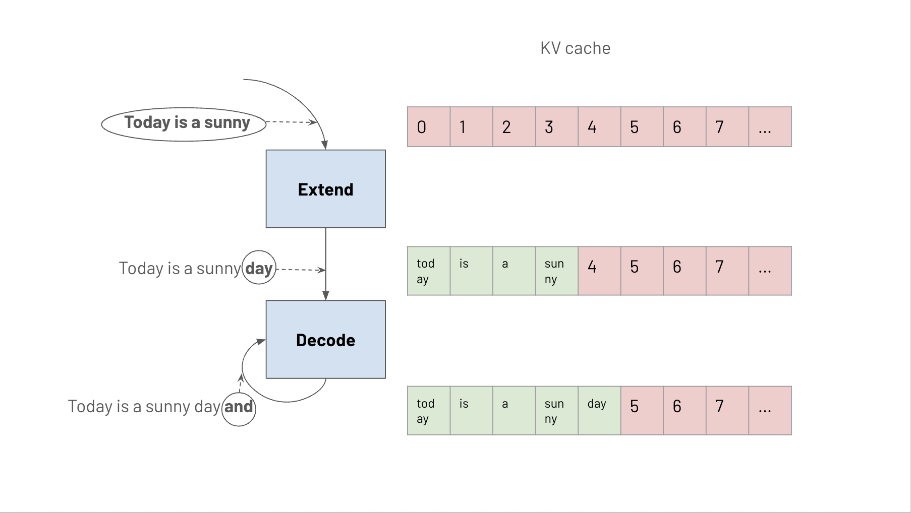
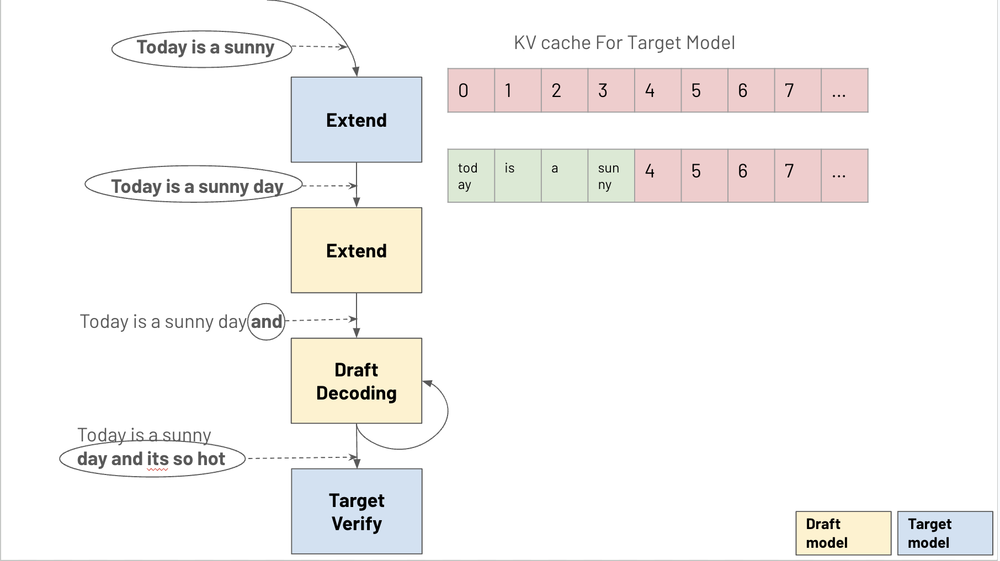
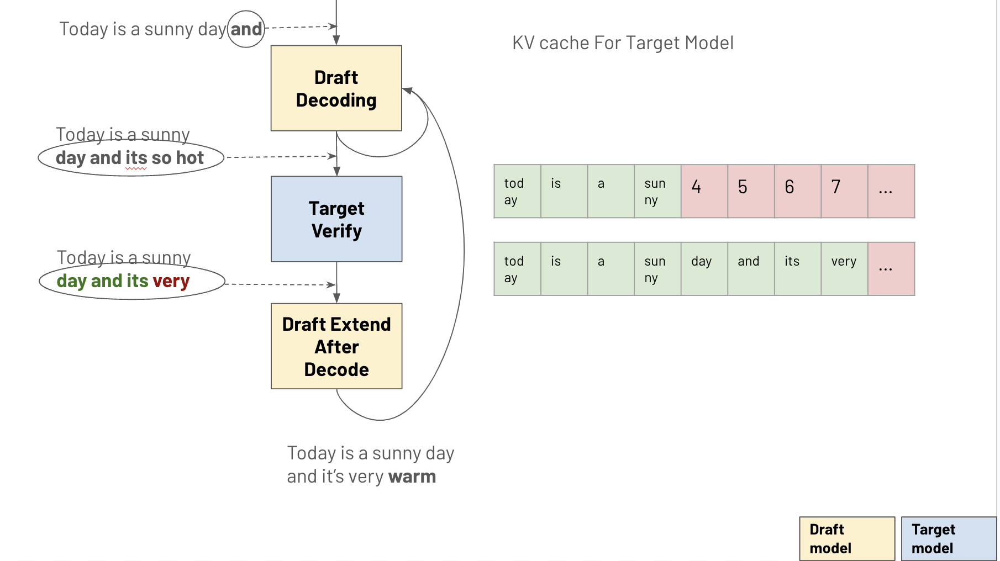

## Speculative Decoding

Speculative decoding is an optimization technique that accelerates inference. While traditional decoding is bottlenecked by memory access when generating one token at a time, speculative decoding leverages a smaller "draft" model to predict next K tokens in one round, achieving up to K times speedup with similar memory usage.

This doc is mainly focused on high level SGLang implementation for speculative decoding, For detailed theoretical background, please refer to the original research papers:
- [Accelerating Large Language Model Decoding with Speculative Sampling](https://arxiv.org/pdf/2211.17192)
- [Fast Inference from Transformers via Speculative Decoding](https://arxiv.org/pdf/2302.01318)

### Token Generation Process

#### Traditional Decoding

Traditional decoding consists of two main stages:
1. **Prefill/Extend**: Performs forward pass on the prefill tokens.
2. **Decode**: Performs forward pass on the current token to generate the next token.

#### Speculative Decoding
Speculative decoding introduces a draft model to generate multiple tokens in parallel:

Compare to traditional decode stage, in speculative decode, it includes:
1. **Draft Prefill/Extend**: Performs forward pass on prefill tokens using the draft model.
2. **Draft Decoding**: Generates N draft tokens sequentially using the draft model.

3. **Target Verification**: The target model verifies N draft tokens through a forward pass. There are three possible cases for verification:

   a. **Full Match**: All N draft tokens are accepted by the target model
      - Best case scenario
      - Returns N tokens in one round
      - Achieves N times speedup

   b. **No Match**: None of the draft tokens are accepted
      - Worst case scenario
      - Returns only one token from the target model
      - Performance equivalent to traditional decoding

   c. **Prefix Match**: Some initial draft tokens are accepted
      - Most common scenario
      - For example in above graph, draft tokens are "and it's so hot" and target model generates "and it's very warm", first two tokens ("and it's") are accepted, the rest are rejected, note the rejected tokens' KV cache need to be evicted.
      - Partial speedup achieved based on number of accepted tokens