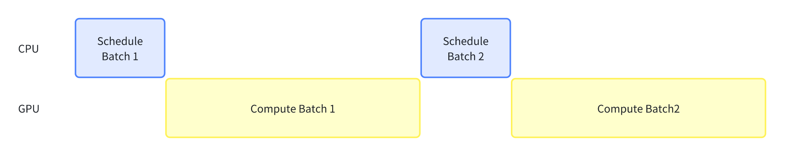
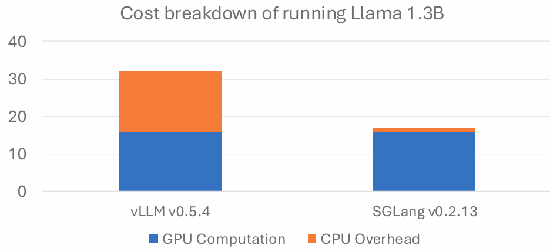
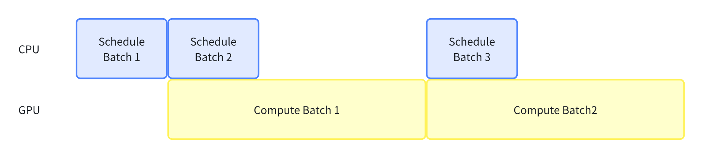
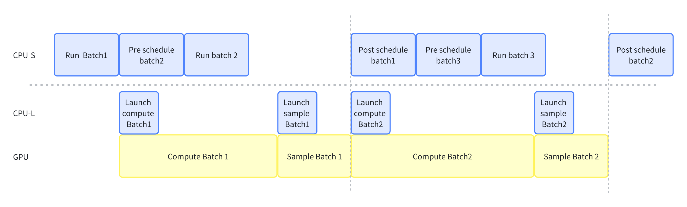
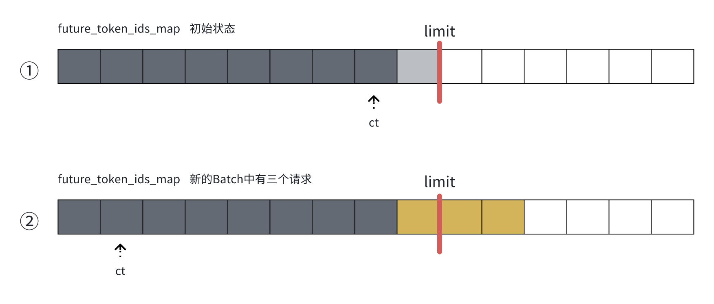
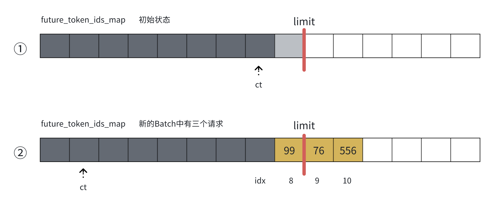

# Zero-Overhead Batch Scheduler 

> 关于作者：我是王冠骅，电子科技大学计算机本硕研二(26毕业)，目前在找推理加速方向的实习，欢迎联系我！281484683@qq.com
> 本文参考 [https://github.com/sgl-project/sgl-learning-materials/blob/main/slides/lmsys_1st_meetup_sglang.pdf](https://github.com/sgl-project/sgl-learning-materials/blob/main/slides/lmsys_1st_meetup_sglang.pdf)

# 引言

传统的推理系统中，CPU 的调度和 GPU 计算是串行执行的。两者需要互相等待才可以继续执行，这样导致了 GPU 会有很长无谓的 Bubble，如下图所示：



未经优化的引擎可能会将一半的时间花费到 CPU 调度上，[下图](https://github.com/sgl-project/sgl-learning-materials/blob/main/slides/lmsys_1st_meetup_sglang.pdf)是 vLLM 0.5.4 版本的模型运行开销数据，Scheduler 开销严重（当然现在 VLLM 也更新了 overlap）。



我们可以将 CPU 调度与 GPU 计算重叠。调度器提前运行一个批次，并准备下一个批次所需的所有元数据。这样可以保持 GPU 始终忙碌，并隐藏调度的昂贵的开销，如图所示。



本篇中，我们将结合 SGLang 的代码，分析 SGLang 实现 overlap 的一些关键代码。首先我们从逻辑上分析一下流水线都有哪些步骤。

# 流水线逻辑解释

## 推理时都有哪些步骤？

在构建流水线之前，我们有必要梳理一下 SGLang 的推理都有哪些步骤，以便更好地分析哪些步骤可以重叠。SGLang 的推理过程主要分为以下四个阶段：

1. Pre schedule：

   - 收集前端传入的请求，并将其放入等待队列。
   - 从等待队列中进行调度，涉及 Radix Tree 和最长前缀匹配（Longest Prefix Matching）算法。
   - 为每个请求分配 Token 所需的内存资源。
2. Compute batch：

   - 将 batch 发送到 GPU 上进行一步（即 Continue Batch 的一个 iter）推理
3. Sample：

   - 根据模型输出的 Logit 进行采样，生成下一步的 Token。
4. Post schedule：

   - 在一步推理完成后，动态检查请求是否满足结束条件（Check Finish Condition）。
   - 将已完成的请求从批次中移除，并送入 Detokenizer 处理，最终将结果返回给前端。

即下表的串行执行，每一步都是同步阻塞的，必须等一个过程完成才能进行下一个过程。

```python
Pre schedule -> Compute batch -> Sample -> Post schedule
```

## 该如何重叠这些步骤？

我们注意到，Compute batch 和 Sample 这两个挨在一起的阶段是 GPU heavy 的，而 schedule 的两个阶段是 CPU heavy 的。当多个 batch 流水线化时，我们可以用 GPU 的 Compute 和 Sample 来重叠上一个 batch 的 post scheduler 与当前 batch 的 pre scheduler。

实际上，如果想让 GPU **异步的**执行代码，我们必须要 CPU 有一个函数，将 Kernel launch 到 GPU 上；并且当 kernel 返回时，我们也需要一个函数来帮助处理 logits。这里，我们将 CPU 分成了两个部分：

1. CPU-S（Scheduler CPU）：负责调度任务，包括 Pre-schedule 和 Post-schedule。
2. CPU-L（Launch CPU）：专门负责 Kernel 的启动以及 Kernel 返回结果的处理。

CPU-S 将调度好的批次传递给 CPU-L 后，便立即转向处理下一个步骤，**让 GPU 去进行异步计算**，而无需等待 Kernel 的启动或返回结果的处理。

一图胜千言，下图代表了重叠的流水线。其中我们所 overlap 的，实际上是以虚线为分界线，重叠 **CPU-S** 和 **CPU-L + GPU** 这个的整体。图中我们假设第一个 batch 已经调度完成并直接运行，RunBatch 这个阶段代表我们把任务从 CPU-S 交给 CPU-L 上去，**请仔细注意 CPU-S 的各个 batch 序号。**



在流水线中，Scheduler 可以在不等待 Compute 阶段返回结果的情况下，继续调度下一个批次。然而，它不能一次性连续调度多个批次（例如，在 Compute Batch1 计算时，直接连续调度 5 个批次）。

我个人的理解是，这种限制主要基于以下两个原因：

1. Check Finish Condition：在每次迭代（iter）完成后，需要对当前批次中的每个请求进行 Check Finish Condition。如果有请求已经完成，则需要立即将其结果返回给用户。
2. 更新约束采样：在每次迭代完成后，还需要更新 vocab_mask，以便在下一轮采样中应用约束条件（下文会详细说明）。

此外，在 Sample 阶段完成后，进入 Post-schedule 阶段之前，存在一个 Event 强制同步。必须等待 Sample 生成的 Token 传递到 CPU 后，才能进行 Post-schedule 的调度。这一同步机制确保了数据的完整性和调度的正确性。

[SGLang 博客](https://lmsys.org/blog/2024-12-04-sglang-v0-4/#zero-overhead-batch-scheduler)中的流水线是下图这么画的，把 CPU 看作了一个整体。我感觉 SGL 博客的流水线图更容易理解思想，本文的流水线图更容易理解代码细节（下节中会看到为什么拆开了 CPU-L）。


## Overlap 伪代码

SGLang 提供的 Overlap 版本的事件循环伪代码如下，其中 run_batch 函数实现了 compute 和 sample 的功能，对这个流程不了解可以先看[无 overlap 版本的文章](https://github.com/zhaochenyang20/Awesome-ML-SYS-Tutorial/blob/main/sglang/sglang-scheduler/readme-CN.md)讲解：

```python
last_batch = None
while True:
    # pre schedule
    recv_reqs = recv_requests()
    process_input_requests(recv_reqs)
    batch = get_next_batch_to_run()
    # compute and sample
    result = run_batch(batch) # This is an asynchronous function, directly returns
    result_queue.put((batch, result))
    # post schedule
    if last_batch is not None:
        tmp_batch, tmp_result = result_queue.get()
        process_batch_result(tmp_batch, tmp_result)
    last_batch = batch
```

> 该伪代码没有讲约束解码的重叠。加上本文最后一小节的 **Overlap 约束解码**，就想完成了 SGLang 的 event_loop_overlap 函数。

# 核心代码

## TpModelWorkerClient

当我们启用 overlap 之后，sglang 会将 Scheduler 的 TpWorkerClass 由 TpModelWorker 换成 TpModelWorkerClient，代表我们走上了**异步的**道路。

`TpModelWorkerClient` 该类对应着流水线的 CPU-L 实体，即专门负责异步的 Launch Kernel 和处理 Kernel 返回的 Logit 结果（即 Sample 阶段）。Scheduler 将调度好的 batch 传给 `TpModelWorkerClient.forward_batch_generation()` 之后，便无需关心 Kernel 的启动或返回值的处理，而是继续执行下一个步骤，从而实现高效的流水线化。

在 TpModelWorkerClient 中，batch 通过 `input_queue` 和 `output_queue` 在流水线各阶段之间传递：

- `input_queue`：batch 通过这个 queue，从 CPU-S 的 run_batch 阶段传递到 CPU-L 的 launch_compute 阶段
- `output_queue`：batch 的返回值通过这个 queue， 从 sample 阶段传递到 CPU-S 的 process batch result 阶段

需要注意的是，同一时间，这两个 queue 中**有且仅有一个任务**。

### forward_batch_generation

schedule 的 run_batch 函数会调用 `TpModelWorkerClient.forward_batch_generation()`，来将刚调度好的 batch 通过 CPU-L，异步的交给 GPU 进行 forward。

但是按理来说 run_batch 一定会返回一个推理完成的 token list，作为下一次推理的输出（LLM 的自回归的特性），但是我现在没推理就要返回，这个 token list 我该怎么办？

`TpModelWorkerClient` 中使用以下三个数据结构来构造出了一组"**token list 的占位符**"，来上演了一场“狸猫换太子”。

1. future_token_ids_map：一个不太彻底的**环状缓冲区**，其大小是 `5*max_running_requests`。我们用该**缓冲区的序号的负值**构造占位符先行返回，实际推理出来的 token 会被异步的放到缓冲区中，下次推理之前进行一次替换，将占位符替换为缓冲区中实际的 token
2. future_token_ids_limit：缓冲区水位线，大小为 `3*max_running_requests`。
3. future_token_ids_ct：即当前缓冲区尾指针，下次的请求从 ct 的位置开始分配 token 位置。

其流程如下：

- 如果 ct+batch_size 小于 limit，我们在 map 缓冲区中继续线性分配**负的 idx** 作为占位符；
- 如果 ct+batch_size 大于 limit，则会将 ct 取模，将绕回 map 缓冲区开头，但是占位符会超过 limit。

下图中 ① 时，`max_running_requests=3`、`future_token_ids_limit=9`、`future_token_ids_ct初始=7`，在 ② 时，新到的 batch 中有三个请求，我们给将 new_future_next_token_ids 分配为[-8, -9, -10]三个位置（每个 req 一个 iter 推理一个 token，所以分配 3 个 token 的位置），即黄色区域，但是 ct 却绕回了缓冲区的开头，从 idx=1 的位置继续分配。



> 这里有些怪，明明可以把 new_future_next_token_ids 直接分配成[-8, 0, 1]的，就没必要溢出缓冲区了。而且按理来说，2*`max_running_requests` 的环状缓冲区已经足够了，为什么要设置到 5max，并且还容许在环状缓冲之后溢出呢？并且使用两个大小为 `max_running_requests` 的缓冲区做为双缓冲区循环使用，就已经可以达到需求了，不太懂当时出于什么考虑设计的这种数据结构和方式来进行异步推理中的 token 保存。

分配完 new_future_next_token_ids 占位符之后，我们将其返回给 scheduler，scheduler 先拿着这个“占位符”进行后续的操作。

好了，现在我们总体性的回顾一遍这个函数

1. batch 来了，将 `(input_batch, input_batch_start_ct)` 这个二元组通过 input_queue 传递给 forward_thread_func_函数，由 forward_thread_func_进行异步 forward。
2. 根据当前的 future_token_ids_ct 和 batch_size，构建出 new_future_next_token_ids 占位符，将这组 token 占位符返回给 scheduler。

### forward_thread_func_

forward_batch_generation 用于异步执行推理，其核心代码如下

```
input_ids = model_worker_batch.input_ids
resolve_future_token_ids(input_ids, _self_.future_token_ids_map)

_# run forward_
logits_output, next_token_ids = _self_.worker.forward_batch_generation(
    model_worker_batch, _self_.launch_done
)

_# Update the future token ids map_
bs = len(model_worker_batch.seq_lens)
_self_.future_token_ids_map[
    future_token_ids_ct + 1 : future_token_ids_ct + bs + 1
] = next_token_ids
```

#### resolve_future_token_ids

假设当前的 batch 是 batch2，batch2 在 decode 开始前，其 input_token 是 batch1 在 decode 时，forward_batch_generation 返回的占位符。我们需要在 batch2 forward 之前，将占位符换掉，即 resolve_future_token_ids 函数。

> 这里有点绕，可以看一下上面的代码

resolve_future_token_ids 函数输入 `(placeholder，` _future_token_ids_map_ `)`，然后将占位符转换为 `future_token_ids_map` 中对应的 token。实际上就是

$$
\text{real\_token} = \text{future\_token\_ids\_map[-placeholder]}
$$

下图中，假设我们的占位符是[-8, -9, -10]，我们就会用 map 中的 idx=8, 9, 10 的内容替换他，替换后的 input_token 是[99, 76, 556]



#### worker.forward_batch_generation

这个函数是个同步阻塞的函数，我们将 batch 放到 GPU 上去跑，跑完之后再在 GPU 上进行一次 Sample 采样。

#### 处理新生成的 token

`worker.forward_batch_generation` 函数会返回采样后的新生成的 token 即 next_token_ids。我们要把 next_token_ids 放到 future_token_ids_map 对应的位置中去，这样下一个 batch 在推理之前，就可以拿着占位符来兑换成真正的的 token 了。

> 这里面其实不需要 placeholder 占位符和环形缓冲区。我们只需要用两个缓冲区做双缓冲，每次 docode 之前，把上一个缓冲区的 token 赋值给 input_ids 就行了。

### resolve_batch_result

以上几个函数，从逻辑上就能构成流水线了。但是 TpModelWorkerClient 还有一个 resolve_batch_result 函数和 output 队列。

这是因为在 forward_thread_func 中，sample 后的 token、logprobs 和 hidden_states 的 tensors 都在 GPU 上，而 scheduler 的 process_batch_result 中需要在 CPU 上用这些 tensors。

我们需要将这些 tensors 拷贝到 CPU 上来，所以我们在 forward_thread_func 中注册了一个 copy done 的 cuda 事件，流水线的 post scheduler 阶段，即 process_batch_result 函数会调用 resolve_batch_result 函数来等待 copy done 事件完成，进行动态移出请求。

# Overlap 约束解码

我们在看代码的时候，会看到额外的两个细节：

1. 在 `event_loop_overlap` 中，有一个 ForwardMode 为 `DUMMY_FIRST` 的空 batch
2. 在 `TpModelWorker.forward_batch_generation() -> ModelRunner.sample() -> _preprocess_logits()` 这条函数链路中，有一个 `sampling_info_done` 这个 event，注释中说"_the function update_regex_vocab_mask was executed in process_batch_result of the last batch._"

奇怪，刚刚的流水线明明已经成立了，为什么还有一个重叠 update_regex_vocab_mask 的流水？这是个什么函数？

故事要说回 SGLang 的约束解码。SGLang 的约束解码保证了模型的输出一定符合给定的 grammar 格式，在生成下一个 token 时，模型的 logits（未归一化的概率）会与 `vocab_mask` 结合，将无效 token 的 logits 设置为一个极小的值（如 `-inf`），从而在采样时被排除。

比如我希望输出符合 grammar=json 的格式，那么输出的 json 格式的第一个 token 一定是一个 `"{"`。我需要在采样前调用 `apply_vocab_mask` 函数，把其他 token 位置的 softmax 概率设置小，保证模型采样出来的第一个 token 一定是 `"{"`。

更新 mask 的这个过程在 `update_regex_vocab_mask` 函数中执行，因为涉及到语法解析逻辑，所以是一个**CPU 密集型的操作。**而将 mask apply 到 logit 则在 `forward_batch_generation()` 这个函数的 sample 之前处理完就行。

加上约束解码之后，我们的推理流程变成了

```python
··· -> forward -> constrained decoding(update_regex_vocab_mask) -> sample -> ···
```

如果我们不做 `update_regex_vocab_mask` 的 overlap，那么我们的解码就会被 `update_regex_vocab_mask` 阻塞，导致 GPU 卡在 sample 之前。

而如果我们有 batch1 和 batch2，我们可以在 batch2 sample 之前，在 batch1 的 process_batch_result 中，提前把 batch2 的 `regex_vocab_mask` 更新出来。这样，我们就把这个 CPU 密集型的操作 overlap 在 GPU 之后了。其代码如下：

```python
# in process_batch_result_prefill and process_batch_result_decode
if batch.next_batch_sampling_info: # 注意这里是next_batch！！！_
_    batch.next_batch_sampling_info.update_regex_vocab_mask()_
_    self.current_stream.synchronize()_
_    batch.next_batch_sampling_info.sampling_info_done.set()
```

而对于第一个 batch，我们需要在其运行之前就把 regex_vocab_mask 计算好，所以需要一个 dummy_batch 来触发 update_regex_vocab_mask，这就是为什么在实际的第一个 batch 运行之前要先构造一个 dummy_batch（实际上这个 batch 没有在 GPU 跑，只是用于触发 update_regex_vocab_mask 函数调用链路）。


上图中的红色方框部分表示加上约束解码后的流水线，红色虚线代表我们通过等待 sampling_info_done event 来保证 sample 前一定更新了 mask。
