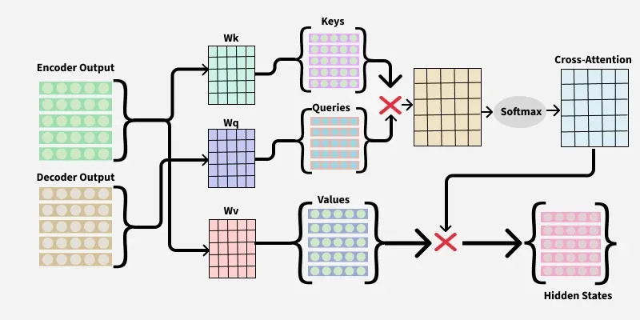

# Cross-Attention Mechanism in Transformers

## [English version](./cross_attention_en.md) | [简体中文](./cross_attention.md)
## Introduction

Cross-attention mechanism is a key part of the Transformer model. It allows the decoder to access and use relevant information from the encoder. This helps the model focus on important details, ensuring tasks like translation are accurate.

*Imagine generating captions for images (decoder) from a detailed description (encoder). Cross-attention helps the caption generator focus on key details, ensuring accuracy in the caption.*

Cross-attention enables different parts of the model to communicate and share useful information for better results.

## How does Cross-Attention Work?

Let's use a simple analogy to explain the process:

1. **Encoder (English Story)**: Encoder reads the English story and breaks it down into smaller chunks, like sentences or words. Each chunk is then turned into a "representation" that captures its meaning.

2. **Decoder (Chinese Translation)**: Decoder's job is to create the Chinese translation, one word at a time. As it generates each word, it needs to know which part of the English story is most important for the current translation.

3. **Cross-Attention (Helper)**: Cross-attention acts as a bridge between the encoder and decoder. It allows the decoder to "ask" the encoder which parts of the English story are most relevant for translating the current word, ensuring the translation is accurate and meaningful.

*In the above image, the first red cross represents the dot product of queries and keys and the second red cross represents dot product of cross-attention and values.*

## Step-by-Step Process

1. **Query (Question)**: Decoder creates a "query" for each word it's trying to translate. This query is like a question asking, "Which part of the English story should I focus on?"

2. **Keys and Values (Answers)**: Encoder provides "keys" and "values." The keys are like labels that help identify the important parts of the story and the values are the actual content of those parts.

3. **Matching (Finding the Best Fit)**: Cross-attention mechanism compares the query from the decoder with the keys from the encoder. It calculates how well each query matches each key. This is like finding the best fit between the question and the answers.

4. **Combining Information (Putting It All Together)**: Once the best matches are found, the cross-attention mechanism combines the relevant information from the encoder (values) to help the decoder generate the next word in the translation.

## Mathematical Expression of Cross-Attention Mechanism

The formula for Cross-attention is very similar to self-attention, except the query (Q) comes from the decoder's output and the key (K), value (V) come from the encoder's output.

Attention(Q, K, V) = softmax(QK^T/√d_k) V

Here, d_k is the dimensionality of the keys.

## Complexity of Cross-Attention

Cross-attention can get pretty complex, and it mostly depends on how long the input is and how many attention heads the model has. The main things it does are calculating dot products and using the softmax function to figure out the attention weights. For cross-attention, the complexity usually looks like this:

### Time Complexity

Cross-Attention takes about O(n² · d) time.

- n is how long the input sequence is (like the number of words in a sentence).
- d is how big the vectors are (like the size of each word's embedding).

The n² part comes from comparing each word with every other word, which makes a big n×n matrix.

### Space Complexity

Cross-Attention needs about O(n²) space. This is because it has to store the attention matrix, which is n×n.

As the sequence gets longer, the complexity grows fast, making the Transformer model use a lot of computing power. But, new ideas like sparse attention and efficient transformers are helping to make this less of a problem.

## Why is Cross-Attention Important?

Cross-attention assists the decoder in focusing on the encoder's most important information. Whether you're translating a sentence, creating a novel or even describing an image, this makes the entire process more accurate and efficient.

In tasks like machine translation, cross-attention helps the system align words from the source language with the most relevant words in the target language. This alignment is crucial for creating accurate and natural translations.

*For example, when translating "I like eating ice cream" into another language, cross-attention helps the system understand that "ice cream" is important and should be translated correctly.*

## Cross-attention Vs Self-attention

| Aspect | Cross-attention | Self-attention |
|--------|----------------|---------------|
| **Definition** | Allows the decoder to use information from the encoder. | Allows each word in a sequence to focus on other words in the same sequence. |
| **Uses** | Used in tasks like translation, where the model must look at the entire input (encoder) while generating output. | Used to understand relationships within a single input (e.g. text) without external context. |
| **Focus** | Focuses on picking useful information from another part of the model. | Focuses on how words in the same sentence relate to each other. |
| **Data Flow** | Involves interaction between two different data parts (encoder and decoder). | Data flows within the same sequence (internal attention). |
| **Example** | In translation, cross-attention helps the decoder choose the right words from the encoder. | In text analysis, self-attention helps the model understand how words in the sentence connect. |

## Applications of Cross-Attention

1. **Speech Recognition**: Cross-attention matches audio sounds with the correct words, ensuring accurate and meaningful transcription by focusing on key audio parts.

2. **Question Answering**: Cross-attention helps the model focus on the question and text together, finding the most relevant parts to extract the right answer.

3. **Text Summarization**: When we want to make a long piece of text shorter, cross-attention helps the model figure out which parts of the original text are most important. It helps create a summary that captures the main ideas.

4. **MultiModel**: Cross-attention mechanism in transformers not only enhances current model capabilities but also opens avenues for future advancements in interpretability, adaptability and scalability, enabling richer interactions with external knowledge bases and other systems.

